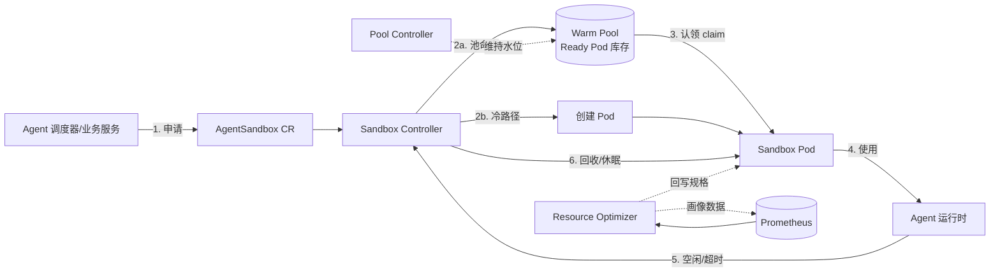
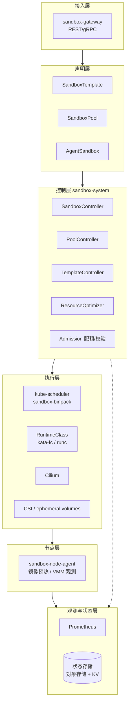
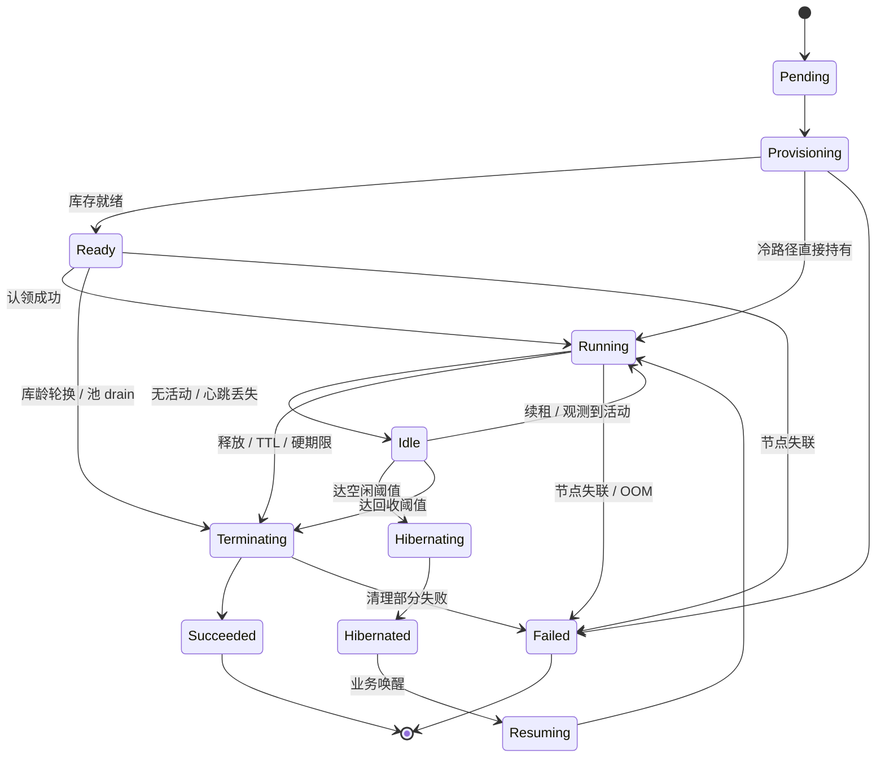

<div align="center">
  <h1>基于 Kubernetes 的 Agent 沙箱生命周期管理与资源优化</h1>
  <p><b>Dynamic Worker Pool Management</b> · <a href="https://github.com/Cyrene-06/Dynamic-Worker-Pool-Management">Cyrene-06/Dynamic-Worker-Pool-Management</a></p>
  <p>🚀Kubernetes+Go 的 Agent 沙箱生命周期管理与资源优化平台，为海量短生命周期、需强隔离的 Agent 负载提供企业级沙箱控制面。它集成了声明式 CRD（AgentSandbox / SandboxPool / SandboxTemplate）、预热池与 CAS 认领协议、TTL 与空闲双触发回收、Finalizer 泄漏防护、Kata/Firecracker 分级隔离、水位闭环弹性扩缩、超卖分级与画像分档、指标告警与安全审计等生产化能力。</p>
</div>

<div align="center">
  
  
  
  
  
  
  
  
  
  
</div>

<br>

<p align="center">
  <b>简体中文</b> | English（待补充）
</p>

---

## 项目文档

- **源码仓库**: [Cyrene-06/Dynamic-Worker-Pool-Management](https://github.com/Cyrene-06/Dynamic-Worker-Pool-Management)
- **设计文档总目录**: [docs/](docs/)（共 10 篇，索引见 [6.1 设计文档索引](#61-设计文档索引)）
- **需求与 SLO 量化**: [docs/01-requirements.md](docs/01-requirements.md)
- **技术选型对比分析**: [docs/02-tech-selection.md](docs/02-tech-selection.md)（11 项选型 + 14 项被否决方案）
- **总体架构**: [docs/03-architecture.md](docs/03-architecture.md)
- **CRD 与生命周期状态机**: [docs/04-api-and-state-machine.md](docs/04-api-and-state-machine.md)
- **预热池与弹性伸缩**: [docs/05-warm-pool-and-scaling.md](docs/05-warm-pool-and-scaling.md)
- **隔离运行时与节点池**: [docs/06-isolation-runtime.md](docs/06-isolation-runtime.md)
- **资源优化策略**: [docs/07-resource-optimization.md](docs/07-resource-optimization.md)
- **可观测性与安全**: [docs/08-observability-security.md](docs/08-observability-security.md)
- **多环境部署方案**: [docs/09-deployment-environments.md](docs/09-deployment-environments.md)
- **里程碑与风险登记**: [docs/10-roadmap-risks.md](docs/10-roadmap-risks.md)

## 架构速览



<table>
  <tr>
    <td width="50%" valign="top">
      <h4>🔥 热路径（池命中）</h4>
      <p>申请 → 认领库存沙箱 → 注入会话上下文</p>
      <p><b>目标 P95 &lt; 800 ms</b></p>
      <p>认领 = 一次带 <code>resourceVersion</code> 前置条件的 CAS Patch，天然分布式安全，无需额外协调服务。</p>
    </td>
    <td width="50%" valign="top">
      <h4>🧊 冷路径（池空兜底）</h4>
      <p>申请 → 创建 Pod → 调度 / 镜像 / microVM 启动</p>
      <p><b>目标 P95 &lt; 2.5 s</b></p>
      <p>不是常态路径。分阶段延迟预算分解见 <a href="docs/03-architecture.md">docs/03</a>。</p>
    </td>
  </tr>
</table>

## 重要提示

1. **M1（池化与生命周期）已于 2026-09-22 关闭，M2 待启动**：控制面交付物齐备 —— `PoolController`（水位闭环 / 阻尼 / 限速）、CAS 认领协议、TTL/空闲/心跳回收、5 步 Finalizer 链 + Sweeper 对账、`sandbox-gateway`（REST / 鉴权 / 配额 / 幂等 / 错误语义）、雪崩保护（`protectMode`）、三镜像共用一个 `Dockerfile`、`config/manager/` 部署清单。**但 8 项退出标准里 5 项未执行、3 项只完成一半**，原因全部是同一个：本机缺一个能跑 Linux 容器的宿主，不是代码或设计问题。逐条状态与解除条件见 [docs/10 §1 M1 关闭记录](docs/10-roadmap-risks.md)；**未验证项的唯一状态源是本文 §2.6**（⚠️/❌ 不是装饰）。隔离验证仍需带 `/dev/kvm` 的环境。
2. 阅读或实践本项目需要一定的 **Kubernetes Operator 开发（Go）** 与 **容器运行时** 基础。
3. 主隔离方案 Kata Containers + Firecracker 要求节点具备 `/dev/kvm`（裸金属或支持嵌套虚拟化的实例）；**本地 kind 环境无法真实验证隔离**，只能用 `simulated` 模式验证控制逻辑。
4. 文档中所有性能数字均为**量级参考**，必须以本项目的压测基线校正后才能写入 SLO。
5. 本项目**不含** Agent 业务逻辑（推理编排、工具调用实现）与 GPU 直通场景，边界见 [docs/01-requirements.md](docs/01-requirements.md)。
6. 仓库尚未包含 `LICENSE` 文件，计划 Apache License 2.0。原计划“随首个代码里程碑补齐”，**M1 关闭时仍未添加**（已记入 [docs/10](docs/10-roadmap-risks.md) 的遗留项）；在补齐之前请勿将本仓库内容用于商业分发。

<br>

## 1. 基本介绍

### 1.1 项目介绍

> 本项目是一个建立在 Kubernetes 之上的**面向 Agent 工作负载的沙箱控制面**：用自定义 Operator 管理 `AgentSandbox` 的完整生命周期（含泄漏防护），用**预热池 + 认领协议**把冷启动从秒级压到百毫秒级，用**分级隔离（runc / Kata-Firecracker）+ 四层资源优化**在满足隔离与 SLO 的前提下把节点利用率拉高。

**范围说明**

- **包含**：控制面架构、CRD 与状态机设计、池化与扩缩策略、隔离运行时选型与落地、资源优化模型、可观测性与安全设计、多环境部署方案、里程碑与风险。
- **不包含**（明确排除）：Agent 业务逻辑本身、Kubernetes 自身改造、GPU 训练类负载调度、跨集群联邦调度。

### 1.2 贡献指南

Hi! 首先感谢你关注本项目。

本项目是一套面向生产环境的平台设计，任何设计层面的修正、反例与实战数据都比"多写几页文档"更有价值。如果你愿意贡献代码或提出建议，请先阅读以下内容。

#### 1.2.1 Issue 规范

- issue 仅用于提交 Bug、Feature 或设计相关的内容，其它内容可能会被直接关闭。
- 提交 issue 之前，请先搜索相关内容是否已被提出。
- 若为**设计争议**，请在 issue 中给出：现状描述 → 你的结论 → **依据（数据/上游文档/实测）** → 反转条件。

#### 1.2.2 Pull Request 规范

- 请先 fork 一份到自己的项目下，不要直接在仓库下建分支。
- commit 信息以 `[文件名]: 描述信息` 的形式填写，例如 `docs/05-warm-pool-and-scaling.md: 修正安全库存公式`。
- 修正 Bug 或数据错误时，请在 PR 描述中给出复现方式或数据来源。
- **性能数字**的改动必须附压测方法与原始数据，不接受"经验上应该是"。
- 合并代码需要两名维护人员参与：一人 review 后 approve，另一人再次 review，通过后即可合并。

## 2. 使用说明

**环境要求**

- Kubernetes >= **v1.30**
- golang >= **v1.27.1**（与 `go.mod` 的 `go` 指令一致；低版本会直接拒绝构建该模块）
- containerd >= **1.7**（如需真实隔离，节点需具备 `/dev/kvm` 与 `vhost_vsock`）
- IDE 推荐：**VS Code**（`Go` + `Kubernetes` 扩展）或 **Goland**

> **依赖版本钉死说明**：`sigs.k8s.io/controller-runtime` 固定在 **v0.24.1**，不要升级到 v0.25.x。
> v0.25.x 在 **Windows 上无法编译**：`pkg/internal/testing/process/signal_windows.go` 定义了 `signalProcess`，
> 与同包内平台无关文件中的同名符号重复声明（`signalProcess redeclared in this block`），
> 而 `signal_other.go` / `signal_unix.go` 用的是 `signalProcessImpl`。v0.25.1 是该分支最新版，上游尚无修复。
> 该包仅在进程内 envtest 测试路径上被编译，因此**只影响本地/CI 的 Windows 开发者**。

### 2.1 控制面 Operator

```bash
# 克隆项目
git clone https://github.com/Cyrene-06/Dynamic-Worker-Pool-Management.git
cd Dynamic-Worker-Pool-Management

# 生成 CRD / RBAC 清单与 DeepCopy（改了 api/ 下的类型后必跑）
make manifests generate

# 单元测试：纯函数状态机 + 隔离抽象层 + 弹性算法，不需要集群、不需要 KVM
make test

# 需要真实 API Server 的测试：CAS 认领并发冲突、CRD 校验（依赖 envtest，不需要 Docker）
make test-envtest

# 完整验证（格式 + vet + 构建 + 测试）—— 提交前跑这一条就够
make verify

# 安装 CRD 并把 Operator 跑起来（本地 simulated 隔离）
make install
make deploy-local
```

> Windows 上没有 make 时，用等价入口：
> `powershell -ExecutionPolicy Bypass -File hack/verify.ps1`
> （支持 `-Task verify|fmt|vet|build|test|manifests|generate|cleanup`）
>
> ⚠️ **Windows 上 envtest 会泄漏控制面进程**（已实测）：测试二进制被强杀时
> （Defender 占用 `*.test.exe`、Ctrl+C、超时），它启动的 etcd / kube-apiserver
> **不会被回收**，累积起来很可观 —— 一轮 `verify` 可能攒下 3–6 GB 内存，
> 而表象是“机器内存不够”或“什么都变慢了”。`verify` 末尾会自动清理，
> 也可单独跑 `-Task cleanup`。清理只针对可执行文件路径含 `sandbox-tools\envtest`
> 的进程，**不会碰真实集群**（kind / kubeadm）。

> **envtest 说明**：`make test-envtest` 会调用 `setup-envtest` 下载并缓存 etcd / kube-apiserver 二进制，
> **完全不需要 Docker**（与 kind 不同）。未设置 `KUBEBUILDER_ASSETS` 时，`internal/claim` 的集成测试会
> 主动 **skip** 而不是失败——目的是让"没装 envtest"的开发者也能跑 `make test` 拿到真实绿灯，
> 而不是把环境缺失伪装成跳过。CI 中请务必设置该变量。

### 2.2 本地开发集群（kind）

```bash
# 创建集群
kind create cluster --config hack/kind-config.yaml

# 应用示例命名空间 / 模板 / 池 / 沙箱（simulated 隔离，回落 runc）
kubectl apply -k config/samples

# 观察状态机推进（Ready = 池中库存，Running = 已售出）
kubectl get agentsandbox -n sandbox-pool -w
```

> E1 默认保留 kind 自带的 kindnet，**不需要先装 Cilium** —— 它的目的是验证控制面逻辑。
> 出口白名单（`CiliumNetworkPolicy`）的验证放在 E2/E3，见 [docs/06 §7.2](docs/06-isolation-runtime.md)。
> 本地集群**无法**验证隔离强度与启动延迟，这两项必须去带 `/dev/kvm` 的环境。

### 2.3 CRD 与 API 参考

```bash
# 查看已注册的 CRD
kubectl get crd | grep sandbox.example.com

# 查看某个沙箱的实时状态与条件（Phase / Conditions）
kubectl get agentsandbox -n sandbox-pool -o yaml
kubectl describe sandboxpool fc-small
```

> 3 个 CRD 的 OpenAPI schema 由 `make manifests` 从 Go 类型生成到 `config/crd/bases/`，**已随仓库提交**；
> 字段级设计说明与状态机语义见 [docs/04-api-and-state-machine.md](docs/04-api-and-state-machine.md)。
> 需要可读的 API 文档时直接看 `kubectl explain agentsandbox.spec`（schema 已带完整描述与校验）。

### 2.4 真实隔离环境（KVM 单节点）

> ⚠️ 本地 kind / minikube **无法**真实验证隔离与启动延迟，必须使用带 `/dev/kvm` 的环境。

```bash
# 前置校验（CPU 虚拟化扩展 / /dev/kvm / vhost-vsock / cgroup v2）
sudo apt-get install -y cpu-checker && sudo kvm-ok
ls -l /dev/kvm /dev/vhost-vsock

# 单节点集群 + 节点标签 + Cilium + Kata
sudo kubeadm init --pod-network-cidr=10.244.0.0/16
kubectl label node $(hostname) sandbox.example.com/isolation=kata-fc
helm install kata-deploy oci://ghcr.io/kata-containers/kata-deploy-charts/kata-deploy -n kube-system

# 冒烟：Pod 内内核版本必须与宿主不同，才证明是独立内核
kubectl apply -f hack/smoke/kata-fc-pod.yaml
kubectl exec -it kata-smoke -- uname -r
```

### 2.5 接入层（gateway）与泄漏对账（sweeper）

```bash
# 接入层：业务唯一入口（申请/续租/释放/查询）
# 签名密钥从环境变量取，避免它出现在 ps 输出与 kubectl describe 里
export SANDBOX_TOKEN_ISSUER_SECRET=$(openssl rand -hex 32)
make gateway-local

# 热路径申请（命中池中库存）
curl -sS -X POST localhost:8090/v1/sandboxes \
  -H "Authorization: Bearer <你的租户令牌>" \
  -H "Idempotency-Key: $(uuidgen)" \
  -d '{"pool":"fc-small","ttlSeconds":600}'

# 对账：先干跑（只报告不执行），确认报告合理后再实跑
make sweeper-local
```

> **幂等键是可选的，但含义完全不同**：提供 `Idempotency-Key` 时同一键只产生一次认领
> （重试安全）；不提供时每次请求都是新的申请，**重试会拿到两个沙箱**。
>
> **错误语义是 API 最重要的部分**：`409` = 竞争激烈、库存可能还在，应当**立即**重试；
> `503` + `Retry-After` = 池确实空了，应当退避或降级；`410` + `recycleReason` = 已被回收，
> 应当重建并恢复状态；`422` = 参数不对，**不要**重试。把 409 与 503 混为一谈会让业务
> 在池里还有库存时去走冷路径（白花一次冷启动，并让命中率指标偏低）。

### 2.6 尚未被验证的边界

这一节是刻意保留的。把它删掉，下面的东西就会被读成"已经好了"。

> M1 关闭时（2026-09-22）这张表**就是**未验证项的正式清单：里程碑的“已关闭”是排期决策，
> 不是“这些都过了”。表里的 ⚠️/❌ 在 [docs/10](docs/10-roadmap-risks.md) 的「M1 关闭记录」里
> 逐条对应，并写明了解除条件。

| 能力 | 状态 | 缺少什么才能验证 |
|---|---|---|
| CRD 状态机 / 认领 CAS / 池水位算法 | ✅ 有单测与 envtest，含并发冲突实测 | — |
| 接入层全部路由与错误语义 | ✅ httptest + envtest（真实 API Server） | — |
| 泄漏对账的判断逻辑 | ✅ 纯函数穷举测试 | — |
| 运营商清单（gateway / sweeper） | ⚠️ 仅用 `kubectl kustomize` 渲染验证过 | 一个真集群 + 镜像 |
| 容器镜像（`Dockerfile`） | ⚠️ 已写好（多阶段 + distroless + 多架构），但**未真正构建过** | 可用的容器运行时。本机的具体阻塞点已定位到 Windows 侧：`VirtualMachinePlatform` 未启用（见 §2.8 的宿主修复步骤） |
| Operator 的 Deployment 清单（`config/manager`） | ⚠️ 仅渲染验证过；PVC 权限与缓存作用域已对齐 | 在真集群验证 leader election / 探针 / 卷回收（`hack/kind-e2e.ps1` 已把这三项写成可执行断言，但**尚未执行过**） |
| kind 端到端（申请→认领→回收全链） | ❌ 未跑通 | 同上。脚本已就绪（`hack/kind-e2e.ps1`），差的是一个能跑 Linux 容器的宿主 |
| Kata / Firecracker 真实隔离、启动延迟、cgroup 冻结 | ❌ 本机物理上做不到 | 带 `/dev/kvm` 的 Linux 节点（本机无 KVM） |
| 接入令牌的**强制** | ❌ 数据面代理尚未实现 | 一个校验令牌的连接代理；在那之前它只是一份凭据，不是一道防线 |
| 状态落盘（L3） | ❌ 默认 `DisabledFlusher`，启用 externalize 时会**明确报错** | 对象存储接入（M2） |

> 最后两行特别值得注意：它们都是"已经存在看起来很完整的接口、但背后没有真正的执行者"。
> 本项目的处理方式是让它们**显式失败或显式写明**，而不是静默成功 ——
> 静默成功会让问题在业务侧以"数据丢了/被攻破了"的形式出现，而那时已经无从定位。

### 2.7 VSCode 工作区

- **开发**：使用 VS Code 打开仓库根目录，`Go` 扩展会自动加载 `go.mod`；`config/` 下是 Kustomize 清单（`crd` / `isolation` / `rbac` / `samples`）。
- **运行/调试**：`.vscode/launch.json` 提供 `Operator`、`Gateway`、`Sweeper（干跑一轮）` 三个配置；`Both`（同时起控制面与接入层）需要两个进程共享一个 kubeconfig，请用两个 VS Code 窗口，或直接用 `make gateway-local`。
- **settings**：`.vscode/settings.json` 中的 `go.toolsEnvVars` 用于 VS Code 自身 Go 工具的环境变量。
  **本项目不提交任何绝对路径**（如 `KUBEBUILDER_ASSETS`）—— 它随机器而异，写进仓库必然在别人机器上失效；
  请改为在自己的 shell 或用户级配置中设置。

### 2.8 构建容器镜像

三个组件（`operator` / `gateway` / `sweeper`）共用仓库根目录的**同一个** `Dockerfile`，
用 `--build-arg BINARY=` 选择编译哪个 `cmd/` 包。这不是为了省文件：三个镜像的差别只有这一点，
拆成三份后“升级 Go 版本”就变成改三处，漏一处就出现“某个组件还是旧 Go 编的”——
而那类差异只在安全扫描报告里看得见。

| 阶段 | 基础镜像 | 为什么是它 |
|---|---|---|
| 构建 | `golang:1.27.1-alpine`（固定跑在构建机架构上） | 用 `$TARGETOS/$TARGETARCH` 交叉编译，多架构构建不需要 QEMU 模拟 |
| 运行 | `gcr.io/distroless/static-debian12:nonroot` | 带 CA 证书包（控制面访问 API Server 必需；`scratch` 会因此报 x509 错误）；无 shell、无包管理器；UID 65532 与清单里的 `securityContext.runAsUser` 一致 |

```bash
# 构建三个镜像（本地架构）。tag 由 IMAGE_TAG 控制，默认 dev
make docker-build

# 只改一个组件时也可以直接调 docker —— BINARY 必须显式给，Dockerfile 刻意没有默认值
docker build --build-arg BINARY=sweeper -t ghcr.io/cyrene-06/dwp-sweeper:dev .

# 多架构构建并推送（需要先 docker login ghcr.io）
make docker-buildx

# 静态检查 Dockerfile —— **不需要容器运行时**，所以本机 Docker 坏掉时依然可用
# （需要 hadolint 在 PATH 上）
make dockerfile-lint

# 把镜像放进 kind 集群
make kind-up        # 若集群尚未创建
make kind-load      # 等价于 kind load docker-image ...（不经过任何 registry）

# 一条命令把控制面部署起来并等就绪：
#   crd → samples（建命名空间）→ rbac → isolation → manager → rollout status
make kind-e2e

# 接入层与对账（可选；gateway 需要先手工创建 Secret sandbox-gateway-auth）
kubectl apply -k config/gateway
kubectl apply -k config/sweeper
```

> **`make kind-load` 是必需步骤，不是可选优化**：kind 的“节点”是 Docker 容器，
> 它们**看不到你本机 docker 的镜像缓存**。跳过这一步会一直 `ImagePullBackOff`，
> 而报错看起来像是“仓库里没有这个镜像”，很容易把人引向错误的排查方向。
>
> **tag 不要用 `:latest`**：kubelet 对 `:latest` 默认 `imagePullPolicy: Always`，
> 会绕过 load 进去的镜像去远端拉。本仓库统一用 `:dev`；发布时用
> `IMAGE_TAG=v0.1.0 make docker-build docker-push`，并把 `config/` 下两份清单里的
> 镜像改成同一个 tag **或 digest**（细节见 `config/gateway/deployment.yaml` 头注释）。
>
> 构建阶段要用 `go mod download` 拉依赖，因此**代理不可达的网络里必须显式指定**：
> `make docker-build GOPROXY=https://goproxy.cn,direct`。
> 不指定时的现象是“不报错但一直不动”，比失败更难发现。
>
> 同一类问题还有一处：`# syntax=docker/dockerfile:1` 会让 BuildKit 去拉那个前端镜像，
> 拉不到时构建会在开头就失败，而报错里只有镜像名 —— 看起来像 Dockerfile 写错了。
> 要么配镜像加速，要么删掉该行与 `--mount=type=cache` 参数回退经典构建器。
>
> ⚠️ 三件事当前还做不到，不要把它们读成已完成：
> 一是本机容器运行时不可用 —— 具体阻塞点已定位到 Windows 侧（`VirtualMachinePlatform`
> 未启用，且一次“已重启但仍然没生效”的 CBS 延迟启动处理），所以上面的构建命令
> **尚未在真实环境里跑过一次**；
> 二是 `config/manager/`（Operator 的 Deployment）已写好，同样**只在渲染层面验证过**；
> 三是“以 Pod 里的 ServiceAccount 跑通”这件事还没做过 —— 而很多缺口只会在那种情况下暴露：
> 例如曾经漏掉的 PVC 权限（现已补齐：`config/rbac/operator-sandbox-namespace.yaml`
> 的 namespaced Role + `cmd/operator/main.go` 收窄的缓存），
> 本地用开发者 kubeconfig（通常是 cluster-admin）跑**永远看不见**（docs/10 R17）。
> `hack/kind-e2e.ps1` 的 verify 阶段已把这条写成了断言：它以 Pod 的 ServiceAccount 身份
> 逐条查 `kubectl auth can-i`，**并断言它“不能”做的那些事**（跨命名空间删 PVC、读 Secret、
> exec 进沙箱），再回读 Operator 日志里有没有 `forbidden`。
>
> **Windows（没有 make）**：仓库里另外三个脚本是同一套流程的 PowerShell 实现，
> 因为“命令写在跑不了的 Makefile 里”正是一个又一个勾选不上里程碑的成因 ——
> `hack/docker-doctor.ps1`（只读诊断）、`hack/host-ready.ps1`（宿主修复，需管理员）、
> `hack/kind-e2e.ps1`（等价于本节的构建/加载/部署/校验全流程）。
> 三者共享 `hack/host-common.ps1`——共享的理由和三个镜像共用一个 Dockerfile 一样：
> 一处修复不应该需要记得改三遍。
>
> 宿主本身出问题时按这个顺序走：先跑 `hack/docker-doctor.ps1` 看**哪一层**坏了
> （逐层报告 CLI / 守护进程 / Docker Desktop 服务 / WSL / 虚拟化 / Windows 服务栈），
> 再用**管理员** PowerShell 跑 `hack/host-ready.ps1 -Mode repair`，它会按缺什么补什么
> （补功能、关快速启动、把 TrustedInstaller 设回自动），并告诉你什么时候必须重启。
> 诊断脚本自身只读、不提权。

## 3. 技术选型

- **控制面**：使用 [controller-runtime](https://github.com/kubernetes-sigs/controller-runtime) 构建 Operator，代码生成只用 `controller-gen`（`controller-tools`）；不引入 operator-sdk 的重框架。
  ⚠️ **不使用 kubebuilder 脚手架**：v4 没有 Windows 发行版，且 `sigs.k8s.io/kubebuilder/v4` 模块不含 `cmd` 包，
  `go install` 必然失败。骨架按 [docs/09](docs/09-deployment-environments.md) 的 Kustomize 布局手写，
  这样 macOS / Linux / Windows 三端行为一致，且避免脚手架生成一堆没人维护的文件。
- **抽象层**：自定义 CRD（`AgentSandbox` / `SandboxPool` / `SandboxTemplate`），承载状态机、TTL、认领、休眠等原生对象无法表达的语义。
- **隔离运行时**：主用 [Kata Containers](https://katacontainers.io/) + [Firecracker](https://firecracker-microvm.github.io/)，通过 `RuntimeClass` 暴露；[Cloud Hypervisor](https://www.cloudhypervisor.org/) 作为需更多设备能力时的折中；runc 用于可信负载与本地开发。
- **调度**：默认 `kube-scheduler` 的第二个 profile（`NodeResourcesFit` = `MostAllocated`）实现装箱，不引入第三方调度器。
- **网络**：使用 [Cilium](https://cilium.io/) 提供默认拒绝、`toFQDNs` 出口白名单与 Hubble 观测（`CiliumNetworkPolicy`）。
- **节点扩缩**：使用 [Karpenter](https://karpenter.sh/) 管理节点池，配合负优先级占位 Pod 预铺节点容量。
- **资源优化**：画像分档（ConfigMap 维护档位）+ 超卖规则引擎；VPA 仅以 `Off` 模式作为画像数据源，不做自动决策。
- **观测**：Prometheus + OpenTelemetry + Grafana / Loki / Tempo；cAdvisor 与节点侧 VMM 进程 RSS 交叉校验内存画像。
- **配置与部署**：Kustomize base + per-env overlay，禁用"仅本地可用"的代码分支。

## 4. 项目架构

### 4.1 系统架构图



### 4.2 生命周期状态机



> `Ready` = **池中库存（未认领）**，`Running` = **已售出**。池水位就是 `count(phase=Ready)`。完整迁移表与不变式见 [docs/04-api-and-state-machine.md](docs/04-api-and-state-machine.md)。

### 4.3 目录结构

```
.
├── Dockerfile                    # operator / gateway / sweeper 共用的多阶段构建
├── .dockerignore                 # 构建上下文过滤（.git 必须排除，否则每次 commit 都让 COPY 层失效）
├── api/v1alpha1/                 # CRD 类型 + labels（跨组件契约）+ zz_generated.deepcopy.go
├── cmd/
│   ├── operator/main.go          # 控制面装配层：scheme / 缓存收窄 / 隔离层 / 控制器
│   ├── gateway/main.go           # 接入层装配层：鉴权 / 配额 / 限流 / HTTP
│   └── sweeper/main.go           # 泄漏对账的一次性入口（CronJob）
├── internal/
│   ├── controller/               # NextPhase 纯函数 + Sandbox/Pool 控制器 + 认领绑定 + Finalizer 链
│   ├── gateway/                  # 路由 / 错误语义 / HMAC 接入令牌 / 配额 / 限流 / 指标
│   ├── claim/                    # CAS 认领协议
│   ├── sweeper/                  # 泄漏对账（Classify 纯函数 + 快照 + 动作执行）
│   └── isolation/                # 隔离级别抽象层（配置校验 + 降级策略 + 探测）
├── config/
│   ├── crd/                      # 生成的 CRD 清单 + kustomization
│   ├── isolation/                # levels.yaml（隔离级别的唯一配置入口）+ ConfigMap
│   ├── rbac/                     # 最小权限 RBAC，兼当可执行安全基线
│   ├── manager/                  # 控制面 Operator（Deployment / 指标 Service / PDB）
│   ├── gateway/                  # 接入层 Deployment / Service / PDB
│   ├── sweeper/                  # 对账 CronJob
│   └── samples/                  # 命名空间 / 模板 / 池 / 沙箱示例
├── hack/
│   ├── kind-config.yaml          # E1 集群配置
│   ├── smoke/                    # Kata / 网络策略冒烟用例
│   ├── bootstrap/                # 节点初始化与 KVM/vsock 自检
│   ├── verify.ps1                # Windows 验证入口（等价于 make verify）
│   ├── docker-doctor.ps1         # 只读诊断：容器运行时为什么起不来（逐层）
│   ├── host-ready.ps1            # 管理者侧修复：把 Windows 补到能跑 Linux 容器
│   ├── kind-e2e.ps1              # Windows 版 kind 端到端 + 选主切换 + RBAC 审计
│   └── host-common.ps1           # 上述三个脚本共享的辅助函数（被 dot-source）
├── test/envtest/                 # 进程内控制面（etcd + kube-apiserver），不需要 Docker
├── docs/                         # 设计文档 01–10
├── Makefile                      # Linux / CI 验证与镜像构建入口
└── go.mod  go.sum
```

**规划中（M2 及以后）**：`cmd/node-agent`、`template_controller`、`resource_optimizer`、
`test/e2e`（集群内端到端；Windows 入口是 `hack/kind-e2e.ps1`）、
`test/conformance`（Kata 一致性套件）、控制器与对账侧的指标导出（现为显式占位，M3 接入）、
以及可直接导入的 Grafana 看板 JSON（面板设计见 [docs/08 §6](docs/08-observability-security.md)）。

## 5. 主要功能

**生命周期管理**

- **完整状态机**：11 个 Phase、7 类 Condition，所有迁移都有原因码（`recycleReason`）与事件，不允许"黑盒回收"。
- **双触发回收**：心跳（`coordination.k8s.io/v1 Lease`）为主判据 + 空闲检测（eBPF 网络活动 / cgroup CPU 增量）为辅 + TTL 兜底上限，避免长任务被误杀与僵尸占用。
- **泄漏防护**：5 个 Finalizer 按 `lease → network → state-flush → volume → metrics` 顺序回收，每步 30s 超时强制推进；独立对账 Sweeper 兜底异常路径。
- **沙箱复用**：同租户原地转正复用，`resetHook` 强制清理 + `maxClaimCount` 轮换；**跨租户复用硬编码禁止**。

**池化与弹性伸缩**

- **预热池分级**：L0 节点容量 → L1 镜像预热 → L2 Ready 库存 → L3 冻结库存 → L4 快照库存，按成本收益比依序实施。
- **CAS 认领协议**：`resourceVersion` 乐观锁实现排他认领，无中心化分配器，天然可伸缩。
- **水位闭环控制**：EWMA + 趋势预测（前馈）+ 命中率反馈 + 平方根安全库存公式，配非对称冷却、滞回、限速与振荡检测。
- **雪崩保护**：容量危机下进入 ProtectMode（失败率触发 + 120s 滞回），拒绝低优申请（`503 protect_mode` + `Retry-After`）、扩容限速降至 50%，避免"扩容→压垮 API Server→更多重试"的自激放大。
  ⚠️ 边界：API Server 延迟判据与"高优排队"未接线（清单见 [docs/05 §5](docs/05-warm-pool-and-scaling.md) 的实现状态表）。
- **节点容量预铺**：负优先级占位 Pod + 高优抢占，解决"池是秒级、节点是分钟级"的时间常数不匹配。

**隔离与安全**

- **分级隔离**：`simulated` / `runc` / `kata-fc` / `kata-clh` 通过配置切换，控制逻辑在 kind 上可完整验证。
- **RuntimeClass 原生约束**：`overhead` 精确计入 VMM 开销，`scheduling.nodeSelector` 保证 Pod 不落到错误节点池。
- **出口治理**：Cilium `toFQDNs` 白名单 + 默认拒绝，显式阻断 API Server、云元数据地址与内网网段。
- **威胁模型**：16 类威胁与控制矩阵，含逃逸响应剧本、镜像签名准入、短期凭据与多租户模型。

**资源优化**

- **画像分档**：以 P95 使用量映射档位，替代逐沙箱精调 requests，避免调度碎片；提供"零碎片"设计规则（档位/开销/节点容量同粒度整数倍）。
- **超卖分级**：CPU 可压缩、内存不可压缩，超卖仅对可重启沙箱开放并设硬上限；Kata 路径下 `limits.memory` 即 guest RAM，是否真省内存取决于 Firecracker 预分配策略。
- **休眠回收**：L1 `cgroup.freeze` 释放 CPU（低成本、可逆、典型节省 70%）→ L3 状态外置 + 销毁重建 → L5 Firecracker 快照（进阶 PoC）。
- **装箱与整理**：`MostAllocated` 装箱 + `PodTopologySpread` 限制故障域；碎片整理仅在低峰执行。

**可观测与运维**

- **指标契约**：严格基数控制（禁止把 `sandbox_id`/`session_id` 放进 label），`reason` 必须是枚举。
- **告警与 Runbook**：16 条告警全部绑定 runbook 与"用户可感知影响"，不因"指标异常"而告警。
- **追踪与审计**：`requestId` 全链路传播，失败与冷路径 100% 采样；审计覆盖申请/生命周期/出口访问/控制面操作。
- **可运维开关**：`pauseScaling`（冻结自动扩缩）、`disableColdPath`（保护节点）、`maxWarm: 0`（一键止血）、池 drain（升级前排空）。

## 6. 知识库

### 6.1 设计文档索引

| 文档 | 内容 | 建议阅读顺序 |
|---|---|---|
| [01 需求与目标](docs/01-requirements.md) | 场景、功能/非功能需求、SLO 量化、边界与非目标 | ① |
| [02 技术选型分析](docs/02-tech-selection.md) | 11 项关键选型的对比矩阵、结论、**被否决方案及原因** | ② |
| [03 总体架构](docs/03-architecture.md) | 分层架构、组件职责、部署拓扑、关键时序、HA 与并发控制 | ③ |
| [04 API 与状态机](docs/04-api-and-state-machine.md) | CRD 字段设计、Phase/Condition、Finalizer、认领协议 | ④ |
| [05 预热池与弹性伸缩](docs/05-warm-pool-and-scaling.md) | 池分级、水位算法、防抖动、与 Karpenter/CA 协同、容量公式 | ⑤ |
| [06 隔离与运行时](docs/06-isolation-runtime.md) | RuntimeClass、Kata/Firecracker 落地、节点规格、存储与网络 | ⑥ |
| [07 资源优化](docs/07-resource-optimization.md) | 四层优化模型、超卖建模、休眠回收、装箱与碎片整理、收益验证 | ⑦ |
| [08 可观测性与安全](docs/08-observability-security.md) | 指标/日志/追踪规范、告警、威胁模型与控制措施 | ⑧ |
| [09 多环境部署](docs/09-deployment-environments.md) | 本地/生产环境矩阵、安装顺序、配置矩阵、升级回滚 | ⑨ |
| [10 里程碑与风险](docs/10-roadmap-risks.md) | 4 个里程碑、验收标准、风险登记表、开放问题 | ⑩ |

### 6.2 参考资料

- **Kubernetes**：[RuntimeClass](https://kubernetes.io/docs/concepts/containers/runtime-class/)、[Pod Topology Spread](https://kubernetes.io/docs/concepts/scheduling-eviction/topology-spread-constraints/)、[KubeSchedulerConfiguration](https://kubernetes.io/docs/reference/scheduling/config/)、[CRD Validation (CEL)](https://kubernetes.io/docs/tasks/extend-kubernetes/custom-resources/custom-resource-definitions/#validation-rules)
- **运行时**：[Kata Containers 文档](https://katacontainers.io/docs/)、[Firecracker 设计](https://github.com/firecracker-microvm/firecracker/blob/main/docs/design.md)、[Cloud Hypervisor](https://www.cloudhypervisor.org/)
- **Operator 开发**：[Kubebuilder Book](https://book.kubebuilder.io/)、[controller-runtime](https://github.com/kubernetes-sigs/controller-runtime)
- **网络与节点**：[Cilium Network Policy](https://docs.cilium.io/en/stable/security/policy/)、[Karpenter](https://karpenter.sh/docs/)
- **资源效率**：[Vertical Pod Autoscaler](https://github.com/kubernetes/autoscaler/tree/master/vertical-pod-autoscaler)、[Kubernetes 调度器插件](https://github.com/kubernetes-sigs/scheduler-plugins)


<br>

<div align="center">
  
  
  
  
</div>

<div align="center">
  <sub>Agent Sandbox Control Plane · M1 已关闭 · 欢迎 Issue / PR</sub>
</div>
