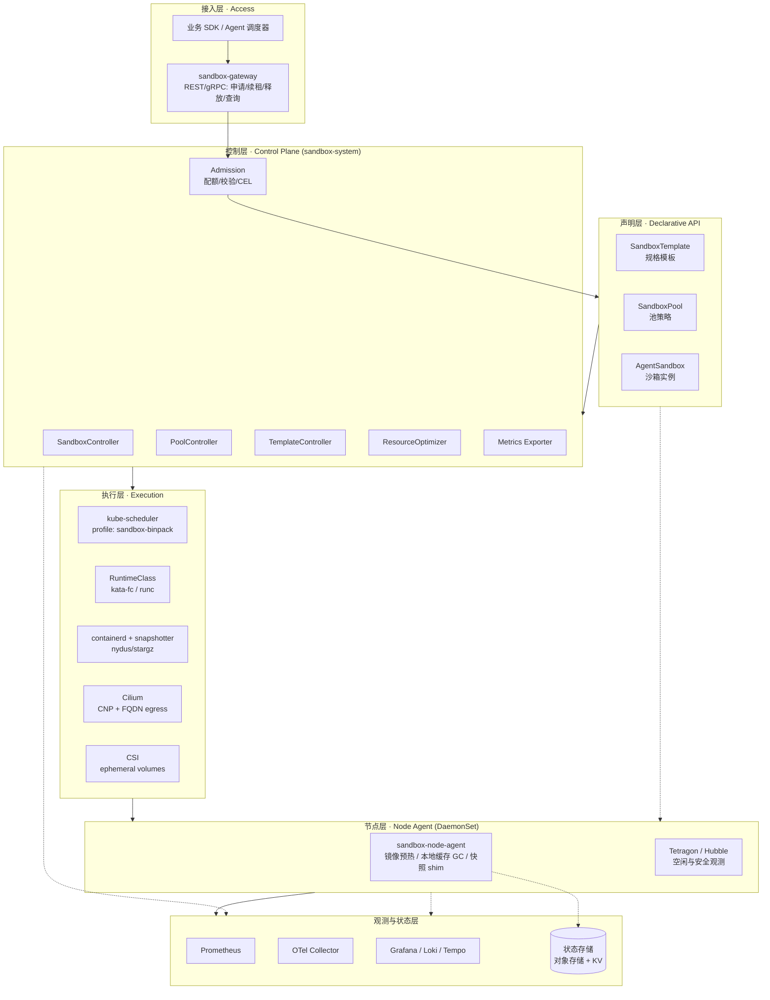
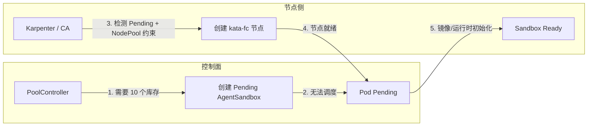
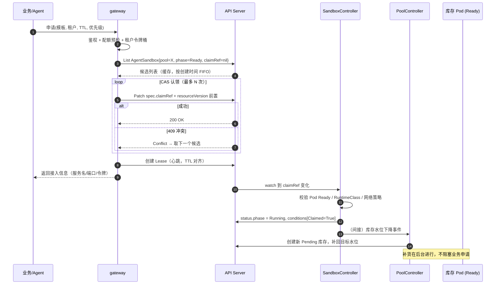
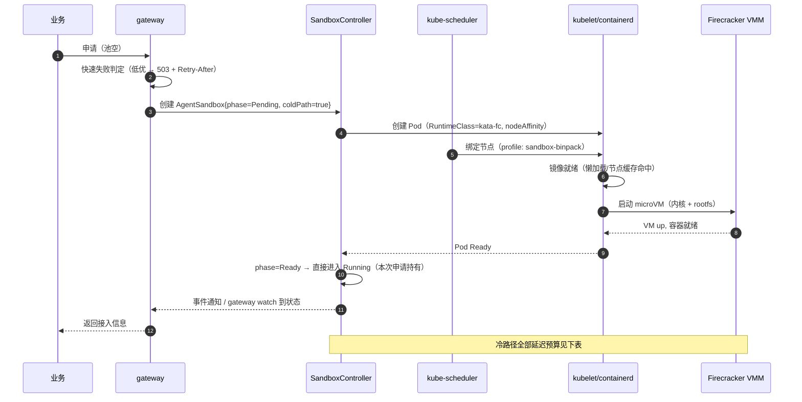
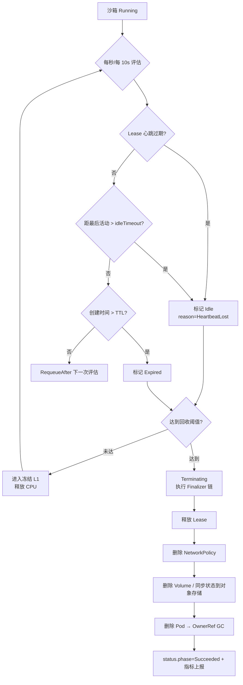
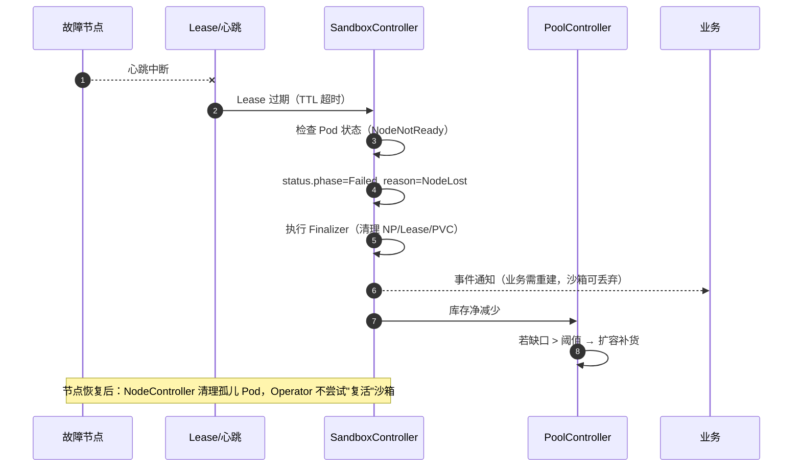
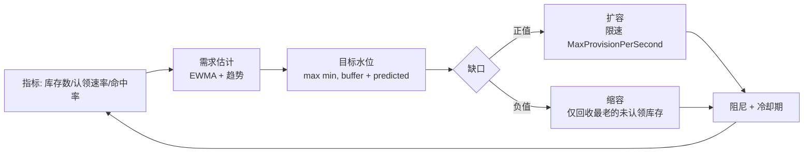
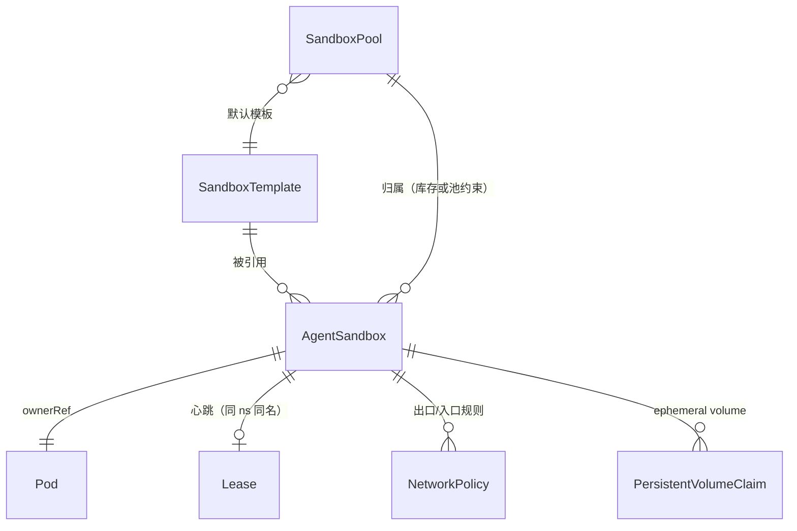

# 03 · 总体架构

[← 上一篇：技术选型](02-tech-selection.md) | [返回导航](../README.md) | [下一篇：API 与状态机 →](04-api-and-state-machine.md)

---

## 1. 分层架构

**分层职责边界**：

| 层 | 职责 | 明确不负责 |
|---|---|---|
| 接入层 | 协议转换、鉴权、租户识别、限流、生成 CR | 不做调度决策 |
| 声明层 | 期望状态的唯一事实来源 | 不含策略逻辑 |
| 控制层 | 状态机推进、池水位、规格画像 | 不直接操作容器运行时 |
| 执行层 | 调度、隔离、网络、存储 | 不感知"会话"概念 |
| 节点层 | 节点级优化与观测（跨 Pod 视角） | 不修改 CR 状态 |
| 观测层 | 指标/日志/追踪/状态持久化 | 不做控制决策（仅作为输入） |

> **关键原则**：控制层**不直接调用 CRI/Docker**，一律通过 K8s API 声明 Pod 与 RuntimeClass。唯一例外是 L5 快照 shim（进阶方案），它也必须以 "Pod 内 init-less 的节点级 agent + CR 驱动" 方式接入，避免引入不可观测的旁路。

---

## 2. 组件清单

| 组件 | 形态 | 副本 | 职责 | 输入 | 输出 |
|---|---|---|---|---|---|
| `sandbox-gateway` | Deployment | 2+ (HPA) | 统一业务 API；鉴权；租户配额预检；申请/续租/释放；返回接入信息 | 业务请求 | `AgentSandbox` CR、`Lease` |
| `sandbox-operator` | Deployment（多控制器合一 Manager） | 2（1 leader） | 承载全部控制器与 Webhook | CR / Pod / Lease 事件 | CR status、Pod、NetworkPolicy、PVC |
| ├ `SandboxController` | 同上 | — | 单沙箱状态机、Pod 生命周期、回收、泄漏清理 | `AgentSandbox` | Pod 及关联资源 |
| ├ `PoolController` | 同上 | — | 池水位、库存创建/淘汰、drain、需求预测 | `SandboxPool` + 全局库存统计 | 库存 `AgentSandbox`（Pending） |
| ├ `TemplateController` | 同上 | — | 模板版本校验、规格档位回写、默认值 | `SandboxTemplate` + 用量画像 | 模板 `spec` 更新 |
| ├ `ResourceOptimizer` | 同上 | — | 采集用量 → 计算 P95 → 映射档位 | Prometheus 指标 | 建议（写入模板或 CR） |
| └ `Admission` | 同上（webhook + ValidatingAdmissionPolicy） | — | 跨对象校验（租户配额、池引用合法性） | AdmissionRequest | 允许/拒绝/默认值 |
| `sandbox-node-agent` | DaemonSet | 每节点 | 镜像预热、本地缓存 GC、节点容量上报、快照 shim（可选） | CR / 节点事件 | 节点 metrics、缓存状态 |
| `sandbox-defrag` | CronJob / 控制器 | 1 | 低峰碎片整理建议与执行（配合 Descheduler） | Prometheus + 节点指标 | 驱逐/迁移请求 |
| 观测栈 | Helm charts | — | 指标/日志/追踪 | — | — | 运维依赖 |

**为什么 `SandboxController` 与 `PoolController` 必须分离**：
若同一控制器既决定"这个沙箱该回收"又决定"池该扩到多大"，两个决策会互相污染（回收瞬时降低库存 → 触发扩容 → 新库存刚就绪又被识别为多余 → 缩容），形成**自激振荡**。分离后，`PoolController` 只消费"库存水位"这一聚合量，并用独立的阻尼参数（见 [05](05-warm-pool-and-scaling.md)）隔离抖动。

---

## 3. 部署拓扑

### 3.1 命名空间划分

| 命名空间 | 内容 | 说明 |
|---|---|---|
| `sandbox-system` | operator、gateway、CRD、RBAC、观测 Agent | 平台管控 |
| `sandbox-runtime` | `kata-deploy` DaemonSet、node-agent | 特权，需严格 RBAC/PSA 例外 |
| `sandbox-pool` | 池库存 `AgentSandbox`（未认领） | 库存集中管理，便于配额与 drain |
| `sandbox-tenant-<id>` | 业务可见的已认领沙箱（可选：库存与认领后跨 ns 移动） | 多租户隔离 |

> **设计取舍**：库存放独立命名空间还是租户命名空间？
> - **独立（推荐）**：便于统一 drain 与配额；认领后把 `spec.claimRef` 指向租户，Pod 仍在池 ns。风险：跨租户资源共处，依赖 NetworkPolicy 与 RBAC 保证隔离。
> - **租户内**：隔离直观，但池水位需按租户分别维持，预热效率低（小租户池命中率差）。
> - **折中（最终选择）**：**库存池按「隔离级别 + 机型档位」划分（而非按租户）**，租户维度通过标签与配额控制。理由：池的物理意义是"资源规格"，不是"归属"。

### 3.2 节点池规划

| 节点池 | Label | Taint | RuntimeClass | 用途 | 机型 |
|---|---|---|---|---|---|
| `system` | `node-role=sandbox-system` | `CriticalAddonsOnly` | runc | 控制面、观测 | 2C4G × 3 |
| `sandbox-fc` | `sandbox.example.com/isolation=kata-fc` | `sandbox=true:NoSchedule` | `kata-fc` | **主力沙箱池**（S1/S2/S4） | metal，≥8C32G，含 `/dev/kvm` |
| `sandbox-ch` | `sandbox.example.com/isolation=kata-clh` | `sandbox=true:NoSchedule` | `kata-clh` | 需更大内存/更好兼容性的沙箱 | metal |
| `sandbox-runc` | `sandbox.example.com/isolation=runc` | `sandbox=runc:NoSchedule` | （默认） | 可信负载、本地开发 | 通用 |

**节点规格建议**（Kata-FC 场景）：

- CPU：≥ 8 核（CPU Manager `static` 策略 + Topology Manager `single-numa-node`，减少跨 NUMA 抖动）
- 内存：≥ 32 GiB；**禁用 swap**（Kata 与内存超卖假设依赖无 swap）
- 本地盘：NVMe，用于镜像层与沙箱临时盘
- 预留：`system-reserved`/`kube-reserved` 显式配置（避免 Kata VMM 进程被误驱逐）
- 关闭 `--cpu-manager-policy` 之外的节能特性（C-states/频率调节会放大启动抖动）

### 3.3 节点自动扩缩协同

**关键配置约束**：

1. Karpenter `NodePool` 的 `minValues`/最小容量**必须 > 0**（或配置 `consolidationPolicy: WhenEmpty` 且 `consolidateAfter` 足够长），否则节点会被缩到 0，预热池永远无法维持。
2. 池库存 Pod 应打 `karpenter.sh/do-not-disrupt: "true"`，防止 Consolidation 驱逐正在预热/认领的沙箱。
3. 扩容路径优化：**让 Karpenter 提前预热节点**（`NodePool` 保持一定 `warmCapacity`），否则"池扩容"实际延迟 = 节点创建（分钟级）+ Pod 启动。**这是本项目最容易踩的坑**：池的秒级承诺依赖节点已就绪。

---

## 4. 关键时序

### 4.1 热路径：池命中认领（目标 P95 < 800ms）

**为什么认领放在 gateway 而不是 controller？** 认领是**同步的用户请求**，必须立即返回结果；controller 是异步最终一致的。若把认领只放 controller，业务需轮询或 watch，延迟不可控。gateway 用 CAS 直接完成绑定，controller 只负责"认领后的收敛"。

### 4.2 冷路径：池空时创建（目标 P95 < 2.5s）

**冷路径延迟预算分解**（可用于定位优化点）：

| 阶段 | 目标 | 优化手段 |
|---|---|---|
| Admission + CR 创建 | 30 ms | 用 CEL 校验替代 webhook；SSA 写入 |
| 调度 | 100 ms | 小拓扑 + `MostAllocated`（候选节点少，评分快） |
| 镜像就绪 | 300–1200 ms | 节点预热 DaemonSet + 懒加载 snapshotter |
| microVM 启动 | 120–350 ms | Firecracker（非 QEMU）；预分配 rootfs；hugepages |
| 容器初始化 + 就绪探针 | 200–600 ms | 精简初始化；就绪探针用 `exec` 而非 `http` 以避开网络就绪等待 |
| **合计** | **~0.8–2.3 s** | |

### 4.3 空闲回收：双触发（TTL + 空闲检测）

**双触发的必要性**：单一 TTL 无法处理"长任务被误杀"（业务跑 3 小时但 TTL 30 分钟）与"僵尸占用"（业务已死但 TTL 未到）。因此：

- **心跳（Lease）为主判据**：业务必须续租；丢失即认为客户端已死。
- **空闲检测为辅**：避免业务忘记续租但沙箱确实在用（用 eBPF 网络活动 + cgroup CPU 增量作为"活动"证据）。
- **TTL 为兜底上限**：无论如何不超过（防泄漏的最终保险）。

**误杀防护**：当"心跳丢失"与"观测到活动"矛盾时，**以活动为准**（保守），并上报 `IdleDetectionConflict` 指标用于调参。

### 4.4 节点故障

**设计原则**：**不做沙箱级故障迁移**（VM 迁移超出范围且成本极高）。契约上明确"沙箱可丢失"，把恢复责任交给业务（配合 L3 状态外置可做到会话无感）。

### 4.5 池水位控制回路

---

## 5. 数据模型关系

| 关系 | 实现方式 | 清理时机 |
|---|---|---|
| `AgentSandbox` → `Pod` | `ownerReferences`（自动 GC） | 删除 CR 时自动 |
| `AgentSandbox` → `Lease` | ValidatingWebhook 命名约定 + Finalizer | Finalizer 显式删除（Lease 支持 ownerRef，但为安全仍显式删） |
| `AgentSandbox` → `NetworkPolicy` | `ownerReferences` + Finalizer（跨版本兼容） | Finalizer |
| `AgentSandbox` → `PVC` | `ownerReferences`（ephemeral volume 由 Pod 生命周期管理，需显式兜底） | Finalizer |
| `SandboxPool` → 库存 | **label selector**（非 ownerRef，允许库存转正） | 池删除时由 Pool 控制器清理 |

---

## 6. 关键设计决策与权衡

| # | 决策 | 理由 | 代价 | 缓解 |
|---|---|---|---|---|
| A1 | 池库存用 `AgentSandbox` CR 表示，而非裸 Pod | 库存本身有状态机/TTL/可观测；避免"僵尸 Pod" | 对象数量翻倍（5k 沙箱 + ~2k 库存）→ API Server 与 etcd 压力 | 库存 CR 的 `status` 极简；只在实质变化时写入；`status` 子资源隔离 |
| A2 | 认领在 gateway 用 CAS 完成，而非 controller | 同步请求需确定性延迟 | gateway 成为无状态但关键路径组件 | 多副本 + 无本地状态；冲突时重试候选 |
| A3 | 心跳用独立 `Lease` 对象，不写 CR | 高频写 CR 会触发所有 watcher，放大 API 压力 | 多一类对象 | Lease 尺寸极小；可用 namespace 级配额控制 |
| A4 | `SandboxController` 与 `PoolController` 分离 | 避免自激振荡 | 需清晰定义边界 | Pool 只创建/删除 **Pending** 库存，绝不动已认领对象 |
| A5 | 不做沙箱故障迁移 | 成本/复杂度极高 | 节点故障导致会话中断 | 契约明确"可丢失"；L3 状态外置实现业务无感 |
| A6 | 空闲检测优先用节点级 eBPF，而非注入 sidecar | sidecar 增加启动延迟、破坏轻量化、Firecracker 下多进程资源开销 | 依赖 Cilium/Tetragon | 心跳为主判据，eBPF 为辅 |
| A7 | 用 CEL 做单对象校验，Webhook 只做跨对象 | 减少控制面可用性依赖 | CEL 表达力受限 | 复杂策略下沉到 ValidatingAdmissionPolicy |
| A8 | 隔离级别通过 RuntimeClass 抽象，不写死 | 同时支持 kind/生产（D11） | 需维护两条验证路径 | 一致性测试套件 |
| A9 | 池按"隔离级别 + 规格档位"划分，不按租户 | 池的物理意义是资源规格，按租户预热效率低 | 跨租户共处需 RBAC/NP 保证隔离 | 严格租户标签 + Cilium 策略 |
| A10 | 所有状态迁移写事件与指标 | 可运维性是硬需求 | 指标基数膨胀风险 | 严格限制 label 维度（见 [08](08-observability-security.md)） |

---

## 7. 并发与一致性

| 场景 | 机制 |
|---|---|
| 多 Operator 副本 | `Lease` 抢占式 Leader Election（`coordination.k8s.io/v1`，租期 15s，重试 2s） |
| 认领竞争 | `resourceVersion` 前置条件的 Patch（乐观锁），409 重试下一候选 |
| 状态写入竞争 | `status` 子资源 + SSA（字段所有权），避免 controller 与 gateway 互相覆盖 |
| 重复 reconcile | 所有操作幂等；创建类操作先 `Get` 再 `Create`，或依赖 `generateName` + 标签去重 |
| 事件丢失 | 不依赖事件，任何状态都能从 CR 全量 reconcile 出来（**"事件只是唤醒信号"** 原则） |
| 定时推进 | `RequeueAfter` 而非轮询全量；用 `LastTransitionTime` 计算下次评估时间 |
| 删除期间的竞态 | Finalizer 保护；删除中拒绝新的认领（Webhook 校验 `deletionTimestamp`） |
| 缓存陈旧 | 认领等强一致操作用 `client.Reader`（直读 API Server，绕过缓存）；状态推进用缓存 |

---

## 8. 失败模式与恢复矩阵

| 故障 | 检测 | 系统行为 | 业务影响 | 恢复 |
|---|---|---|---|---|
| Operator Pod 崩溃 | Leader Election 租约超时 | 新 leader 重建 informer 缓存 | 秒级控制面中断（沙箱不受影响） | 自动 |
| 控制面全挂 > TTL | 告警 | 沙箱继续运行；回收暂停 | 资源增长；泄漏风险 | 恢复后 reconcile 补偿 |
| 节点 NotReady | Node lease | 标记 `Failed/NodeLost`，清 Finalizer | 该节点上沙箱全部丢失 | 池自动补货 |
| Pod 被手动删除 | `Owns()` watch | reconcile 发现缺失 → 重启 Provisioning 或标记 Failed | 单沙箱中断 | 幂等 |
| etcd 写入变慢 | `apiserver_request_duration` | 降低 status 写入频率（合并更新） | 状态延迟 | 自动 |
| 池被大规模驱逐清空 | 水位指标 | 进入降级模式：拒绝低优申请，仅高优走冷路径 | 部分申请失败 | 池补货 |
| 认领后业务不激活 | claim 后未 Running 计时 | 按策略回收回池或销毁 | 无 | 自动 |
| Admission 配额拒绝 | 429/403 返回 | 快速失败 + `Retry-After` | 申请被拒（预期行为） | 业务退避 |
| 节点资源不足（OOM/驱逐） | kubelet eviction | 优先驱逐低优未认领库存 | 库存下降 | 池补货 + 调档位 |
| 沙箱逃逸 | 运行时/eBPF 告警 | 隔离节点（cordon + taint）、保留现场、驱逐该节点 | 该节点沙箱中断 | 人工取证 |
| Kata 运行时不可用 | 节点 DaemonSet 健康检查 | 该节点标记不可调度；池降级到 runc 档位（策略可配） | 容量下降 | 修复 |

---

## 9. 反压与限流

| 位置 | 机制 | 参数（初值，需压测校正） |
|---|---|---|
| Gateway 入口 | 租户级令牌桶（创建速率） | 10 创建/秒/租户（突发 30） |
| Gateway 入口 | 租户并发沙箱配额 | 按套餐配置 |
| 池空时 | 高优排队、低优快速失败 | 高优排队超时 5s |
| 池扩容 | `MaxProvisionPerSecond` | 50/s（受 Karpenter 与 API 限制） |
| 池缩容 | `MaxReclaimPerSecond` | 30/s（避免批量删除打爆 API 与 CNI） |
| 状态写入 | 单对象 status 写入节流 | 最小间隔 1s（合并变更） |
| Node Agent | 镜像预热并发 | 3 并发/节点 |
| Defrag | 每周期最大驱逐数 | 5 节点/15 分钟 |

---

## 10. 与外部系统的边界

| 外部系统 | 交互 | 契约 |
|---|---|---|
| 业务/Agent 调度器 | 通过 gateway REST/gRPC | 见 [04](04-api-and-state-machine.md) 的 API 契约；沙箱**可被回收**、**可丢失** |
| Karpenter / Cluster Autoscaler | NodePool、`do-not-disrupt` | 节点容量是池水位的前提；最小节点数 > 0 |
| Prometheus | 拉取 operator/gateway/node-agent 指标 | 指标契约见 [08](08-observability-security.md) |
| Cilium | CNP 对象、Hubble 事件 | 出口白名单由模板声明，operator 渲染 |
| 对象存储 / KV | L3 状态外置 | 路径规范与生命周期由业务侧 SDK 遵循 |
| 镜像仓库 | 沙箱镜像 | 必须签名（cosign）；节点侧校验 |
| 密钥管理（Vault/KMS） | 沙箱内凭据注入 | 短期凭据，禁止长期密钥进沙箱 |

---

[← 上一篇：技术选型](02-tech-selection.md) | [返回导航](../README.md) | [下一篇：API 与状态机 →](04-api-and-state-machine.md)
