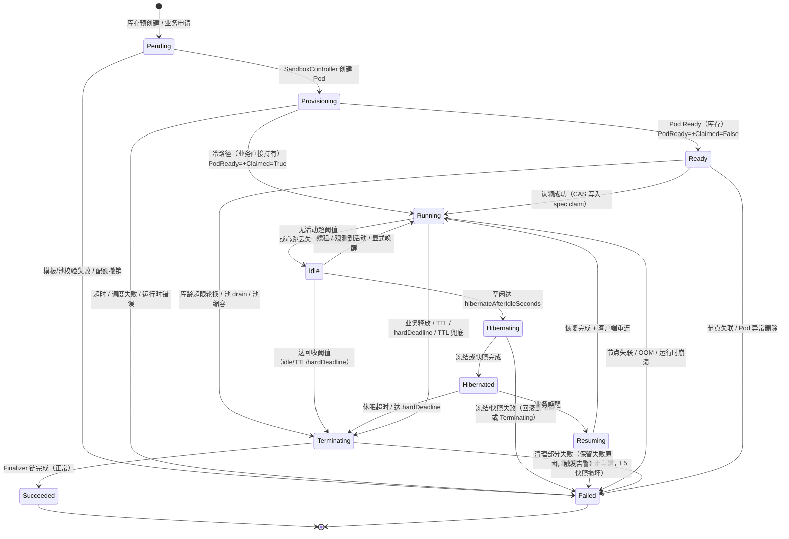

# 04 · CRD API 与生命周期状态机

[← 上一篇：总体架构](03-architecture.md) | [返回导航](../README.md) | [下一篇：预热池与弹性伸缩 →](05-warm-pool-and-scaling.md)

---

## 0. API 设计原则

| 原则 | 说明 |
|---|---|
| **P1 业务不直接操作 K8s** | `AgentSandbox` 是平台内部对象；租户只能通过 `sandbox-gateway` 的 REST/gRPC 访问。理由：K8s RBAC 无法表达"只能看属于自己租户的对象"，把授权放到 gateway 才能正确实现多租户。 |
| **P2 规格不逐沙箱精调** | `spec.resources.tier` 引用档位，而非直接写 `requests`（见 [07](07-resource-optimization.md)）。 |
| **P3 状态机可全量重建** | 所有状态都能从 CR 内容推导；事件只是唤醒信号，丢失事件不影响正确性。 |
| **P4 声明式而非命令式** | `spec.claim` 表达"期望绑定给谁"，而非"请帮我认领"。 |
| **P5 安全默认值** | 所有布尔安全开关默认取最严值（如不允许跨租户复用）。 |
| **P6 校验前移** | 单对象约束用 CEL（`x-kubernetes-validations`），减少对 Webhook 可用性的依赖。 |

---

## 1. 资源范围与命名空间

| CRD | Scope | 所在命名空间 | 可写者 | 说明 |
|---|---|---|---|---|
| `SandboxTemplate` | **Cluster** | — | 平台管理员 | 平台策展的规格模板（镜像、档位、出口档位） |
| `SandboxPool` | **Cluster** | — | 平台管理员 | 池策略，与节点池一一对应 |
| `AgentSandbox` | **Namespaced** | `sandbox-pool` | gateway / operator | 沙箱实例（库存与已认领共用同一 CR） |

租户私有资源（`Secret`、`PersistentVolumeClaim`）放在 `sandbox-tenant-<id>`，由 `AgentSandbox.spec` 引用；沙箱 Pod 本身跑在 `sandbox-pool`。

> **为什么池库存与已认领对象是同一类 CR 的同一命名空间？**
> 若拆成两类（`SandboxStock` / `Sandbox`），认领时需"删除+重建"，会产生窗口期与 ID 变更，业务持有的句柄失效。用同一对象 + `spec.claim` 字段变更实现**原地转正**，`sandboxID` 稳定不变。

---

## 2. `SandboxTemplate`（Cluster）

```yaml
apiVersion: sandbox.example.com/v1alpha1
kind: SandboxTemplate
metadata:
  name: python-3.12
spec:
  # ---- 镜像与执行 ----
  image: registry.internal/py-sandbox:3.12-2026.09
  imagePullPolicy: IfNotPresent        # 节点已预热，避免每次都校验
  command: ["/usr/local/bin/sandbox-entry"]
  workingDir: /workspace
  env:
    - name: PYTHONUNBUFFERED
      value: "1"
    - name: SANDBOX_ID
      valueFrom: { fieldRef: { fieldPath: metadata.name } }
  # 环境变量来自租户 Secret（不落地到平台侧）
  envFromSecretRef:
    - name: TENANT_CREDENTIALS     # 注入为环境变量前缀
      secretRef: { name: tenant-creds }
      optional: false

  # ---- 启动与就绪 ----
  startupProbe:  { exec: { command: ["/usr/local/bin/sandbox-health"] }, periodSeconds: 1, failureThreshold: 30 }
  readinessProbe: { exec: { command: ["/usr/local/bin/sandbox-ready"] }, periodSeconds: 2, failureThreshold: 3 }
  # 注意：Kata/Tetragon 观测需要进程可被识别
  sandboxEntrypointProcess: sandbox-entry

  # ---- 资源档位（可选档位白名单） ----
  allowedTiers: [tiny, small, medium, large]
  defaultTier: small
  tierOverrides:
    large:
      # 允许为特定档位微调（仍以档位为调度单位）
      cpuRequestBurst: "2"

  # ---- 生命周期与复用 ----
  defaults:
    ttlSecondsAfterCreation: 7200
    idleTimeoutSeconds: 300
    heartbeatGraceSeconds: 60
    reclaimPolicy: ReturnToPool      # ReturnToPool | Destroy
    allowSameTenantReuse: true       # 同租户复用（需 resetHook）
    maxClaimCount: 20                # 复用次数上限，超过则销毁重建
  resetHook:
    # 复用前必跑的清理脚本：清工作区、杀残留进程、轮换凭证
    exec: { command: ["/usr/local/bin/sandbox-reset"] }
    timeoutSeconds: 20

  # ---- 存储 ----
  volumes:
    - name: workspace
      ephemeral: { sizeLimit: 2Gi, storageClassName: local-nvme }
      mountPath: /workspace
    - name: tmp
      emptyDir: { sizeLimit: 512Mi, medium: "" }
      mountPath: /tmp
    - name: cache
      hostPath: { path: /var/cache/sandbox/py312, type: DirectoryOrCreate }
      mountPath: /root/.cache
      readOnly: true

  # ---- 网络（档位化，不直接暴露域名） ----
  egressProfile: default-llm
  ingress: { allowGatewayOnly: true }    # 只有 gateway 可连入

  # ---- 隔离与调度 ----
  isolation:
    preferredRuntimeClass: kata-fc
    allowedRuntimeClasses: [kata-fc, kata-clh, runc]
  scheduling:
    nodeSelector: { sandbox.example.com/isolation: kata-fc }
    priorityClassName: sandbox-interactive

  # ---- 空闲判定（辅助信号） ----
  idleSignals:
    requireHeartbeat: true
    treatNetworkActivityAsActive: true
    treatCpuAboveMilli: 50
  status:
  phase: Active                       # Active | Deprecated | Retired
  observedTiers:                      # 由 ResourceOptimizer 回写（画像结果）
    - tier: small
      p95CpuMilli: 210
      p95MemMiB: 380
      sampleCount: 12034
      lastEvaluated: "2026-09-21T03:00:00Z"
```

### 档位定义（平台级 ConfigMap，非 CRD）

```yaml
apiVersion: v1
kind: ConfigMap
metadata: { name: sandbox-tiers, namespace: sandbox-system }
data:
  tiers.yaml: |
    tiers:
      tiny:   { cpuRequest: "100m",  cpuLimit: "1",    memRequest: "256Mi", memLimit: "512Mi",  maxSandboxesPerNode: 60 }
      small:  { cpuRequest: "250m",  cpuLimit: "2",    memRequest: "512Mi", memLimit: "1Gi",    maxSandboxesPerNode: 40 }
      medium: { cpuRequest: "1",     cpuLimit: "4",    memRequest: "2Gi",   memLimit: "3Gi",    maxSandboxesPerNode: 16 }
      large:  { cpuRequest: "4",     cpuLimit: "8",    memRequest: "8Gi",   memLimit: "10Gi",   maxSandboxesPerNode: 4  }
    # 超卖比 = cpuLimit/cpuRequest；内存超卖仅对 reclaimPolicy=Destroy 的沙箱开放
```

---

## 3. `SandboxPool`（Cluster）

```yaml
apiVersion: sandbox.example.com/v1alpha1
kind: SandboxPool
metadata:
  name: fc-small
spec:
  # ---- 池身份 ----
  isolation: { runtimeClassName: kata-fc, isolationLevel: vm }
  nodePoolSelector: { matchLabels: { sandbox.example.com/isolation: kata-fc } }
  templateRef: { name: python-3.12 }
  tier: small

  # ---- 水位策略 ----
  scaling:
    minWarm: 20                 # 低峰保底库存（保证低峰也有热路径）
    maxWarm: 400                # 上限（防失控烧钱）
    targetWarmBuffer: 30        # 目标 = max(minWarm, predictedDemand) + buffer
    maxProvisionPerSecond: 50
    maxReclaimPerSecond: 30
    # 阻尼（防振荡）
    dampening:
      scaleUpCooldownSeconds: 15
      scaleDownCooldownSeconds: 180        # 缩容远慢于扩容（保守）
      demandWindowSeconds: 120
      ewmaAlpha: 0.3
    prediction:
      mode: EwmaWithTrend       # None | Ewma | EwmaWithTrend | ScheduleProfile
      scheduleProfileRef: { name: business-hours }   # 可选：按时间分布预设
  # ---- 库存健康 ----
  stockPolicy:
    maxStockAgeSeconds: 3600     # 库存超过 1h 未认领 → 轮换销毁（防镜像过期/内存老化）
    rotateBatchSize: 10          # 每周期轮换批量
    stockReadyTimeoutSeconds: 120  # 库存超过 2min 未 Ready → 标记失败并重建
  # ---- 故障与降级 ----
  degradation:
    onRuntimeUnavailable: FailFast      # FailFast | FallbackToRunc | PauseScaling
    onNodeFailuresAbovePercent: 30      # 节点故障超 30% → 暂停扩容（避免雪崩）
  # ---- 优先级与抢占 ----
  priorityBands:
    - { className: sandbox-interactive, minWarmShare: 0.7 }   # 70% 库存留给交互式
    - { className: sandbox-batch,       minWarmShare: 0.3 }
  # ---- 维护 ----
  drain: {}                      # 由运维写入 { enabled: true, reason: "kata upgrade" }
  # ---- 雪崩保护（docs/05 §5）----
  protectMode:
    enabled: true                 # 默认 true；用 *bool 以免"忘记设置"静默关掉保护
    failureRatePercent: 30        # provision 失败率阈值（分母：inflight + failed）
    minSamples: 10                # 样本不足时不做判定（防 1/1 = 100% 误触发）
    apiserverLatencyThresholdMs: 2000
    holdSeconds: 120              # 滞回：进入后至少保持这么久，持续故障则不断续期
    scaleUpThrottlePermille: 500  # 保护期内扩容限速降至 50%
    maxQueueDepth: 200            # 预留：接入层当前快速失败（见下方边界 ③）
status:
  warm: 142                      # 未认领且 Ready
  claimed: 61
  provisioning: 8
  failed: 2
  target: 150
  saturation: 0.42               # claimed / (warm + claimed)
  hitRatio1h: 0.94               # 热路径占比（1 小时滑动窗口）
  claimLatencyP95Ms: 320
  predictedDemand: 120
  conditions:
    - type: ScalingReady
      status: "True"
    - type: NodeCapacitySufficient
      status: "False"
      reason: InsufficientNodes
      message: "need 3 more kata-fc nodes to reach target 150"
  lastScaleDecision:
    at: "2026-09-22T09:14:03Z"
    reason: DemandTrendUp
    delta: +20
  protectMode:
    active: false
    reason: ""                    # ProvisionFailureRate | ApiserverLatency | HoldActive
    since: null                   # 本次（或最近一次）进入保护的时刻
    until: null                   # 滞回期结束时刻
    trips: 0                      # 累计进入次数（持续增长 = 阈值偏低或未真恢复）
    failureRatePermille: 0        # 本次判定用的失败率，供事后复盘
```

> **`SandboxPool` 暴露 `/scale` 子资源**（`spec.scaling.targetWarm` ↔ `status.warm`），供 KEDA/HPA 可选叠加驱动（见 [02](02-tech-selection.md) D5）。

> **保护模式的实现边界**（不要把上面这份 schema 读成"阈值都已生效"）：
>
> ① 失败率的分母是 `inflight + failed`，**不是**严格的 60s 滑动窗口。严格滑窗需要控制器持有内存时间序列，而那种计数器会在重启后清零 —— 恰好在最需要保护的时刻失效；从对象状态推导没有这个性质，代价是它只能看到"当前仍处于 inflight/failed 的对象"。
> ② API Server 延迟判据已定义并参与判定，但控制器的延迟观测**尚未接线**（与 `nodeHeadroom` 一样显式上报"未知"，M3 接入指标管线后补齐）。因此当前实际生效的触发条件只有失败率。
> ③ "高优申请排队（≤200 并发）"未实现：接入层目前是**快速失败**，是否引入排队仍是 [10](10-roadmap-risks.md) Q8 的开放问题。`maxQueueDepth` 因此暂时只是一个对外承诺的上限记录 —— 保留一个不会被读取的字段是有代价的（会被误认为已生效），若 Q8 结案为"继续快速失败"则应删除它。

---

## 4. `AgentSandbox`（Namespaced）

```yaml
apiVersion: sandbox.example.com/v1alpha1
kind: AgentSandbox
metadata:
  name: sbx-7f3a9c2e            # generateName: sbx-
  namespace: sandbox-pool
  labels:
    sandbox.example.com/pool: fc-small
    sandbox.example.com/tier: small
    sandbox.example.com/template: python-3.12
    sandbox.example.com/isolation: kata-fc
    sandbox.example.com/tenant: t-1001        # 库存阶段为 ""
    sandbox.example.com/stateful: "false"     # 影响超卖与回收策略（见 07）
  annotations:
    sandbox.example.com/created-by: gateway
    sandbox.example.com/request-id: req-9f12
spec:
  poolRef: { name: fc-small }
  templateRef: { name: python-3.12 }
  tier: small
  isolation:
    runtimeClassName: kata-fc
    # 逃生舱：仅平台管理员可覆盖，需 CEL + RBAC 双重限制
    override: {}
  lifecycle:
    ttlSecondsAfterCreation: 7200
    idleTimeoutSeconds: 300
    heartbeatGraceSeconds: 60
    hibernateAfterIdleSeconds: 120       # 0 = 不冻结
    reclaimPolicy: ReturnToPool
    terminationGracePeriodSeconds: 30
    onHeartbeatLoss: Grace               # ReclaimImmediately | Grace | Ignore
  claim:
    # 库存阶段为空；gateway 以 CAS 写入后即为"已认领"
    requestedBy:
      tenant: t-1001
      sessionId: sess-abc
      principal: user:alice
      requestId: req-9f12
    priorityClassName: sandbox-interactive
    hardDeadline: "2026-09-22T11:00:00Z"   # 到期强制释放（业务 SLA 兜底）
  workload:
    env: []
    mounts:
      - name: datasets
        objectStorage: { bucket: agent-datasets, prefix: t-1001/sess-abc, mode: ro }
    credentialsSecretRef: { name: t-1001-llm-creds }
  network:
    egressProfile: default-llm
    additionalEgress: []                   # 需审批（由 CEL 限制长度 + 审批注解）
  state:
    externalize: true                      # L3：状态同步到对象存储
    stateURI: s3://agent-state/t-1001/sess-abc
  hibernation:
    enabled: true
    mode: Freeze                           # Freeze | Snapshot | DestroyAndRehydrate
status:
  observedGeneration: 3
  sandboxID: 01HZX...                      # 不可变，业务侧句柄
  phase: Running
  conditions:
    - { type: PodReady,      status: "True",  reason: "",              lastTransitionTime: "2026-09-22T09:00:01Z" }
    - { type: Claimed,       status: "True",  reason: WarmPoolHit,     lastTransitionTime: "2026-09-22T09:00:02Z" }
    - { type: NetworkReady,  status: "True",  reason: PolicyApplied,   lastTransitionTime: "2026-09-22T09:00:02Z" }
    - { type: LeaseHealthy,  status: "True",  reason: HeartbeatOK,     lastTransitionTime: "2026-09-22T09:05:00Z" }
    - { type: StorageReady,  status: "True",  reason: "",              lastTransitionTime: "2026-09-22T09:00:02Z" }
    - { type: Hibernated,    status: "False", reason: NotHibernated,   lastTransitionTime: "2026-09-22T09:00:02Z" }
    - { type: ResourceAdjusted, status: "False", reason: TierStable,   lastTransitionTime: "2026-09-22T09:00:02Z" }
  podName: sbx-7f3a9c2e
  nodeName: node-17
  runtimeClassName: kata-fc
  claimRef:
    tenant: t-1001
    sessionId: sess-abc
    claimedAt: "2026-09-22T09:00:02Z"
    leaseName: sbx-7f3a9c2e
    hardDeadline: "2026-09-22T11:00:00Z"
  access:
    endpoint: "10.2.3.4:7788"
    # 接入令牌短期有效，业务每 10min 由 gateway 轮换
    tokenExpiresAt: "2026-09-22T09:10:00Z"
  activity:
    lastActiveAt: "2026-09-22T09:04:30Z"
    activeConnections: 1
    p95CpuMilli: 210
    p95MemMiB: 380
  budget:
    cpuMilliSecondsUsed: 412000
    memMiBSecondsUsed: 921000
  hibernation:
    state: Active                  # Active | Freezing | Frozen | Restoring
    since: null
  metrics:
    provisionedAt: "2026-09-22T08:59:58Z"
    claimedCount: 3                # 复用次数
    coldPath: false
    recycleReason: null            # IdleTimeout | TTLExpired | ClientReleased | HeartbeatLost
                                   # | NodeLost | PoolDrain | StockRotation | QuotaRevoked | RuntimeError
```

---

## 5. 生命周期状态机

### 5.1 Phase 定义

| Phase | 含义 | 是否占用库存额度 | 可被认领 |
|---|---|---|---|
| `Pending` | CR 已创建，尚未分配 Pod | 是（预留） | ❌ |
| `Provisioning` | Pod 创建中（调度/镜像/VM 启动） | 是 | ❌ |
| `Ready` | **池中库存**：Pod Ready、策略已就绪、未认领 | 是 | ✅ |
| `Running` | 已认领且在使用 | 否（计入 claimed） | ❌ |
| `Idle` | 已认领但无活动（等待回收阈值） | 否 | ❌ |
| `Hibernating` | 正在冻结/快照 | 否 | ❌ |
| `Hibernated` | 已休眠（CPU 已释放） | 否 | ❌ |
| `Resuming` | 正在唤醒 | 否 | ❌ |
| `Terminating` | 正在执行 Finalizer 链 | 否 | ❌ |
| `Succeeded` | 正常结束 | 否 | ❌ |
| `Failed` | 异常终止（保留原因） | 否 | ❌ |

> **`Ready` 与 `Running` 的区分是整个设计的支点**：`Ready` 表示"库存"，`Running` 表示"已售出"。池水位 = `count(phase=Ready)`。

### 5.2 状态迁移图



### 5.3 迁移详情表（触发 · 动作 · 超时）

| 迁移 | 触发条件 | 控制器动作 | 超时/兜底 |
|---|---|---|---|
| `Pending → Provisioning` | 队列消费该 CR | `Create` Pod（RuntimeClass/nodeAffinity/PriorityClass），写 `status.podName` | 10s 未创建成功 → `Failed(ProvisionFailed)` |
| `Provisioning → Ready` | Pod `Ready` 且 `spec.claim` 为空 | 应用 CNP、创建 Lease（未激活）、写 `Ready` | `stockReadyTimeoutSeconds`(120s) → `Failed(ProvisionTimeout)` |
| `Provisioning → Running` | 冷路径：Pod `Ready` 且 `spec.claim` 非空 | 激活 Lease、令牌签发、写 `Running` | 同上 |
| `Ready → Running` | gateway 写入 `spec.claim`（CAS） | 校验租户配额、签发短期接入令牌、`Claimed=True`、重置空闲计时 | 校验失败 → 回滚 `claim` 并事件告警 |
| `Running → Idle` | `now - lastActiveAt > idleTimeout` 或心跳丢失（`Grace`/`ReclaimImmediately`） | 写 `Idle` + `recycleReason`；`ReclaimImmediately` 直接转 `Terminating` | 观测到活动 → 回 `Running`（保守） |
| `Idle → Hibernating` | 空闲 ≥ `hibernateAfterIdleSeconds` 且 `hibernation.enabled` | 节点侧执行冻结/快照（node-agent 或 Pod 内 hook） | 60s → 回 `Idle` 并告警 |
| `Idle/Hibernated → Terminating` | 空闲/TTL/`hardDeadline` 超阈值，或休眠超时 | 开始 Finalizer 链，进入限速队列 | 回收限速 `maxReclaimPerSecond` |
| `Terminating → Succeeded` | Finalizer 链全部成功 | Lease→CNP→(状态同步)→PVC→Pod | 单步 30s 超时 → 记录 `Failed` 并强制推进（避免卡死） |
| 任意 `→ Failed` | 节点失联 / Pod 异常 / 运行时错误 | 标记原因、清理关联资源、通知业务 | `NodeLost` 检测依赖 Lease TTL（≤60s） |
| `Ready → Running`（复用） | 同租户申请命中已有库存 | 若 `claimedCount ≥ maxClaimCount` 或跨租户 → 拒绝并触发库存轮换 | — |

### 5.4 状态机不变式（Invariants，必须由测试守护）

| ID | 不变式 |
|---|---|
| INV-1 | `phase ∈ {Ready}` ⟺ `spec.claim` 为空 且 `Pod.Ready` 为真 |
| INV-2 | `phase ∈ {Running, Idle, Hibernating, Hibernated, Resuming}` ⟹ `spec.claim` 非空 |
| INV-3 | `claimedCount ≤ templateSpec.defaults.maxClaimCount` |
| INV-4 | `claimRef.tenant` 一旦写入，**不可变更**（CEL 规则），仅可清空后重认领 |
| INV-5 | `status.sandboxID` 一经生成不可变 |
| INV-6 | 任意时刻 `count(phase=Ready) ≤ pool.spec.scaling.maxWarm` |
| INV-7 | 存在 `deletionTimestamp` 时，不接受新的 `spec.claim` 写入 |
| INV-8 | 每个 `AgentSandbox` 至多关联 1 个 Pod、1 个 Lease |

---

## 6. Finalizer 与资源回收

### 6.1 Finalizer 清单与顺序

```yaml
finalizers:
  - sandbox.example.com/lease-cleanup          # 1. 删除 Lease（让业务侧感知"已死"）
  - sandbox.example.com/network-cleanup        # 2. 删除 CNP/NetworkPolicy（先断网，防外泄）
  - sandbox.example.com/state-flush            # 3. 触发状态外置落盘（L3，带超时）
  - sandbox.example.com/volume-cleanup         # 4. 清理残余 PVC/本地卷
  - sandbox.example.com/metrics-finalize       # 5. 上报最终用量与回收原因到外部系统
```

> Pod 由 `ownerReferences` 自动 GC，无需 Finalizer；但为可观测性，仍在 `metrics-finalize` 前显式确认 Pod 已删除（带超时）。

### 6.2 清理顺序的设计理由

1. **先断网再落盘**：避免落盘过程中沙箱继续外发数据。
2. **先删 Lease**：Lease 是业务侧"沙箱是否存活"的信号；先释放可让客户端更快失败转移。
3. **状态落盘在断网之后、删卷之前**：此时卷仍可读。
4. **每步超时 + 强制推进**：Finalizer 卡死是 Operator 最常见的严重故障；每步 30s 超时后记录失败并继续，宁可泄漏也不能锁死删除流程（泄漏由对账 Job 兜底）。

### 6.3 泄漏对账（Reconciliation Sweeper）

独立 CronJob 每 5 分钟运行：

| 检查 | 处理 |
|---|---|
| 存在 Pod 但无对应 `AgentSandbox`（孤儿 Pod） | 删除 Pod 并告警（应为 0） |
| 存在 Lease 但无对应 `AgentSandbox` | 删除 Lease |
| 存在 CNP 但无对应 `AgentSandbox` | 删除 CNP |
| `AgentSandbox` 超过 `hardDeadline + 10min` 仍未删除 | 强制清理并告警 |
| 处于 `Pending` 超过 30min | 标记 `Failed` 并上报（疑似容量不足或调度失败） |
| `status.phase=Ready` 但 Pod 不存在 | 转 `Failed` 并触发池补货 |
| 节点已不存在但仍有 `Running` 沙箱 | 转 `Failed(NodeLost)` |

**这条对账链路是"泄漏率 0"目标的实际保障**：状态机处理正常路径，对账处理一切异常路径。

---

## 7. Webhook 与 CEL 校验

### 7.1 CEL（单对象，无需 Webhook）

```yaml
# AgentSandbox CRD 中的 x-kubernetes-validations
- rule: "!(has(self.claimRef.tenant) && self.claimRef.tenant != '') || !has(oldSelf.claimRef)"
  message: "claim 一旦绑定不可直接改写，需先 release（清空再重认领）"
- rule: "self.lifecycle.ttlSecondsAfterCreation <= 86400"
  message: "TTL 上限 24 小时，长任务请拆分或申请专用池"
- rule: "self.lifecycle.hardDeadline == '' || duration(self.lifecycle.hardDeadline) <= duration('24h')"
  message: "hardDeadline 距创建不得超过 24h"   # 实际用 timestamp 比较
- rule: "self.network.additionalEgress.size() <= 5"
  message: "额外出口条目最多 5 条，且需审批注解 approval.sandbox.example.com/granted"
- rule: "self.tier in ['tiny','small','medium','large']"
  message: "未知档位"
- rule: "!self.state.externalize || self.state.stateURI != ''"
  message: "启用状态外置必须提供 stateURI"
```

### 7.2 ValidatingAdmissionPolicy / Webhook（跨对象）

| 校验 | 原因 | 实现 |
|---|---|---|
| 租户并发沙箱数 ≤ 配额 | 需读配额对象 + 计数 | Webhook（缓存计数，非实时 List） |
| `templateRef` 与 `poolRef` 兼容（tier 在 `allowedTiers` 内、RuntimeClass 在 `allowedRuntimeClasses` 内） | 跨对象 | Webhook（缓存模板） |
| RuntimeClass 在当前环境可用（`simulated`/`runc`/`kata-fc` 存在） | 依赖集群能力 | Webhook 启动时探测 + 定时刷新 |
| `additionalEgress` 具备审批注解 | 安全合规 | ValidatingAdmissionPolicy + 注解断言 |
| 创建者具备租户 RBAC（`principal` 与 `requestedBy.tenant` 一致） | 防越权 | gateway 已鉴权，Webhook 二次校验签名头 |

> **Webhook 不可用时的策略**：`failurePolicy: Fail`（对 `AgentSandbox`，因为错误规格会造成资源与安全后果）；但配额类校验降级为"记录并放行"，避免 Webhook 故障导致全站不可用。此为显式取舍，需在 SLO 中说明。

---

## 8. Gateway 业务 API 契约

| 方法 | 路径 | 说明 | 幂等 |
|---|---|---|---|
| `POST` | `/v1/sandboxes` | 申请沙箱 | 用 `Idempotency-Key` 头 |
| `GET` | `/v1/sandboxes/{id}` | 查询状态与接入信息 | ✅ |
| `POST` | `/v1/sandboxes/{id}:renew` | 续租（刷新心跳与令牌） | ✅ |
| `POST` | `/v1/sandboxes/{id}:release` | 显式释放 | ✅ |
| `POST` | `/v1/sandboxes/{id}:hibernate` | 手动休眠 | ✅ |
| `POST` | `/v1/sandboxes/{id}:wake` | 唤醒 | ✅ |
| `GET` | `/v1/pools` | 池水位（管理员） | ✅ |
| `POST` | `/v1/pools/{name}:drain` | 排空池（管理员） | ✅ |

### 申请响应示例

```json
{
  "id": "sbx-7f3a9c2e",
  "sandboxId": "01HZX8K2...",
  "phase": "running",
  "access": {
    "endpoint": "10.2.3.4:7788",
    "token": "<短期令牌，10min 有效>",
    "protocol": "ws"
  },
  "isolation": "kata-fc",
  "tier": "small",
  "expiresAt": "2026-09-22T11:00:00Z",
  "path": "warm",
  "claimLatencyMs": 312,
  "renewIntervalSeconds": 60
}
```

### 错误语义（关键：让业务能正确退避）

| HTTP | 场景 | 业务应做什么 |
|---|---|---|
| `429` + `Retry-After` | 租户配额/速率超限 | 指数退避重试 |
| `503` + `Retry-After` | 池空且优先级不足（快速失败） | 退避重试或降级到自有环境 |
| `409` | 认领冲突（内部重试已耗尽） | 立即重试（幂等键） |
| `410 Gone` | 沙箱已被回收（`recycleReason` 给出原因） | 重建沙箱并恢复状态（L3） |
| `422` | 规格非法（档位/RuntimeClass/出口） | 修正请求，不重试 |
| `507` | 集群容量不足 | 退避重试 + 告警 |

---

## 9. 版本演进策略

| 阶段 | 版本 | 内容 |
|---|---|---|
| M1–M2 | `v1alpha1` | 核心字段；`served: true, storage: true`；允许破坏性变更 |
| M3 | `v1beta1` | 字段冻结；新增字段只增不删、不加必填；开启 conversion webhook |
| M4+ | `v1` | 承诺兼容性；`v1alpha1` 转为 `served: false` 并给出弃用窗口 |

**演进规则**：

1. CRD 必须从第一天就开启 `subresources: { status: {} }`，否则后续无法拆分状态写入。
2. 列表类字段一律用 `+listType=map` / `+listMapKey`，保证 SSA 与合并不产生意外覆盖。
3. 不做字段删除，只做"标记 `deprecated` + 停止读取 + 计划下线"。
4. 每次 CRD 变更都需经过 **upgrade/downgrade 测试**（上一个 Operator 版本读新 CRD，反之亦然），纳入 CI。

---

## 10. 与需求/SLO 的对应

| 需求 | 落点 |
|---|---|
| FR-1 声明式申请 | `AgentSandbox.spec` + gateway API（§8） |
| FR-3/FR-4 状态机与回收 | §5 状态机、§6 Finalizer |
| FR-5 泄漏防护 | §6.3 对账 Sweeper + INV 不变式 |
| FR-6 心跳 | `Lease` + `Idle` 双向判定（§5.3） |
| FR-7 休眠 | `spec.hibernation` + `Idle/Hibernating/Hibernated/Resuming` |
| FR-10 优先级抢占 | `lifecycle.priorityClassName` + pool `priorityBands` |
| FR-12 配额限流 | CEL + Webhook（§7）+ gateway 令牌桶 |
| FR-13 业务接口 | §8 |
| FR-14 审计 | `metrics-finalize` + 事件（见 [08](08-observability-security.md)） |
| NFR 可测试性 | INV 不变式 + envtest（见 [10](10-roadmap-risks.md)） |

---

[← 上一篇：总体架构](03-architecture.md) | [返回导航](../README.md) | [下一篇：预热池与弹性伸缩 →](05-warm-pool-and-scaling.md)
