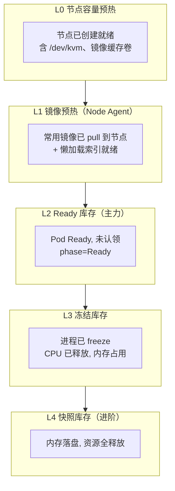
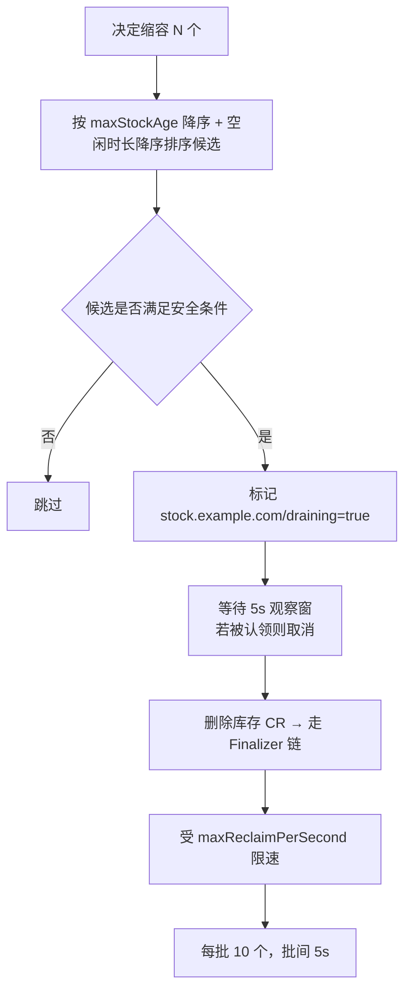
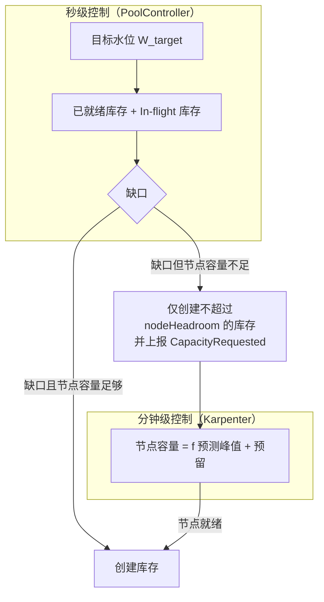

# 05 · 预热池与弹性伸缩

[← 上一篇：API 与状态机](04-api-and-state-machine.md) | [返回导航](../README.md) | [下一篇：隔离与运行时 →](06-isolation-runtime.md)

---

## 1. 为什么必须做池：延迟预算倒推

冷路径的总延迟（见 [03 §4.2](03-architecture.md)）由**不可压缩的部分**主导：

| 阶段 | 是否可优化 | 优化下限 |
|---|---|---|
| API 写入 + Admission | ✅ | ~30 ms |
| 调度 | ✅ | ~100 ms |
| 镜像就绪 | ⚠️ | 有缓存 ~50 ms，无缓存 300–1200 ms |
| microVM 启动 | ❌（物理下限） | Firecracker ~120–350 ms |
| 容器就绪 + 探针 | ⚠️ | ~200 ms |

即使全部优化到位，冷路径下限仍在 **0.8–1.0 s**（P95 约 2 s）。而已认领的库存沙箱**认领开销仅为一次 API Patch + 令牌签发**（~100 ms 网络 + ~10 ms 服务端）。

> **结论：要达到 S1 场景的 P95 < 800ms，唯一可行路径是池化。** 这不是"优化"，而是"唯一解"。

### 1.1 命中率与延迟的关系

设命中率 $h$，热路径延迟 $L_w = 300\text{ms}$，冷路径延迟 $L_c = 2.0\text{s}$：

$$L_{P95} \approx h \cdot L_w + (1-h) \cdot L_c \quad (\text{近似，忽略分布形状})$$

$$L_{P95} < 800\text{ms} \implies 0.3h + 2.0(1-h) < 0.8 \implies h > 0.706$$

$$L_{P99} < 1.5\text{s} \implies h > 0.29 \text{ (P99 由尾部决定，需更细的分布建模)}$$

**设计含义**：命中率 70% 是 SLO 的硬底线，但 P99 会被 30% 的冷路径彻底污染。因此：

- 稳态命中率目标定在 **> 90%**（为 P99 留出余量）。
- **且必须保证冷路径不被"批量冷启动"雪崩**：突发 200/s 全部走冷路径时会压垮节点。所以需要 §5 的"降级 + 快速失败"。

---

## 2. 池的四个层级（分层预热）



| 层级 | 每单位资源成本 | 恢复时延 | 本项目的取舍 |
|---|---|---|---|
| L0 节点预留 | 极高（整机） | 0 | 必须做，但由 Karpenter 管理，仅保底容量 |
| L1 镜像预热 | 低（磁盘） | 省 300–1200 ms | ✅ 全节点做，成本收益比最高 |
| **L2 Ready 库存** | 中（完整资源占用） | ~300 ms | ✅ **主力**，按水位维持 |
| L3 冻结库存 | 中（内存，无 CPU） | ~1.5 s | ✅ 长空闲场景使用（S4） |
| L4 快照库存 | 低（仅对象存储） | 100–300 ms | ⚠️ 需自研，M4 评估 |

> **重要观察**：**L1 是"免费"的优化**（磁盘便宜，收益大），应无条件先做好。很多团队跳过 L1 直接做 L2 池化，导致池节点上仍然要等镜像，白白浪费了池的成本。**顺序必须是 L1 → L2 → L3 → L4。**

---

## 3. 水位算法

### 3.1 目标水位公式

$$W_{target} = \max\left(W_{min},\ \hat{D}\right) + B_{safe}$$

其中：

- $\hat{D}$：对未来 $T_{replenish}$ 时间内需求的预测
- $B_{safe}$：安全库存（buffer）

### 3.2 安全库存：为什么用平方根法则

把池看作一个**库存系统**（这是运筹学中经典的 newsvendor / safety stock 问题）：

$$B_{safe} \approx z \cdot CV \cdot \sqrt{\hat{D} \cdot \frac{T_{replenish}}{T_{sample}}}$$

- $z$：服务水平系数（命中率 90% → $z \approx 1.28$；95% → 1.65）
- $CV = \sigma/\mu$：需求变异系数（Agent 负载通常 0.5–1.5，**波动很大**）
- $T_{replenish}$：补货时间（从"决定扩容"到"库存 Ready"的**实际**时间）
- $T_{sample}$：采样窗口

**这个公式驱动了两个极其重要的设计结论**：

| 结论 | 说明 |
|---|---|
| **C1：补货时间越短，所需 buffer 越小（平方根关系）** | $T_{replenish}$ 从 120s 降到 30s，buffer 可减少 50%。所以**加快补货比加大 buffer 更省资源**。补货时间的主导项是"节点已就绪 + L1 镜像已预热"。 |
| **C2：需求波动直接放大成本** | $CV$ 从 1.0 降到 0.5 可省 50% 库存。所以**削峰填谷（业务侧排队/租约批量申请）比平台侧硬扛更有效**——这应写进业务契约。 |

### 3.3 纯放大公式的替代：闭环水位控制（推荐实现）

预测公式给出**前馈**，实际实现还需**反馈**修正。推荐控制器形式：

```
每 5 秒评估：
  # 1. 观测量
  warm      = count(phase=Ready)
  inflight  = count(phase=Pending|Provisioning)
  rate_in   = 认领速率（滑动 30s）
  rate_out  = 回收速率（滑动 30s）
  hit_ratio = 1h 滑动命中率

  # 2. 预测需求（EWMA + 趋势）
  demand_hat = ewma(rate_in) * T_replenish + trend_correction * horizon

  # 3. 反馈修正：命中率不足则加权上调
  error      = target_hit_ratio - hit_ratio
  feedback   = clamp(1 + kp*error + ki*∫error, 0.8, 1.8)   # 抗积分饱和

  # 4. 目标
  target = max(minWarm, demand_hat * feedback) + buffer
  target = min(target, maxWarm)

  # 5. 阻尼 + 限速
  delta  = clamp(target - (warm + inflight), -reclaim_rate, provision_rate)
  if cooldown_active: delta = 0
```

### 3.4 防抖动（这是池化最容易翻车的地方）

| 机制 | 参数 | 作用 |
|---|---|---|
| **冷却期（Cooldown）** | 扩容 15s / 缩容 180s | 非对称：扩容要快，缩容要慢 |
| **滞回（Hysteresis）** | 扩容阈值 +5%，缩容阈值 −10% | 防止在目标附近反复进出 |
| **限速** | `maxProvisionPerSecond` / `maxReclaimPerSecond` | 保护 API Server 与 CNI |
| **阻尼（Damping）** | 变化量上限 = 当前水位 × 20%/周期 | 防止一次大幅跳变 |
| **预测窗口平滑** | EWMA α=0.3 | 抑制尖峰噪声 |
| **震荡检测** | 记录 5 分钟内方向反转次数 > 3 → 冻结决策并告警 | 显式暴露问题，而非任其震荡 |

**实测建议**：先用 `minWarm` 静态水位跑通，再打开预测。预测算法引入的抖动往往比它带来的收益更值得警惕。

---

## 4. 缩容：drain 而非 kill

缩容**绝不能**简单删除库存对象。正确流程：



**安全条件（全部满足才可回收）**：

1. `phase == Ready` 且 `spec.claim` 为空（由状态机保证）
2. 该库存存在时间 ≥ `maxStockAgeSeconds` **或** 池水位超出目标 ≥ 10%（滞回）
3. 节点未处于排水/维护状态（避免与节点运维打架）
4. 该池的 `drain.enabled == false`
5. 不在"冷启动突发保护窗口"内（最近 60s 内有申请被拒）

**为什么先 drain 再删**：库存删除不是瞬时操作（Finalizer 链需 1–3s）。若直接批量删，会出现"水位已判减但库存尚未消失"的窗口，下个周期再次判减 → 过度缩容。`draining` 标记让这类对象从水位统计中排除，避免重复决策。

---

## 5. 池空时的降级路径

池不可能 100% 命中。池空时的行为决定了系统是"优雅降级"还是"雪崩"：

| 优先级 | 池空时行为 | 理由 |
|---|---|---|
| `sandbox-interactive`（高） | **允许冷路径**（新建，P95 2.5s），最多等待 `coldPathBudget` + 在 queue 中排队 5s | 交互式用户能接受 2.5s，不能接受失败 |
| `sandbox-batch`（低） | **快速失败 503 + Retry-After: 10** | 批处理可退避，不应占用冷路径容量挤掉交互式 |
| `sandbox-system`（内部） | 允许冷路径，保留专用 `minWarm` 份额 | 不能因业务高峰影响平台自身 |

**雪崩保护（关键）**：

```
if 近 60s 内 provision 失败率 > 30% 或 API Server P99 > 2s:
    进入 ProtectMode（持续 120s）:
        - 拒绝所有低优申请
        - 高优申请降级为"排队"，最多 200 并发
        - 池扩容限速降至 50%
        - 触发告警 + 事件
```

没有 ProtectMode 的系统在容量危机下会**自我放大**：扩容请求压垮 API Server → 更多超时 → 更多重试 → 彻底不可用。这是必须实现的组件。

**实现状态与边界**（代码：`internal/controller/protect.go`、`internal/gateway/store.go`）：

| 文档要求 | 实现情况 |
|---|---|
| 失败率 > 30% → 进入保护 | ✅ 分母是 `inflight + failed`（不是严格 60s 滑窗，理由见下） |
| API Server P99 > 2s → 进入保护 | ⚠️ 判据已实现且参与判定，但延迟观测本身**尚未接线**（显式上报"未知"，M3 接入指标管线） |
| 持续 120s（滞回） | ✅ 触发条件持续存在则不断续期；条件消失后仍保持到 `until` 过期 |
| 拒绝所有低优申请 | ✅ 接入层在 `ClaimWarm` 与 `CreateCold` 两个入口都拦；拒绝用 **503 + `protect_mode`**（独立错误码），带 `Retry-After: 10` |
| 高优降级为排队（≤ 200 并发） | ❌ 未实现 —— 接入层是快速失败，"是否排队"仍是 [10](10-roadmap-risks.md) Q8 的开放问题 |
| 池扩容限速降至 50% | ✅ 只压**扩容**方向（缩容不受影响 —— 保护期恰恰是应该允许回收资源的时候） |
| 触发告警 + 事件 | ⚠️ 已有 Event（`ProtectModeEnabled` / `ProtectModeDisabled`，仅在状态**变化**时发）与 Condition（`ProtectModeNormal=False`）；指标待 M3 |

两个关键设计取舍：

1. **触发状态只存一份**：控制器判定并写入 `status.protectMode`，接入层只读。两边各自算一遍必然会在某一轮出现分歧，而分歧的表现（控制器认为已恢复、gateway 仍在拒绝）从任一组件都解释不了。
2. **失败率的分母不是"池里全部沙箱"**：那样一个 5000 实例的健康池即使新建全部失败，失败率也只有 0.1% —— 保护永远不会触发，而那正是它唯一要应对的场景。`inflight + failed` 是"尚未确认成功 + 已经失败"的那批，正常时接近 0、故障时迅速逼近 1。代价是它**不是**严格滑窗，只能看到当前仍处于这两个状态的对象。

> 失败方向刻意是**开放**的（读不到池、状态未知、优先级未知一律放行）：误拒一个正常业务是可用性事故，放行一个批处理只是多占一点冷路径容量。这与"跳租户复用硬编码禁止"那类安全边界取的方向相反，因为两者一个是不对称的可用性权衡、一个是不可谈判的安全边界。

---

## 6. 与节点自动扩缩的协同（最易踩坑处）

### 6.1 时间常数不匹配问题

| 动作 | 典型耗时 |
|---|---|
| 池扩容（库存创建） | 300 ms – 2 s |
| **节点扩容（Karpenter 创建 metal 节点）** | **90 s – 5 min** |
| 池缩容 | 受 `maxReclaimPerSecond` 限制，数十秒 |

**问题**：池的控制周期是秒级，节点是分钟级。若池按"目标水位"直接扩容，会在节点尚未就绪时反复产生 Pending 库存 → 触发 Karpenter 超量扩容 → 节点就绪后库存过剩 → 缩容 → 节点 Consolidation 缩容 → 下个峰值又来一遍。**形成分钟级的低频振荡，且直接烧钱。**

### 6.2 解决方案：分层容量契约



**具体配置要点**：

1. **节点容量预铺（Capacity Reservation）**：维护一组**低优先级占位 Pod**（`pause` 镜像，`PriorityClass: sandbox-placeholder`，负优先级）。它们不消耗实际 CPU，但让 Karpenter 认为节点已被占用，从而**提前把节点准备好**。真正的沙箱 Pod 因优先级更高会**抢占**占位 Pod，实现"节点已就绪但资源可用"。

   ```yaml
   # 占位 Pod（PoolController 按 capacityReservation 数量维护）
   priorityClassName: sandbox-placeholder     # 值 = -10，低于所有真实沙箱
   spec:
     containers:
       - name: pause
         image: registry.k8s.io/pause:3.10
         resources:
           requests: { cpu: "250m", memory: "512Mi" }   # 与目标档位一致
   ```

2. **`do-not-disrupt`**：库存与运行中的沙箱 Pod 打 `karpenter.sh/do-not-disrupt: "true"`；占位 Pod **不打**（可被驱逐，这正是它的用途）。

3. **Karpenter `NodePool` 最小容量**：`spec.limits` 只做上界，**下界靠占位 Pod 保障**（Karpenter 无 minValues 语义时）。若使用 `consolidationPolicy: WhenEmpty`，须确认占位 Pod 不被计入（占位 Pod 应打 `karpenter.sh/do-not-consolidate` 或使用 `consolidateAfter` 足够长）。

4. **缩容顺序**：先削减占位 Pod（释放节点压力），观察一段时间后再让 Karpenter Consolidation 缩节点；**绝不允许节点缩容先于池缩容**（否则库存被驱逐）。

5. **`PodDisruptionBudget`**：池库存需 PDB（`minAvailable` 或 `maxUnavailable: 10%`）保护，避免节点排水时一次性清空池。

---

## 7. 池的运维操作

### 7.1 Drain（排空）

```yaml
# 维护窗口：Kata 升级前
spec:
  drain:
    enabled: true
    reason: "kata-containers 3.3.0 -> 3.4.0"
    graceSeconds: 600        # 停止认领后等待现有会话结束的最长时间
```

Drain 语义：

1. 立即将该池从 gateway 的候选池列表中移除（新申请走其他池或冷路径）。
2. 停止扩容。
3. 未认领库存立即进入 `Terminating`。
4. 已认领沙箱：不主动杀，等待自然释放；超过 `graceSeconds` 后按优先级（先 batch 后 interactive）强制回收并通知业务。
5. `status.conditions[Drained]=True` 后允许节点升级。

### 7.2 手动扩缩

`kubectl patch sandboxpool fc-small --type=merge -p '{"spec":{"scaling":{"minWarm":200}}}'`，控制器在下一周期（≤5s）响应。

### 7.3 熔断开关

| 开关 | 作用 |
|---|---|
| `pauseScaling: true` | 冻结所有自动扩缩（排查问题时） |
| `disableColdPath: true` | 只服务池内申请（保护节点） |
| `maxWarm: 0` | 完全关闭池（成本失控时的一键止血） |

---

## 8. 容量规划公式（用于估算节点数）

### 8.1 并发沙箱数（Little's Law）

$$N_{concurrent} = \lambda_{arrival} \times \bar{W}_{session}$$

例：峰值到达 5 沙箱/秒 × 平均驻留 600 秒 = **3,000 并发沙箱**。

### 8.2 所需节点数

$$N_{nodes} = \left\lceil \frac{\sum_{i} N_i \cdot r_i}{\eta \cdot C_{node}} \right\rceil \times \frac{1}{overcommit} \times (1 + \text{碎片率})$$

其中：

- $N_i$：第 $i$ 类沙箱的并发数，$r_i$：其档位请求资源
- $C_{node}$：节点可分配资源（扣除 `system-reserved` 与 Kata VMM 开销）
- $\eta$：目标利用率上限（建议 0.7，留出突发余量）
- $overcommit$：超卖比（CPU 可达 2–4，内存建议 ≤ 1.5，见 [07](07-resource-optimization.md)）
- 碎片率：初始按 0.15 估算（见 [07](07-resource-optimization.md) 的装箱分析）

### 8.3 示例验算

假设：2,400 个 `small`（0.25C/512Mi）+ 600 个 `medium`（1C/2Gi），节点 16C/64G（可分配 14C/56G），$\eta=0.7$，CPU 超卖 2x，内存超卖 1.4x：

| 资源 | 需求 | 有效容量/节点 | 节点数 |
|---|---|---|---|
| CPU | 2400×0.25 + 600×1 = 1,200 C | 14 × 0.7 × 2 = 19.6 C | **62** |
| 内存 | 2400×0.5 + 600×2 = 2,400 GiB | 56 × 0.7 × 1.4 = 54.9 GiB | **44** |
| 沙箱数上限 | 3,000 | 40 个/节点（`maxSandboxesPerNode`） | **75** |

→ 受**沙箱密度上限**约束，取 **75 节点**（再乘 1.15 碎片率与故障域冗余 → 约 **86 节点**）。

**洞察**：本例中瓶颈不是 CPU/内存，而是 **`maxSandboxesPerNode`**（Kata 每 VM 的 VMM 开销与 IP 地址池限制）。这说明**优化方向应与直觉不同**：应优先降低每沙箱固定开销，而不是压缩 requests。

---

## 9. 指标与告警

| 指标 | 类型 | 用途 | 告警阈值 |
|---|---|---|---|
| `sandbox_pool_warm{pool}` | Gauge | 库存水位 | `< minWarm × 0.5` 持续 2min → 警告 |
| `sandbox_pool_target{pool}` | Gauge | 目标水位 | 用于排查控制器 |
| `sandbox_pool_saturation{pool}` | Gauge | `claimed/(warm+claimed)` | `> 0.9` 持续 5min → 警告 |
| `sandbox_pool_hit_ratio_1h{pool}` | Gauge | 命中率 | `< 0.85` 持续 10min → 警告 |
| `sandbox_claim_latency_seconds{path}` | Histogram | 分 `warm`/`cold` | `path=warm` P95 > 0.8 → 严重 |
| `sandbox_pool_scale_events_total{pool,direction}` | Counter | 扩缩次数 | 5min 内 direction 反转 > 3 → 震荡告警 |
| `sandbox_provision_duration_seconds{stage}` | Histogram | 分阶段延迟 | 用于定位 L1/L2 瓶颈 |
| `sandbox_pool_stock_age_seconds` | Histogram | 库存年龄分布 | P95 > `maxStockAge` → 检查轮换 |
| `sandbox_protect_mode_active{pool}` | Gauge | 是否处于保护模式 | `> 0` → 严重告警 |
| `sandbox_capacity_request_pending_nodes{pool}` | Gauge | 等待节点的库存数 | `> 0` 持续 5min → 检查 Karpenter |
| `sandbox_placeholder_pods{pool}` | Gauge | 占位 Pod 数 | `== 0` 且 `minWarm > 0` → 配置错误告警 |

---

## 10. 设计取舍小结

| 决策 | 选择 | 备选与代价 |
|---|---|---|
| 池库存表示 | `AgentSandbox` CR | 裸 Pod：无 TTL/状态机，易僵尸 |
| 认领方式 | gateway CAS（乐观锁） | 中心化分配器：单点与吞吐瓶颈 |
| 缩容速度 | 慢于扩容 12 倍 | 对称缩容：资源浪费少但抖动大，用户可感知 |
| 池空行为 | 高优降级冷路径，低优快速失败 | 全部排队：雪崩；全部冷路径：压垮节点 |
| 节点容量 | 占位 Pod 预铺 + 高优抢占 | 依赖 Karpenter 即时扩容：分钟级延迟，池失效 |
| 库存复用 | 同租户 + resetHook + `maxClaimCount` | 跨租户复用：数据泄漏风险，**明确禁止** |

---

[← 上一篇：API 与状态机](04-api-and-state-machine.md) | [返回导航](../README.md) | [下一篇：隔离与运行时 →](06-isolation-runtime.md)
