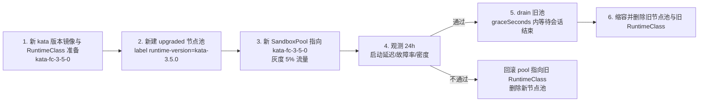

# 06 · 隔离运行时与节点池设计

[← 上一篇：预热池与弹性伸缩](05-warm-pool-and-scaling.md) | [返回导航](../README.md) | [下一篇：资源优化 →](07-resource-optimization.md)

---

## 1. 隔离级别抽象层

代码与 CRD **不感知**具体运行时，只通过一个映射层决定 `RuntimeClass`：

```yaml
apiVersion: v1
kind: ConfigMap
metadata: { name: sandbox-isolation, namespace: sandbox-system }
data:
  levels.yaml: |
    levels:
      simulated:            # 本地 kind/minikube：逻辑验证
        runtimeClassName: ""            # 使用默认 runc
        requiresKvm: false
        allowOvercommit: false          # 保守：本地不做超卖，便于排查
      runc:                 # 可信负载
        runtimeClassName: ""
        requiresKvm: false
        allowOvercommit: true
      kata-fc:              # 主力：不可信 Agent 代码
        runtimeClassName: kata-fc
        requiresKvm: true
        allowOvercommit: true
        overhead: { cpu: "250m", memory: "160Mi" }
      kata-clh:             # 需要更多设备能力时的折中
        runtimeClassName: kata-clh
        requiresKvm: true
        allowOvercommit: true
        overhead: { cpu: "300m", memory: "200Mi" }
```

控制器在启动与每 5 分钟探测：

```
1. GET RuntimeClass 列表
2. 校验每个 level 的 runtimeClassName 是否存在
3. 检查候选节点的 label / taint / .status.nodeInfo.containerRuntimeVersion
4. 不可用 → 写 SandboxPool.condition[RuntimeClassUnavailable]，
   并按 degradation.onRuntimeUnavailable 决策（FailFast / FallbackToRunc / PauseScaling）
```

> **为什么必须有这一层**：`02-tech-selection.md` D11 已确定要同时支持 kind 与生产。若 `RuntimeClass` 名称写死在控制器逻辑里，本地就完全无法验证状态机。这一层是整个"双环境"策略的技术前提。

---

## 2. RuntimeClass 定义

```yaml
apiVersion: node.k8s.io/v1
kind: RuntimeClass
metadata:
  name: kata-fc
handler: kata-fc                      # 必须与 containerd 配置中的 runtime key 一致
overhead:
  # 关键：让调度器把 VMM + guest 内核的开销计入节点容量
  # 否则节点会被过度装箱，导致实际内存不足
  podFixed:
    cpu: "250m"
    memory: "160Mi"
scheduling:
  nodeSelector:
    sandbox.example.com/isolation: kata-fc
  tolerations:
    - { key: sandbox, operator: Equal, value: "true", effect: NoSchedule }
```

`RuntimeClass.scheduling.nodeSelector` 与 `tolerations` 是**必须使用**的特性：它把"该运行时只能在哪些节点跑"下沉到 K8s 原生，使得即使有人绕过 `SandboxPool` 直接创建 Pod，也不会把 Kata Pod 调度到 runc 节点上（反之亦然）。

### 2.1 版本化 RuntimeClass（升级期间的共存）

```yaml
apiVersion: node.k8s.io/v1
kind: RuntimeClass
metadata:
  name: kata-fc-3-4-0        # 显式版本，便于灰度与回滚
handler: kata-fc
```

**策略**：节点升级期间，新旧两版 `RuntimeClass` 并存；`SandboxPool` 通过 `isolation.runtimeClassName` 切换；旧池 drain 完成后再删除旧 RuntimeClass。这样升级不会出现"新沙箱落到未升级节点"的混合状态。

---

## 3. 节点前置条件

### 3.1 KVM 能力检测（节点启动脚本）

```bash
# 1. CPU 虚拟化扩展
grep -qE 'vmx|svm' /proc/cpuinfo || exit 1

# 2. KVM 模块与设备
ls -l /dev/kvm || exit 1
[ -r /dev/kvm ] && [ -w /dev/kvm ] || exit 1

# 3. 嵌套虚拟化（虚拟机实例上必需，裸金属不需要）
#    裸金属：cat /sys/module/kvm_intel/parameters/nested 无意义
#    云 VM：必须为 1 或 Y
cat /sys/module/kvm_intel/parameters/nested 2>/dev/null   # 或 kvm_amd

# 4. cgroup v2 + 关键模块
stat -fc %T /sys/fs/cgroup          # 期望 cgroup2fs
modprobe vhost_vsock && ls /dev/vhost-vsock
modprobe vhost_net

# 5. 内核版本（Kata 3.3+ 建议 5.15+，推荐 6.1+）
uname -r
```

### 3.2 各环境的 KVM 可得性

| 环境 | 是否可用 | 说明 |
|---|---|---|
| 裸金属服务器 | ✅ | 最佳选择 |
| AWS `*.metal` | ✅ | 非 metal 实例不支持嵌套虚拟化 |
| GCP N1/N2（开嵌套虚拟化） | ✅ | 需显式启用 `enableNestedVirtualization` |
| Azure Dv3/Ev3/Dv4/Ev4 | ✅ | 需启用嵌套虚拟化 |
| 其他云通用实例 | ❌ | 无嵌套虚拟化 |
| WSL2（Windows 11 + 嵌套虚拟化） | ⚠️ | 需在 `.wslconfig` 开启 `nestedVirtualization=true`；仅适合实验 |
| kind（Docker 节点） | ❌（默认） | 需 privileged + 挂载 `/dev/kvm`，路径脆弱，**不建议** |

### 3.3 网络

| 端口/协议 | 用途 | 要求 |
|---|---|---|
| TCP 8080（kubelet） | — | 常规 |
| **AF_VSOCK** | Kata 的 `exec`/`logs`/`port-forward` 通道 | 需 `vhost_vsock` 模块；**缺失时 `kubectl exec` 会失败**（高频故障点） |
| TCP 10250 | CRI/metrics | 常规 |
| UDP/TCP DNS | guest 内 DNS | 需 guest 内 `/etc/resolv.conf` 由 Kata 注入 |

---

## 4. 节点系统调优

```yaml
# KubeletConfiguration（必须显式配置，否则 Kata VMM 进程可能被误驱逐）
kubeReserved:
  cpu: "500m"
  memory: "1Gi"
  ephemeral-storage: "10Gi"
systemReserved:
  cpu: "500m"
  memory: "1Gi"
  ephemeral-storage: "10Gi"
evictionHard:
  memory.available: "1.5Gi"        # 高于 runc 节点：给 VMM 留缓冲
  nodefs.available: "10%"
  imagefs.available: "10%"
cpuManagerPolicy: static           # 沙箱用整核，减少 CPU 抖动
topologyManagerPolicy: single-numa-node
memoryManagerPolicy: Static        # 可选：内存大页/热度优化
reservedMemory:                    # 为 Kata VMM 进程以外的系统预留
  - numaNode: 0
    limits: { memory: "2Gi" }
```

```bash
# 内核参数
vm.swappiness=0                       # 禁用 swap（Kata 与内存假设前提）
vm.overcommit_memory=1                # 允许超卖；配合 cgroup v2 内存控制
kernel.keys.maxkeys=20000             # 高密度容器场景
net.core.somaxconn=32768
net.ipv4.ip_local_port_range="1024 65000"
fs.inotify.max_user_instances=8192    # 高密度 Pod 常见耗尽
fs.inotify.max_user_watches=524288
fs.file-max=2097152
vm.max_map_count=262144
```

**CPU 频率稳定性**：关闭 `intel_pstate` 的节能策略或设置 `cpufreq governor = performance`，并把 C-state 限制在 C1。实测中这可将 microVM 启动延迟缩短 20–40%，并显著降低 P99 抖动。

**大页**：`hugepages-2Mi` 预留（如 8 GiB），Firecracker 使用大页可减少 TLB miss 与内存开销。

---

## 5. containerd 与 Kata 安装

### 5.1 containerd 配置

```toml
# containerd 2.x 路径：plugins."io.containerd.cri.v1.runtime"
# containerd 1.7 路径：plugins."io.containerd.grpc.v1.cri"
[plugins."io.containerd.cri.v1.runtime"]
  enable_selinux = false
  # 允许 Pod 注解透传给 Kata（Kata 依赖注解传递配置）
  enable_annotations = ["io.katacontainers.*", "sandbox.example.com/*"]

  [plugins."io.containerd.cri.v1.runtime".containerd]
    snapshotter = "overlayfs"

    [plugins."io.containerd.cri.v1.runtime".containerd.runtimes]
      # runc 默认运行时（低敏感负载）
      [plugins."io.containerd.cri.v1.runtime".containerd.runtimes.runc]
        runtime_type = "io.containerd.runc.v2"
        [plugins."io.containerd.cri.v1.runtime".containerd.runtimes.runc.options]
          SystemdCgroup = true

      # Kata + Firecracker
      [plugins."io.containerd.cri.v1.runtime".containerd.runtimes.kata-fc]
        runtime_type = "io.containerd.kata-fc.v2"
        privileged_without_host_devices = true
        pod_annotations = ["io.katacontainers.*", "sandbox.example.com/*"]

      # Kata + Cloud Hypervisor（备选）
      [plugins."io.containerd.cri.v1.runtime".containerd.runtimes.kata-clh]
        runtime_type = "io.containerd.kata-clh.v2"
        privileged_without_host_devices = true
        pod_annotations = ["io.katacontainers.*"]
```

```toml
# 懒加载镜像（可选，用于压缩冷路径镜像时间，与 Kata 的兼容性需实测）
[proxy_plugins]
  [proxy_plugins.nydus]
    type = "snapshot"
    address = "/run/containerd-nydus/containerd-nydus-grpc.sock"

[plugins."io.containerd.cri.v1.runtime".containerd]
  snapshotter = "nydus"
```

> **风险提示**：懒加载 snapshotter 与 Kata 的 guest 内 rootfs 挂载路径组合需要显式验证（部分版本存在 `virtiofsd` 与按需拉取的竞态）。列为 §9 兼容性矩阵的必测项。

### 5.2 kata-deploy

```bash
helm install kata-deploy oci://ghcr.io/kata-containers/kata-deploy-charts/kata-deploy \
  --namespace kube-system \
  --set shims.enabled="firecracker,clh,qemu" \
  --set createRuntimeClasses=true \
  --set nodeSelector."sandbox\.example\.com/isolation"=kata-fc \
  --set tolerations[0].key=sandbox \
  --set tolerations[0].operator=Equal \
  --set tolerations[0].value=true \
  --set tolerations[0].effect=NoSchedule
```

**注意点**：

1. **`kata-deploy` 必须只跑在 Kata 节点上**（`nodeSelector`），否则会在所有节点安装 guest 内核与 rootfs（浪费磁盘），且可能与不需要的 shim 冲突。
2. `kata-deploy` 生成 RuntimeClass 时**可能不设置 `overhead`**——必须由我们的 Operator 或 Kustomize patch 补上（见 §2），否则调度会失真。
3. DaemonSet 需特权与 `hostPID`（用于检测残留 VMM 进程）。
4. 配置通过 ConfigMap 注入（`configuration-fc.toml`），**关键可调项**：

```toml
# configuration-fc.toml（节选，需按基准测试调优）
[hypervisor.firecracker]
  path = "/opt/kata/bin/firecracker"
  kernel = "/opt/kata/share/kata-containers/vmlinux.container"
  image = "/opt/kata/share/kata-containers/kata-containers.img"
  kernel_params = "console=ttyS0 reboot=k panic=1 pci=off \
                   iommu=off quiet no_hash_pointers \
                   tsc=reliable clocksource=kvm-clock"
  default_vcpus = 1
  default_memory = 512
  hugepages = true                    # 大页：降低内存开销与 TLB 抖动
  disable_block_device_use = false
  enable_virtio_fs = true
  # 关闭不需要的设备以加速启动
  disable_selinux = true
  default_maxvcpus = 8
  # 保留调试通道（生产关闭以减小攻击面）
  debug = false
  enable_debug_console = false
```

**`kernel_params` 精简原则**：每一项不必要的内核特性探测都会增加启动时间。`pci=off`（Firecracker 无 PCI）可显著加快引导。这一优化通常能带来 30–80 ms 的启动延迟收益——**在微秒必争的沙箱场景值得做**。

---

## 6. 节点池与调度

### 6.1 节点池定义（Karpenter 示例）

```yaml
apiVersion: karpenter.sh/v1
kind: NodePool
metadata:
  name: sandbox-fc
spec:
  template:
    metadata:
      labels:
        sandbox.example.com/isolation: kata-fc
        sandbox.example.com/runtime-version: "kata-3.4.0"
    spec:
      requirements:
        - { key: kubernetes.io/arch, operator: In, values: ["amd64"] }
        - { key: karpenter.k8s.aws/instance-cpu, operator: Gt, values: ["7"] }
        - { key: karpenter.k8s.aws/instance-memory, operator: Gt, values: ["32767"] }
        - { key: karpenter.sh/capacity-type, operator: In, values: ["on-demand"] }
        # 仅 metal 或支持嵌套虚拟化的实例族
        - { key: karpenter.k8s.aws/instance-family, operator: In, values: ["m5","m6i","c5","c6i"] }
        - { key: karpenter.k8s.aws/instance-size, operator: In, values: ["metal"] }
      taints:
        - { key: sandbox, value: "true", effect: NoSchedule }
      kubelet:
        maxPods: 60                  # 与 maxSandboxesPerNode 对齐
        cpuManagerPolicy: static
        topologyManagerPolicy: single-numa-node
        evictionHard: { memory.available: "1.5Gi" }
      nodeClassRef: { name: sandbox-fc-nodes }
  disruption:
    consolidationPolicy: WhenEmptyOrUnderutilized
    consolidateAfter: 30m            # 足够长，配合占位 Pod（见 05 §6.2）
    budgets:
      - nodes: "10%"                 # 限制并发驱逐，保护预热池
  limits:
    cpu: "800"                       # 全局上限，成本止血
    memory: 3200Gi
```

### 6.2 调度 profile

```yaml
apiVersion: kubescheduler.config.k8s.io/v1
kind: KubeSchedulerConfiguration
profiles:
  - schedulerName: sandbox-binpack
    plugins:
      score:
        enabled:
          - name: NodeResourcesFit
            weight: 3
          - name: PodTopologySpread
            weight: 2
          - name: InterPodAffinity
            weight: 1
    pluginConfig:
      - name: NodeResourcesFit
        args:
          scoringStrategy:
            type: MostAllocated      # 装箱：优先塞满已有节点
            resources:
              - { name: cpu, weight: 2 }
              - { name: memory, weight: 3 }
      - name: PodTopologySpread
        args:
          defaultConstraints:
            # 限制同租户在单节点集中度，缩小故障域
            - maxSkew: 1
              topologyKey: kubernetes.io/hostname
              whenUnsatisfiable: ScheduleAnyway
              labelSelector: { matchLabels: { sandbox.example.com/tenant: "" } }
  - schedulerName: default-scheduler
    plugins: {}                      # 系统组件与 DaemonSet 用默认打散策略
```

**`MostAllocated` 的副作用**：装箱会**降低突发弹性**（热点节点难以接纳新 Pod）且**扩大故障域**。因此必须配合：

- `PodTopologySpread`（限制单节点单租户密度）
- `Descheduler` / defrag 控制器在低峰整理
- 节点池保持 ≥ 1 个空节点余量（`η = 0.7` 而非 0.9）

> **不要在 Kata 节点上混跑 runc 的普通服务**：VM 与进程混杂会让 CPU/内存画像失真，无法做准确的超卖计算，也放大了逃逸影响面。用 taint 隔离节点池。

---

## 7. 存储与网络（Kata 特有注意事项）

### 7.1 存储

| 挂载类型 | Kata 实现 | 注意事项 |
|---|---|---|
| `emptyDir`（默认） | 宿主目录经 `virtio-fs` 共享 | 走 `virtiofsd`，大文件 IO 抖动高于宿主路径 |
| `emptyDir{medium: Memory}` | guest 内 tmpfs | 不占用宿主内存可见性（计入 guest 内存），**资源核算需注意** |
| Ephemeral Volume（CSI） | `virtio-blk` 块设备直通给 guest | **性能最好**；但需 CSI 支持（如本地盘 CSI） |
| `hostPath` | `virtio-fs` 共享 | 仅用于只读缓存（依赖/模型）；**禁止读写挂载** |
| PVC（块存储） | `virtio-blk` | Firecracker **不支持热插拔**，必须在创建时声明 |
| 对象存储 | 走网络（用户态或 FUSE） | S3 场景推荐，避免大卷挂载 |

**关键约束（来自 Firecracker 能力边界）**：

> **一旦 Pod 创建，无法为运行中的沙箱追加卷。** 所以 `AgentSandbox.spec.workload.mounts` 必须在创建前确定（属于 `immutable` 字段）。若业务需要"挂载新数据集"，唯一路径是**通过对象存储/网络接口获取**，而不是挂卷。这个约束必须写进业务契约。

**`virtiofsd` 是为每 Pod 启动的独立进程**，高密度下是显著开销（每 Pod 约 10–20 MB 内存 + 一个进程）。因此：**优先减少挂载点数量**，把多个挂载合并为一个工作区。

### 7.2 网络

```yaml
apiVersion: cilium.io/v2
kind: CiliumNetworkPolicy
metadata:
  name: sbx-egress-default-llm
  namespace: sandbox-pool
spec:
  endpointSelector:
    matchLabels:
      sandbox.example.com/egress-profile: default-llm
  egress:
    # 1. DNS（必须显式放行，否则 FQDN 规则无法解析）
    - toEndpoints:
        - matchLabels: { "k8s:io.kubernetes.pod.namespace": kube-system, "k8s:k8s-app": kube-dns }
      toPorts:
        - ports: [{ port: "53", protocol: ANY }]
          rules:
            dns:
              - matchPattern: "llm-gw.internal"
              - matchPattern: "pypi.org"
              - matchPattern: "*.files.pythonhosted.org"
              - matchPattern: "s3.*.amazonaws.com"
    # 2. 白名单域名
    - toFQDNs:
        - { matchName: "llm-gw.internal" }
        - { matchPattern: "*.pypi.org" }
        - { matchPattern: "*.files.pythonhosted.org" }
        - { matchPattern: "*.amazonaws.com" }
      toPorts:
        - { ports: [{ port: "443", protocol: TCP }] }
    # 3. 集群内 gateway 回程
    - toEndpoints:
        - matchLabels: { "k8s:io.kubernetes.pod.namespace": sandbox-system, app: sandbox-gateway }
  ingress:
    # 只允许 gateway 连入
    - fromEndpoints:
        - matchLabels: { "k8s:io.kubernetes.pod.namespace": sandbox-system, app: sandbox-gateway }
```

```yaml
# 全局：禁止沙箱访问 API Server（必须，防止凭据滥用与横向移动）
apiVersion: cilium.io/v2
kind: CiliumClusterwideNetworkPolicy
metadata: { name: deny-kube-apiserver-from-sandboxes }
spec:
  endpointSelector:
    matchLabels: { sandbox.example.com/role: sandbox }
  egressDeny:
    - toEntities: ["kube-apiserver"]
```

**Kata 与网络的关系**：Kata 的 guest 网络通过 `virtio-net` 接入 Pod netns，因此 **CNI/Cilium 策略完全照常生效**，无需为 Kata 定制网络策略。这是 Kata 相对"自研 microVM 网络"的巨大优势。

**IP 地址池规划**：Cilium `cluster-pool` 默认每节点 `/24`（253 个 Pod IP）。若 `maxPods: 60`，`/24` 充足；但若未来提升密度到 200+/节点，需改为 `/23`。**IP 耗尽会表现为 Pod 创建失败，且错误信息不直观**——列入监控项 `cilium_ipam_available_ips`。

**Hubble 用于空闲检测与审计**：Hubble 的流日志提供"沙箱在何时与谁通信"的证据，既用于 §4.3 的空闲判定（辅助信号），也用于 FR-14 审计。

---

## 8. 高密度限制与容量核算

### 8.1 为什么 `maxSandboxesPerNode` 是硬约束

每个 Kata Pod 的宿主侧固定开销：

| 项 | 开销 |
|---|---|
| Firecracker VMM 进程 | ~10–20 MB RSS + 一个线程组 |
| guest 内核 + rootfs 页缓存 | ~40–80 MB（共享 `vmlinux`/`kata-containers.img` 页缓存，故低于独立 VM） |
| `virtiofsd`（每 Pod） | ~10–20 MB + 进程 |
| Cilium eBPF endpoint | ~1–2 MB |
| 一个 Pod IP | 1 个 IP |
| PID / 线程 | ~10–30 个线程 |

**4C8G 节点上 40 个沙箱** ≈ 0.4–1.0 GB 纯固定开销，即 5–12%。**这个比例在高密度下不可忽略**，必须通过 `RuntimeClass.overhead` 让调度器正确核算，否则会出现"调度成功但节点 OOM"。

### 8.2 密度上限的确定方法

```
1. 单节点压测：逐步提升沙箱密度，记录
   - VMM/每沙箱内存开销
   - 沙箱启动延迟 P50/P95（密度上升后会劣化）
   - 节点 CPU 上下文切换/调度延迟
2. 找到延迟 P95 劣化 > 20% 的拐点密度
3. 取拐点密度的 80% 作为 maxSandboxesPerNode
4. 与 IPAM 容量、PID 上限、inotify 上限取最小值
```

---

## 9. 兼容性矩阵（必须纳入 CI）

| Kubernetes | containerd | Kata | 内核 | Firecracker | CNI | 状态 |
|---|---|---|---|---|---|---|
| 1.30 | 1.7.x | 3.3.x | 5.15 | 1.6 | Cilium 1.15 | 已验证基线 |
| 1.30 | 1.7.x | 3.4.x | 6.1 | 1.7 | Cilium 1.16 | 待验证 |
| 1.31 | 2.0.x | 3.4.x | 6.1 | 1.8 | Cilium 1.16 | 待验证 |
| 1.32+ | 2.0.x | 3.5.x | 6.6 | 1.9+ | Cilium 1.17 | 规划中 |

**必须持续验证的项**：

| # | 验证项 | 方法 |
|---|---|---|
| T1 | 沙箱启动延迟与密度关系 | 基准测试脚本，出图存证 |
| T2 | `kubectl exec`/`logs`（vsock 通道） | 冒烟测试 |
| T3 | `emptyDir` 与 CSI 卷读写正确性与性能 | fio 对比 |
| T4 | 懒加载镜像与 Kata 组合 | 集成测试 |
| T5 | Cilium FQDN 策略在 guest 网络下生效 | 连通性 + 越权访问测试 |
| T6 | OOM/驱逐行为（超卖下的优先级） | 压测 |
| T7 | in-place pod resize（Kata 支持情况） | 特性探测 |
| T8 | 节点重启后孤儿 VMM 进程检测 | 混沌测试 |
| T9 | Kata 升级路径（版本化 RuntimeClass） | 升级演练 |

---

## 10. 本地开发环境

### 10.1 kind（逻辑验证，推荐日常使用）

**不要试图在 kind 上跑 Kata。** 原因：kind 的"节点"是 Docker 容器，需要 privileged + 挂载 `/dev/kvm` + 修改 containerd 配置，链路脆弱且与生产差异大，调试成本超过收益。

```yaml
# kind-config.yaml —— 用 simulated 模式验证状态机/池化/资源逻辑
kind: Cluster
apiVersion: kind.x-k8s.io/v1alpha4
nodes:
  - role: control-plane
  - role: worker
  - role: worker
```

```yaml
# 控制器配置（ConfigMap）—— 本地用 simulated
data:
  isolation.level: simulated
  runtimeClassName: ""            # 回落到 runc
  allowOvercommit: false          # 本地不做超卖，便于排查
```

**在 kind 上能验证什么**：状态机全迁移、认领冲突与重试、TTL/空闲回收、Finalizer 链与泄漏对账、池水位算法与抖动、配额与限流、指标与告警规则、CRD 演进。
**不能验证**：真实隔离、启动延迟、密度上限、Kata 特有故障、CNI 与 Firecracker 组合行为。

### 10.2 单节点 KVM 环境（运行时真实验证）

```bash
# Ubuntu 22.04/24.04 裸金属或支持嵌套虚拟化的 VM
# 1. 前置检查
sudo apt-get install -y cpu-checker && sudo kvm-ok

# 2. 单节点集群
sudo kubeadm init --pod-network-cidr=10.244.0.0/16
kubectl taint nodes --all node-role.kubernetes.io/control-plane-

# 3. 节点标签（供 RuntimeClass.scheduling 使用）
kubectl label node $(hostname) sandbox.example.com/isolation=kata-fc

# 4. CNI
helm install cilium cilium/cilium --namespace kube-system --set kubeProxyReplacement=true

# 5. Kata
helm install kata-deploy oci://ghcr.io/kata-containers/kata-deploy-charts/kata-deploy -n kube-system

# 6. 冒烟测试
kubectl apply -f hack/smoke/kata-fc-pod.yaml
kubectl exec -it kata-smoke -- dmesg | head    # guest 内核日志，证明是独立内核
```

```yaml
# hack/smoke/kata-fc-pod.yaml
apiVersion: v1
kind: Pod
metadata: { name: kata-smoke, labels: { sandbox.example.com/role: sandbox } }
spec:
  runtimeClassName: kata-fc
  nodeSelector: { sandbox.example.com/isolation: kata-fc }
  tolerations: [{ key: sandbox, operator: Equal, value: "true", effect: NoSchedule }]
  containers:
    - name: app
      image: registry.k8s.io/busybox:1.36
      command: ["sh", "-c", "sleep 3600"]
      resources: { requests: { cpu: "250m", memory: "256Mi" }, limits: { memory: "512Mi" } }
```

**验证清单**（每次环境变更后执行）：

- [ ] `uname -r` 在 Pod 内返回 **guest 内核**版本，与宿主不同
- [ ] `cat /proc/cpuinfo` 显示虚拟 CPU
- [ ] `kubectl exec` / `kubectl logs` 正常（验证 vsock）
- [ ] 宿主 `ps aux | grep firecracker` 能看到 VMM 进程
- [ ] `dmesg` 显示 Firecracker 引导日志（`console=ttyS0`）
- [ ] 出网白名单生效：访问允许域名成功、非白名单域名超时
- [ ] 访问 `kubernetes.default.svc` **失败**（deny 策略生效）

### 10.3 环境切换的唯一入口

```yaml
# values-local.yaml / values-production.yaml（Kustomize overlay）
isolation:
  level: simulated          # local
  # level: kata-fc         # production
```

**纪律**：任何"仅本地可用"的代码分支都必须通过配置表达（而非 `if env == dev`），且 CI 必须用 `simulated` 跑一套、用 `kata-fc` 在 KVM runner 上跑一套。

---

## 11. Kata 特有故障模式

| 症状 | 根因 | 诊断 | 处理 |
|---|---|---|---|
| Pod 卡 `ContainerCreating`，事件无明确错误 | `/dev/kvm` 权限或缺失 | 节点 `ls -l /dev/kvm`；`journalctl -t kata-runtime` | 修正设备权限/换节点 |
| `failed to launch VM` | 内核/rootfs 与 Kata 版本不匹配 | 比对 `vmlinux.container` 与 Kata 版本 | 重装 kata-deploy |
| `kubectl exec`/`logs` 失败但容器正常运行 | `vhost_vsock` 未加载 | `ls /dev/vhost-vsock` | `modprobe vhost_vsock` 并持久化 |
| 挂载目录为空或 IO 挂起 | `virtiofsd` 崩溃 | 宿主对应用户进程；`journalctl` 搜 `virtiofsd` | 重启 Pod；升级 Kata；降级为块设备卷 |
| guest 内时间漂移 | 时钟源问题 | `date` 对比宿主 | `kernel_params` 加 `tsc=reliable clocksource=kvm-clock` |
| 节点内存持续上涨且无对应 Pod | 孤儿 VMM 进程 | `ps -eo pid,rss,args \| grep -E 'firecracker\|virtiofsd'` 与 Pod 列表对账 | node-agent 上报；**不自动 kill**（避免误杀），人工确认后清理 |
| 沙箱启动延迟随时间劣化 | 节点内存碎片/页缓存压力 | 按密度出延迟曲线 | 限制密度；启用大页；轮换节点 |
| Pod 创建报 `no IP addresses available` | Cilium IPAM 耗尽 | `cilium_ipam_available_ips` | 扩容 PodCIDR |
| 高密度下 `fork: Resource temporarily unavailable` | PID/inotify 上限 | `sysctl` 检查 | 按 §4 调优 |

---

## 12. 运行时升级策略



**硬性规则**：

1. **禁止原地升级正在运行沙箱的节点上的 Kata** —— 会破坏运行中的 VM 与 containerd 状态。
2. 升级必须**先减流量后升级节点**（池 drain），而不是反序。
3. 保留一个旧版本 `RuntimeClass` 至少一个完整业务周期，确保回滚可行。
4. 升级前后必须跑 §9 的 T1–T9 验证清单。

---

## 13. 与需求/SLO 的对应

| 需求 | 落点 |
|---|---|
| FR-8 强隔离运行时 | §2 RuntimeClass + §5 安装 |
| 约束「本地 kind + 生产双支持」 | §1 抽象层 + §10 |
| 冷路径延迟（NFR 4.1） | §5.2 `kernel_params` 精简、§7.1 卷选择、§5.1 懒加载 |
| 密度目标（NFR 4.2） | §8 密度核算与 `maxSandboxesPerNode` |
| 资源效率（NFR 4.4） | §2 `overhead` 正确核算 + §4 节点调优 |
| 安全（FR-9） | §7.2 Cilium 出口白名单 + deny API Server |
| 可用性（NFR 4.3） | §11 故障模式 + §12 升级策略 |

---

[← 上一篇：预热池与弹性伸缩](05-warm-pool-and-scaling.md) | [返回导航](../README.md) | [下一篇：资源优化 →](07-resource-optimization.md)
