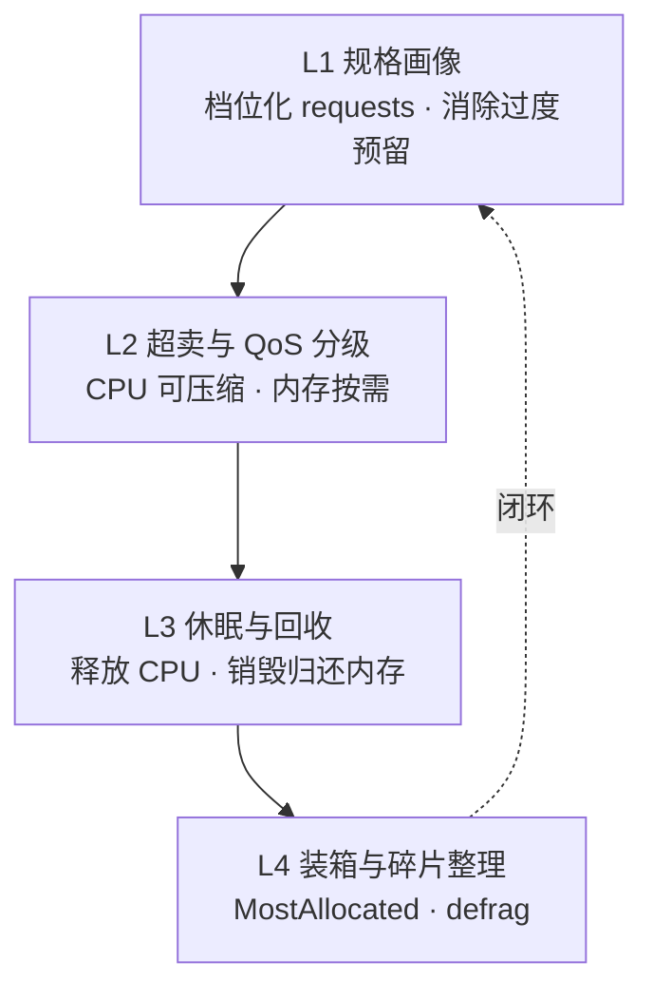
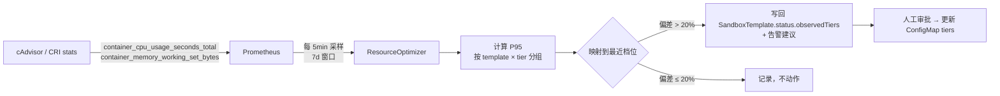
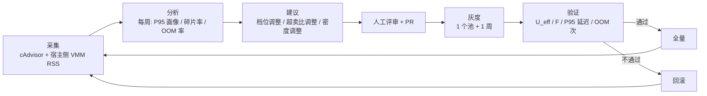

# 07 · 资源优化策略

[← 上一篇：隔离与运行时](06-isolation-runtime.md) | [返回导航](../README.md) | [下一篇：可观测性与安全 →](08-observability-security.md)

---

## 1. 优化目标：先把"利用率"定义清楚

大多数团队说的"利用率"是错误的，会导致优化方向跑偏。这里使用三个严格定义的量：

### 1.1 有效利用率（Effective Utilization）

$$U_{eff} = \frac{\sum_{i \in \text{sandboxes}} \text{actual\_usage}_i}{\sum_{j \in \text{nodes}} \text{allocatable}_j}$$

- 分子：**实际用量**（来自 cAdvisor/CRI stats），不是 `requests`
- 分母：节点 **allocatable**，不是 capacity

### 1.2 装箱密度（Packing Density）

$$D = \frac{\sum_i \text{requests}_i}{\sum_j \text{allocatable}_j}$$

### 1.3 碎片率（Fragmentation Ratio）

$$F = \frac{\sum_j \max\left(0,\ \text{residual}_j\ \text{中无法容纳任何档位的部分}\right)}{\sum_j \text{allocatable}_j}$$

**三个量的关系与陷阱**：

| 现象 | $U_{eff}$ | $D$ | $F$ | 诊断 |
|---|---|---|---|---|
| 请求过大（反应过度） | 低 | 高 | 高 | **最常见的病态**：利用率低但节点也装不下更多 |
| 请求过小（过度超卖） | 高 | 低 | 低 | OOM/抖动风险 |
| 健康 | 中高 | 中 | 低 | 目标状态 |

> **核心陷阱**：只盯 $U_{eff}$ 会诱使你把 `requests` 越调越小来"提高利用率"，结果是调度器过度装箱、节点 OOM、P99 崩塌。必须同时看 $F$ 和超卖相关的风险指标。

---

## 2. 四层优化模型



**实施顺序不可颠倒**：L1 未做好就做 L2，等于在错误的基准上超卖，风险不可控。**L1 的收益通常最大且风险最低**（凭经验可拿到 30–50% 的资源节省）。

---

## 3. L1 · 规格画像与档位化

### 3.1 为什么不做"逐沙箱精调"

| 方案 | 装箱后果 |
|---|---|
| 每个沙箱独立 `requests`（如 213m/437Mi） | **调度碎片灾难**：残留资源几乎无法被任何 Pod 使用 |
| 档位化（如 250m/512Mi） | 残留资源是高概率可复用的，装箱率显著提升 |

$$F_{\text{精调}} \gg F_{\text{档位化}}$$

**结论：档位化是可装箱性的前提。** 精调的微小收益（少预留几十 MiB）远小于碎片造成的损失。

### 3.2 最小粒度与"零碎片"设计规则

> **规则 R1**：所有档位的 `requests` 都是同一粒度 $g$ 的整数倍，且节点的可分配资源也是 $g$ 的整数倍，则在 CPU/内存维度上**碎片率为 0**（任何残留都至少能容纳一个最小档位）。

推导：若节点 allocatable $= n \cdot g$，每档请求 $= k_i \cdot g$，装箱后残留 $= (n - \sum k_i) \cdot g = m \cdot g$，$m \ge 0$。若 $m \ge 1$ 则可容纳 1 个最小档位（$1 \cdot g$）；只有当 $m = 0$ 时才"无碎片"但资源恰好用尽。因此碎片只来自两个地方：**① 其他资源维度**（磁盘、Pod 数上限、PID、IP）；**② 非 $g$ 倍数的开销**（`RuntimeClass.overhead`、`system-reserved`）。

**因此**：

$$g_{cpu} = 100\text{m} \quad \text{或} \quad 250\text{m}, \qquad g_{mem} = 64\text{Mi}$$

```
✅ 好：tiers = 100m/250m/1/4 (CPU, 均为 100m 倍数)
✅ 好：RuntimeClass.overhead.cpu = 250m (2.5 × 100m)    → 破坏 R1（非整数倍）
✅ 更好：RuntimeClass.overhead.cpu = 300m (3 × 100m)     → 满足 R1
✅ 好：overhead.memory = 192Mi (3 × 64Mi)                → 满足 R1
❌ 差：overhead.memory = 160Mi (2.5 × 64Mi)              → 破坏 R1
```

> **实践提示**：把 `RuntimeClass.overhead` 调整为粒度整数倍，是"零成本"的装箱改善——很多人忽略这一点。

### 3.3 档位设计准则

| 准则 | 说明 |
|---|---|
| 档位数量 3–5 个 | 太少无法区分负载；太多削弱"可共享残留"，且管理复杂 |
| 相邻档位比值 ≈ 2 | 几何阶梯（如 100m→250m→1→4 → 比值 2.5/4/4）；算术阶梯会造成档位重叠浪费 |
| 覆盖 P95 而非极值 | 档位应对齐**使用量的 P95 分布峰值**，不是最大值 |
| 提供"逃生舱" | `tierOverrides` 供少数特殊负载使用，且必须审批（否则档位化迅速退化为精调） |
| 档位命名按用途而非数值 | `tiny/small/medium/large`，便于后续无感调整数值 |

### 3.4 画像数据采集与档位回写



**采集注意事项（Kata 特有）**：

| 问题 | 影响 | 处理 |
|---|---|---|
| CRI stats 的**内存**只反映 guest 内用量，**不含 VMM/`virtiofsd` 开销** | 画像偏低 → 超卖过度 | 画像时显式加上 `RuntimeClass.overhead`（这是它必须准确配置的第二个理由） |
| guest 内存按需分配时，**宿主 RSS 与 guest 用量可能不同步** | 节点内存会被低估 | 同时采集宿主侧（node-agent 读 VMM 进程 RSS）做交叉校验 |
| 沙箱生命周期短（分钟级） | 采样窗口内样本少，P95 不稳 | 按 template 聚合而非按实例；用 7 天窗口 |
| 复用（`claimedCount` 累积） | 长驻实例内存缓慢增长（泄漏） | 画像按"存活时长分桶"，并设 `maxClaimCount` 强制轮换 |

**回写策略（保守优先）**：

- 只有**连续 3 个周期**偏差 > 20% 才建议调整档位（避免噪声）。
- 调整**只能通过 PR 修改 ConfigMap**，不允许控制器直接改数值（资源规格变更必须有人负责）。
- 每次调整记录前后指标，形成"变更-效果"可追溯链。

---

## 4. L2 · 超卖与 QoS 分级

### 4.1 核心事实：Kata 与 runc 的超卖机制完全不同

| 维度 | runc | **Kata + Firecracker** |
|---|---|---|
| `limits.cpu` 语义 | cgroup CPU 配额（CFS quota） | 同样作用于宿主 cgroup，限制 vCPU 线程组 |
| CPU 超卖 | ✅ 可行（CPU 是可压缩资源） | ✅ 可行，机制相同 |
| `limits.memory` 语义 | cgroup 内存上限 | **决定 guest RAM 大小（VM 内存规格）** |
| `requests.memory` | 仅调度用 | 仅调度用，**不影响实际分配** |
| 内存超卖 | ✅ 通过 cgroup 限制 + 页面回收 | ⚠️ **取决于 Firecracker 是否预分配内存** |

> **关键结论 K1**：在 Kata 路径下把 `requests.memory` 设为小于 `limits.memory`，**就是在做内存超卖**；但是否真的节省宿主内存，取决于 `configuration-fc.toml` 中的 `prealloc` / `hugepages` 设置。

### 4.2 预分配权衡（必须显式选择）

| 配置 | 宿主内存行为 | 启动延迟 | 超卖收益 | 适用 |
|---|---|---|---|---|
| `hugepages=false`, `prealloc=false`（**按需分配**） | RSS 随 guest 触达页面增长；未用内存不占宿主 | 略高（缺页开销） | ✅ **大**（隐性超卖） | S1 短生命周期、`reclaimPolicy=Destroy` |
| `hugepages=true`（**预分配**） | 内存全量常驻 | 更低、抖动更小 | ❌ 无 | S4 长驻、延迟敏感 |
| 混合（按池配置不同 `configuration-fc.toml`） | — | — | — | **推荐做法** |

**落地方式**：为"短生命周期池"和"长驻池"使用不同的 Kata 配置档（通过不同的 `kata-deploy` RuntimeClass 或不同 shim 配置），而非全局统一。这需要两套节点池——**这是本项目资源优化与隔离设计的重要交汇点**。

### 4.3 超卖比设定

```yaml
# ConfigMap: sandbox-tiers（超卖规则）
overcommit:
  rules:
    # 规则 1：CPU 超卖按档位差异
    - match: { isolation: [runc, kata-fc, kata-clh], reclaimPolicy: Destroy }
      cpu: { maxRatio: 4.0 }              # requests 100m → limits 400m
      memory:
        maxRatio: 1.0                     # 不可重启/有状态：不超卖
    # 规则 2：可重启且短生命周期的沙箱允许内存超卖
    - match: { reclaimPolicy: Destroy, stateful: "false", lifecycle: short }
      cpu: { maxRatio: 4.0 }
      memory: { maxRatio: 1.6 }
    # 规则 3：长驻或有状态沙箱不超卖内存
    - match: { stateful: "true" }
      cpu: { maxRatio: 2.0 }
      memory: { maxRatio: 1.0 }
  # 硬性上限（任何规则不可突破）
  hardLimits:
    memoryMaxRatio: 1.8                   # 超过此值直接拒绝创建（CEL/Webhook 校验）
    perNodeMemoryOvercommit: 1.6          # 节点级：Σrequests.mem / allocatable.mem 上限
```

**为什么内存超卖比必须给上限**：内存**不可压缩**。CPU 用超了只是变慢，内存用超了就是 OOM Killer 杀进程（甚至杀错进程）。在沙箱场景里，一次 OOM 可能杀掉**其他租户的无辜沙箱**——这是安全事故，不只是性能问题。

### 4.4 QoS 与优先级体系

| PriorityClass | 值 | QoS | 用途 | 是否可被抢占 | 是否参与超卖 |
|---|---|---|---|---|---|
| `sandbox-critical` | 1000000 | Guaranteed | 平台内部、付费高优 | ❌ | ❌ |
| `sandbox-interactive` | 1000 | Burstable | 交互式会话（S1/S2/S4） | ❌（可抢占 batch） | CPU ✅ / 内存 ❌ |
| `sandbox-batch` | 500 | Burstable | 批处理（S3） | ✅ | CPU ✅ / 内存 ✅ |
| `sandbox-placeholder` | **-10** | Burstable | 节点容量占位（见 [05 §6.2](05-warm-pool-and-scaling.md)） | ✅（必须可抢占） | — |
| `sandbox-stock` | **-5** | Burstable | **未认领的池库存** | ✅ | — |

> **`sandbox-stock` 优先级低于所有真实沙箱**：这样当节点资源紧张时，**未认领库存会先被驱逐**，而不是先牺牲正在服务的沙箱。这是"库存成本"与"服务质量"之间的正确排序。注意：库存被驱逐后需触发池补货，且要防止"驱逐-补货-驱逐"循环（补货需检查节点余量）。

### 4.5 OOM 防护（必做）

| 措施 | 说明 |
|---|---|
| `evictionHard.memory.available` 提高 | Kata 节点设 1.5Gi（高于 runc 节点的 500Mi），给 VMM 留缓冲 |
| `systemReserved` 显式配置 | 防止系统组件与 kubelet 被 OOM |
| 内存超卖**只对 `sandbox-batch`** 开放 | 批处理可重启，损失可控 |
| 节点级超卖比限制（`perNodeMemoryOvercommit`） | 在调度前拦截（Webhook 或调度器插件） |
| 监控 `kube_pod_container_status_terminated_reason{reason="OOMKilled"}` | 超卖过度的一级指标 |
| **禁用 KSM**（内核同页合并） | 虽有去重收益，但存在跨 VM 侧信道攻击风险，不适用于多租户隔离场景 |

**CPU limits 的取舍**：设 `limits.cpu` 会造成 CFS 节流（`container_cpu_cfs_throttled_seconds_total`），伤害 Agent 的突发推理响应。建议：

- `sandbox-interactive`：**不设 CPU limits**（仅 requests），依靠节点级超卖与 Kata 隔离保证；避免节流。
- `sandbox-batch`：设 limits（4×requests），保护交互式。
- 监控 `cpu_cfs_throttled` 作为是否需要调整的信号。

---

## 5. L3 · 休眠与回收（释放已占资源）

详见 [02 D7](02-tech-selection.md) 的可行性分析。这里给出落地的资源配置：

| 层级 | 机制 | CPU 收益 | 内存收益 | 恢复时延 | 实现成本 |
|---|---|---|---|---|---|
| **L1 冻结** | `Idle` 时对沙箱主进程发 `SIGSTOP` 或节点侧写 `cgroup.freeze` | **100%**（CPU 完全释放） | 0 | 毫秒 | 低 |
| **L3 状态外置 + 销毁** | 同步工作区到对象存储 → 删除 Pod → 唤醒时重建 | 100% | **100%** | 0.5–2.5 s | 中 |
| **L5 快照** | Firecracker `snapshot` → 落盘 → 销毁 VMM | 100% | **100%** | 100–300 ms | **高**（需自研 shim） |

### 5.1 冻结的实现路径（三选一，按侵入性排序）

| 路径 | 做法 | 优点 | 缺点 |
|---|---|---|---|
| **A. cgroup freeze（推荐）** | node-agent 写入 `/sys/fs/cgroup/.../cgroup.freeze` | 无需改镜像；Kata 下冻结宿主侧 cgroup 可冻结 VMM 线程组的 CPU | 需验证对 guest 的影响；内存不释放 |
| **B. Pod 内 hook** | `preStop`/自定义 UNIX socket 让 guest 内进程自我暂停 | 语义精确 | 需镜像配合；侵入业务 |
| **C. Kata shim 调用** | 直接调用 Kata agent 的 pause 接口 | 最干净 | 依赖 Kata 内部 API，版本耦合 |

> **推荐 A**：`cgroup.freeze` 是内核稳定接口，不侵入镜像，且对 runc/Kata 都适用。**但必须在兼容性矩阵（[06 §9](06-isolation-runtime.md) T7）中验证**：冻结 VMM 线程组是否会导致 guest 时钟漂移（唤醒后时间跳变）——这是 Agent 场景的常见 bug 源（Token 过期、超时判断错乱）。缓解：唤醒后通过 `chrony`/`systemd-timesyncd` 在 guest 内强制同步时间，或限制单次冻结时长（如 ≤ 30min）。

### 5.2 空闲判定与休眠策略表

| 场景 | 空闲阈值 | 动作 | 目标 |
|---|---|---|---|
| S1（短、突发） | 60 s | `Terminating`（销毁） | 立即归还全部资源 |
| S2（浏览器，中） | 180 s | L1 冻结 → 600 s 后销毁 | 保会话，释放 CPU |
| S3（长任务） | 不自动休眠（靠心跳） | 仅 TTL 兜底 | 避免干扰长任务 |
| S4（长对话，常驻） | 120 s | L1 冻结 → 12 h 后 L3 销毁（状态外置） | 释放 CPU，最终归还内存 |

**参数放在 `SandboxTemplate.defaults`**，按模板差异化，而非全局一刀切。

### 5.3 收益量化

以 2,000 个 S4 类沙箱（`medium`：1C/2Gi）为例，假设空闲占比 70%（典型对话 Agent）：

| 策略 | CPU 占用 | 内存占用 | 对比基准 |
|---|---|---|---|
| 不优化 | 2,000 C | 4,000 GiB | 100% |
| L1 冻结 | **600 C** | 4,000 GiB | CPU −70% |
| L1 + L3（状态外置） | 600 C | **1,200 GiB** | CPU −70%，内存 −70% |

**结论：L1 是"免费的 70% CPU 收益"**——实现成本低（一个 cgroup 写操作）、风险低（可立即解冻），且完全可逆。**应先做 L1，再评估是否需要 L3/L5。** 很多团队直接跳到复杂的快照方案，是典型的优化顺序错误。

---

## 6. L4 · 装箱与碎片整理

### 6.1 装箱策略（配置见 [06 §6.2](06-isolation-runtime.md)）

| 参数 | 建议 | 理由 |
|---|---|---|
| `scoringStrategy` | `MostAllocated` | 装箱，减少空闲节点数（腾出整节点供缩容） |
| CPU vs 内存权重 | 内存权重更高（3:2） | 内存是 Kata 场景的瓶颈维度（见 [05 §8.3](05-warm-pool-and-scaling.md)） |
| `nodeAffinity` | 按 isolation label 硬约束 | 由 `RuntimeClass.scheduling` 保证 |
| `PodTopologySpread` | `maxSkew: 1`（按租户） | 限制故障域，平衡装箱收益 |
| `maxPods` | = `maxSandboxesPerNode` | 单一事实来源，避免不一致 |

### 6.2 碎片整理（Defrag）

**何时该整理**：

| 信号 | 阈值 | 动作 |
|---|---|---|
| 有节点空闲率 > 70% 且总量足够缩容 | 持续 30 min | 驱逐该节点 Pod（受 PDB 保护），让节点被 Karpenter 回收 |
| 碎片率 $F$ > 15% | 持续 1 h | 提示扩容节点或调整档位（**通常不是整理能解决的**） |
| 负载处于低谷（命中率 > 98%、饱和度 < 30%） | — | 这是唯一适合整理的窗口 |

**何时不该整理**：高峰期整理是**负收益**——驱逐会重建沙箱（1–2.5 s），消耗 CPU 与 API 配额，可能引发级联延迟。**设定整理黑名单时段**（业务高峰）。

**关键反模式**：不要试图用"迁移沙箱"来整理（VM 无法在线迁移）。整理的唯一手段是**驱逐 + 重建**，成本高，因此**只在低峰做，且只针对"腾空整节点"这一明确目标**（收益可量化：省一整台节点的钱），而不是为了"提高装箱率"这类模糊目标。

### 6.3 混合档位与节点规格选择

| 策略 | 装箱率 | 管理复杂度 | 建议 |
|---|---|---|---|
| 单一大节点 + 多档位混装 | 高 | 中 | ✅ 主力 |
| 按档位分节点池 | 中 | 低 | 只对极端档位（`large`）使用 |
| 小节点 + 单一档位 | 低 | 低 | 仅本地测试环境 |

**节点规格选择规则**：节点 allocatable 应为最大档位请求的**整数倍**，且是粒度 $g$ 的整数倍。例：`large` = 4C/8Gi → 节点可分配 16C/64Gi 可装 4 个 `large`；再验算其他档位组合的残留。

---

## 7. 与 VPA 的协同

| VPA 模式 | 是否使用 | 说明 |
|---|---|---|
| `Off`（仅出建议） | ✅ | 作为画像数据源之一，与自研采集交叉验证 |
| `Initial` | ❌ | 只影响创建时刻，与池化复用冲突 |
| `Recreate` | ❌ | 会重启 Pod，直接杀掉运行中的沙箱 |
| `InPlaceOrRecreate` | ⚠️ | 仅对 `stateful=true` 长驻沙箱启用，**前提是 Kata 支持 in-place resize**（[06 §9](06-isolation-runtime.md) T7 未验证前禁用） |

**冲突根源**：VPA 的优化目标是"每个 Pod 的 requests 贴合其实际用量"，这与 §3.1 论证的"档位化以避免碎片"直接冲突。因此：**VPA 只做数据采集，不做决策**。

---

## 8. 调优闭环



**每周例行的 5 个问题**：

1. 哪些 `template × tier` 组合的 P95 用量偏离档位 > 20%？（→ 调档位）
2. 碎片率 $F$ 是否 > 10%？若是，是规格问题还是容量问题？（→ 调档位或调节点规格）
3. `OOMKilled` 次数是否 > 0？（→ 降低超卖比或收紧档位）
4. 命中率 < 90% 的池是哪个？（→ 调水位，不是调资源）
5. 是否有 `large` 档位实例数 < 5 却占用了专用节点池？（→ 合并节点池）

---

## 9. 收益验证方法（避免"优化了但没赚到"）

**A/B 灰度设计**：

| 项 | 做法 |
|---|---|
| 对照 | 保留 1 个节点池用**旧参数**（旧档位 / 旧超卖比 / 不冻结） |
| 实验 | 1 个节点池用**新参数** |
| 流量 | 池按标签分流，确保两类负载画像相近（按 template 分配而非随机） |
| 周期 | ≥ 7 天（覆盖工作日与周末峰值形态差异） |
| 指标 | $U_{eff}$、$F$、`claims/s`、P95 申请延迟、OOM 次数、节点数、`cost/node-hour × 节点数` |
| 判定 | **成本（节点数）下降且 SLO 全部达标**才算成功；只涨利用率不降成本是"假优化" |

> **重要**：优化的最终度量是**成本**，不是利用率。利用率提升但节点数不变 = 没赚到钱（因为节点不能切分）。务必同时看"节点数"与"单节点成本"。

---

## 10. 反模式清单（Anti-Patterns）

| # | 反模式 | 后果 | 正确做法 |
|---|---|---|---|
| AP1 | 逐沙箱精调 `requests` | 碎片率爆炸，装箱率下降 | 档位化（§3.1） |
| AP2 | 无上限地提高内存超卖比 | 跨租户 OOM，安全事故 | 硬上限 + 只对 batch 开放（§4.3/4.5） |
| AP3 | CPU 设 `limits` 却不监控节流 | Agent 响应莫名变慢 | 交互式不设 CPU limits；监控 `cpu_cfs_throttled` |
| AP4 | 用 KSM 省内存 | 跨 VM 侧信道风险 | 禁用（§4.5） |
| AP5 | 高峰期做碎片整理 | 级联延迟、雪崩 | 只低峰整理（§6.2） |
| AP6 | 只在 Prometheus 看 CRI 内存 | 漏掉 VMM 开销，低估节点压力 | 加上 `RuntimeClass.overhead` + 宿主侧交叉校验（§3.4） |
| AP7 | 让 VPA 全自动改 requests | 与池化/档位化冲突，重启沙箱 | VPA 仅 `Off` 模式（§7） |
| AP8 | 全局统一 Kata 配置（预分配/大页） | 要么损失启动延迟，要么损失超卖收益 | 按池分两套配置（§4.2） |
| AP9 | 只优化利用率不看节点数 | "假优化"，成本不变 | 以成本为最终判据（§9） |
| AP10 | `RuntimeClass.overhead` 未设或非粒度倍数 | 调度失真 + 隐性碎片 | 显式设置且对齐粒度（§3.2） |

---

## 11. 指标清单

| 指标 | 来源 | 用途 | 目标 |
|---|---|---|---|
| `sandbox_effective_utilization_ratio{dimension}` | 自算（PromQL） | 有效利用率 | CPU > 0.55，内存 > 0.65 |
| `sandbox_packing_density_ratio` | 自算 | 装箱密度 | 0.7–0.9 |
| `sandbox_fragmentation_ratio` | 自算 | 碎片率 | < 0.10 |
| `sandbox_oom_kills_total{tier,tenant}` | kube-state-metrics | 超卖健康度 | 0（>0 即告警） |
| `sandbox_cpu_throttled_seconds_total{priority}` | cAdvisor | CPU 限流 | interactive 应为 0 |
| `sandbox_vmm_rss_bytes{node}` | node-agent | 宿主侧真实开销 | 用于校准 overhead |
| `sandbox_tier_usage_p95{template,tier,resource}` | ResourceOptimizer | 档位偏差 | 偏差 < 20% |
| `sandbox_hibernation_active_total{mode}` | operator | 休眠收益 | — |
| `sandbox_reclaim_total{reason}` | operator | 回收原因分布 | `IdleTimeout`/`ClientReleased` 应为主 |
| `sandbox_cost_estimate_daily` | 节点数 × 单价 | **最终判据** | 持续下降 |

---

[← 上一篇：隔离与运行时](06-isolation-runtime.md) | [返回导航](../README.md) | [下一篇：可观测性与安全 →](08-observability-security.md)
