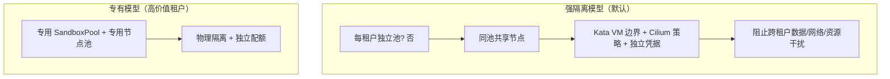

# 08 · 可观测性与安全

[← 上一篇：资源优化](07-resource-optimization.md) | [返回导航](../README.md) | [下一篇：多环境部署 →](09-deployment-environments.md)

---

# 第一部分 · 可观测性

## 1. 信号分层与用途

| 信号 | 用途 | 保留期 | 关键约束 |
|---|---|---|---|
| **指标（Metrics）** | 告警、容量规划、SLO 计算 | 15 个月（降采样） | 基数受控，禁止高基数 label |
| **日志（Logs）** | 排障、审计 | 30 天（审计 1 年） | **严禁记录沙箱内容与凭据** |
| **事件（K8s Events）** | 状态迁移轨迹、运维可见 | 7 天（同时落 Loki 长期化） | 每次迁移必须有事件 |
| **追踪（Traces）** | 申请路径延迟分解、跨组件定位 | 7 天 | 采样率按路径区分 |

## 2. 指标规范

### 2.1 命名与 label 约定

```
sandbox_<subsystem>_<name>_<unit>
```

| Label | 允许出现 | 基数上限 | 说明 |
|---|---|---|---|
| `pool` | 全部池相关 | ~20 | 池数量有限 |
| `tier` | 资源相关 | ≤ 5 | |
| `path` | 申请相关 | 2（`warm`/`cold`） | |
| `phase` | 状态相关 | ≤ 11 | |
| `reason` | 回收相关 | ≤ 10（枚举值） | **必须是枚举，禁止透传自由文本** |
| `template` | 画像相关 | ~50 | |
| `tenant` | **仅少量指标** | 无硬上限但需治理 | ⚠️ 见下方警告 |
| `sandbox_id` / `session_id` | **禁止** | — | 放日志/追踪，不放指标 |

> ⚠️ **基数爆炸警告**：`tenant` label 是最大的风险源。若租户数 1 万，一个带 `tenant` 的指标就有 1 万条时间线。**规则**：只有"平台运营必需"的指标（如每小时申请数、当前沙箱数、配额使用率）才带 `tenant`；延迟类直方图**不带** `tenant`。需要租户级延迟时，用日志/Trace 聚合。

### 2.2 核心指标清单

**控制面（controller-runtime 自带 + 自定义）**

| 指标 | 类型 | 说明 |
|---|---|---|
| `controller_runtime_reconcile_total{controller,result}` | Counter | reconcile 成功率 |
| `controller_runtime_reconcile_errors_total{controller}` | Counter | **首要排障指标** |
| `controller_runtime_reconcile_time_seconds{controller}` | Histogram | 单次 reconcile 耗时（> 1s 即异常） |
| `workqueue_depth{name}` | Gauge | **积压信号**，持续 > 100 说明控制器跟不上 |
| `workqueue_adds_total{name}` | Counter | 事件速率 |
| `leader_election_master_status` | Gauge | 是否 leader（用于判断为何"没动作"） |

**生命周期（自定义）**

| 指标 | 类型 | Labels | 说明 |
|---|---|---|---|
| `sandbox_phase_total` | Gauge | `phase`, `pool` | 各阶段沙箱数（`Ready` 即库存水位） |
| `sandbox_transitions_total` | Counter | `from`, `to`, `reason` | 状态迁移次数（用于发现异常迁移） |
| `sandbox_reclaim_total` | Counter | `reason`, `pool` | 回收原因分布 |
| `sandbox_claim_total` | Counter | `path`, `pool`, `result` | 申请结果（成功/冲突/失败） |
| `sandbox_claim_latency_seconds` | Histogram | `path`, `pool` | **核心 SLO 指标** |
| `sandbox_provision_duration_seconds` | Histogram | `stage` | 分阶段延迟（调度/镜像/VM/探针） |
| `sandbox_provision_errors_total` | Counter | `stage`, `reason` | 失败定位 |
| `sandbox_lease_expired_total` | Counter | `pool` | 心跳丢失次数 |
| `sandbox_idle_detection_conflict_total` | Counter | — | 心跳与活动信号矛盾的次数（调参依据） |
| `sandbox_recycle_prevented_total` | Counter | `reason` | 因活动信号而取消回收的次数（**误杀防护有效性**） |
| `sandbox_hibernation_total` | Counter | `mode`, `result` | 休眠次数与失败 |
| `sandbox_finalizer_duration_seconds` | Histogram | `finalizer` | **> 30s 说明卡住** |
| `sandbox_leak_sweeper_found_total` | Counter | `kind` | 对账发现的孤儿资源（**目标恒为 0**） |
| `sandbox_quota_rejected_total` | Counter | `tenant`, `quota_type` | 配额拒绝 |
| `sandbox_protect_mode_active` | Gauge | `pool` | 保护模式（> 0 即严重） |

**池（PoolController）**

| 指标 | 类型 | 说明 |
|---|---|---|
| `sandbox_pool_warm` | Gauge | 库存数 |
| `sandbox_pool_target` | Gauge | 目标水位 |
| `sandbox_pool_inflight` | Gauge | 正在创建的库存 |
| `sandbox_pool_saturation` | Gauge | 饱和度 |
| `sandbox_pool_hit_ratio_1h` | Gauge | 命中率 |
| `sandbox_pool_scale_decisions_total` | Counter | `direction`, `reason` |
| `sandbox_pool_scale_oscillation` | Gauge | 5min 内方向反转次数 |
| `sandbox_capacity_pending_nodes` | Gauge | 等待节点的库存数 |

**资源（来自 cAdvisor / kube-state-metrics / node-agent）**：见 [07 §11](07-resource-optimization.md)。

### 2.3 关键 PromQL

```promql
# SLO：热路径申请延迟 P95（目标 < 0.8s）
histogram_quantile(0.95,
  sum by (le) (rate(sandbox_claim_latency_seconds_bucket{path="warm"}[5m]))
)

# SLO：P99 全路径（目标 < 1.5s）
histogram_quantile(0.99,
  sum by (le) (rate(sandbox_claim_latency_seconds_bucket[5m]))
)

# SLO：池命中率（目标 > 0.9）
sum(rate(sandbox_claim_total{path="warm",result="success"}[30m]))
  / sum(rate(sandbox_claim_total{result="success"}[30m]))

# 有效利用率（CPU）
sum(rate(container_cpu_usage_seconds_total{label_sandbox_example_com_role="sandbox"}[5m]))
  / sum(kube_node_status_allocatable{resource="cpu", node=~"node-sandbox-.*"})

# 泄漏（必须为 0）
sum(rate(sandbox_leak_sweeper_found_total[1h]))

# 状态迁移异常：出现不该有的迁移（期望集合之外）
sum by (from, to) (rate(sandbox_transitions_total[5m]))
  unless on (from,to) sandbox_transitions_allowed

# 控制器积压
max(workqueue_depth{name=~"agentsandbox.*"})
```

## 3. 告警规则

| 告警 | 表达式（简化） | 级别 | Runbook |
|---|---|---|---|
| `ClaimLatencyWarmHigh` | 热路径 P95 > 0.8s for 5m | critical | `RB-001` |
| `PoolHitRatioLow` | 命中率 < 0.85 for 10m | warning | `RB-002` |
| `PoolWarmBelowMin` | `warm < minWarm*0.5` for 2m | warning | `RB-003` |
| `PoolOscillation` | `oscillation > 3` for 5m | warning | `RB-004` |
| `ProtectModeActive` | `protect_mode_active > 0` for 1m | critical | `RB-005` |
| `SandboxLeakDetected` | `increase(leak_found_total[15m]) > 0` | critical | `RB-006` |
| `FinalizerStuck` | `finalizer_duration > 30s` (P99) for 10m | critical | `RB-007` |
| `ReconcileErrorsHigh` | `rate(reconcile_errors_total[5m]) > 1` for 10m | warning | `RB-008` |
| `WorkqueueBacklog` | `workqueue_depth > 100` for 5m | warning | `RB-009` |
| `OOMKilledSandbox` | `increase(oom_kills_total[10m]) > 0` | **critical** | `RB-010` |
| `ProvisionFailuresHigh` | `rate(provision_errors_total[5m]) / rate(provision_total[5m]) > 0.1` for 5m | critical | `RB-011` |
| `CapacityInsufficient` | `capacity_pending_nodes > 0` for 5m | warning | `RB-012` |
| `QuotaRejectionSpike` | `rate(quota_rejected_total[5m]) > 10` for 5m | warning | `RB-013` |
| `LeaseExpiredSpike` | `rate(lease_expired_total[5m]) > 5` for 5m | warning | `RB-014` |
| `RuntimeUnavailable` | `sandbox_pool_condition{type="RuntimeClassUnavailable"} == 1` | critical | `RB-015` |
| `IdleMisDetection` | `rate(idle_detection_conflict_total[10m]) > 1` | warning | `RB-016` |

> **告警设计原则**：每个告警必须绑定 runbook 与"用户可感知的影响"。**"指标异常"不是告警理由**——例如 `reconcile_errors` 短暂波动无害；只有持续高于阈值才告警。

## 4. 日志

### 4.1 结构化字段

```json
{
  "ts": "2026-09-22T09:14:03.218Z",
  "level": "info",
  "logger": "sandbox-controller",
  "msg": "phase transition",
  "sandboxId": "01HZX8K2...",
  "sandboxName": "sbx-7f3a9c2e",
  "namespace": "sandbox-pool",
  "pool": "fc-small",
  "tenant": "t-1001",
  "requestId": "req-9f12",
  "fromPhase": "Idle",
  "toPhase": "Terminating",
  "reason": "IdleTimeout",
  "idleSeconds": 305,
  "durationMs": 12,
  "traceId": "4f2a..."
}
```

### 4.2 日志红线（必须由 lint 与 Code Review 保证）

| 禁止 | 原因 |
|---|---|
| 记录沙箱内 stdout/stderr | 含用户数据，可能含个人隐私与代码 |
| 记录接入令牌、Secret、AK/SK | 凭据泄漏 |
| 记录 `additionalEgress` 中的完整 URL（含 query） | 可能含敏感参数 |
| 记录完整 `spec` 对象 | 体积与泄漏双重风险 |
| 以 `tenant` + 高基数 ID 做日志索引主键 | 成本失控 |

**必须记录**：状态迁移、回收原因、失败原因、Finalizer 各步耗时、认领路径（warm/cold）与延迟、配额决策。

### 4.3 Kubernetes Events（状态迁移的审计轨迹）

```
Normal  SandboxClaimed      claimed by tenant t-1001 session sess-abc from pool fc-small (age 42s, path=warm)
Normal  SandboxIdle         no activity for 305s
Normal  SandboxHibernated   frozen via cgroup.freeze (cpu released)
Normal  SandboxReclaimed    reason=IdleTimeout, lifetime=1218s, claimedCount=1
Warning SandboxLeaseLost    heartbeat expired after 60s grace
Warning SandboxNodeLost     node node-17 NotReady, sandbox marked Failed
Warning SandboxProvisionFailed stage=vmBoot, reason=RuntimeCreateFailed
```

事件应同时写入 Loki（带 `reason` 结构化字段）以支持长期查询与聚合。

## 5. 分布式追踪

```
Span: POST /v1/sandboxes                        [gateway]  312ms
├── Span: authz + quota check                   [gateway]    2ms
├── Span: claim (CAS)                           [gateway]   48ms
│   ├── Span: list candidates (cache)                       1ms
│   └── Span: patch claimRef                                45ms   ← API Server 往返
├── Span: token issue                           [gateway]   12ms
└── Span: wait PodReady                         [operator] 250ms
    ├── Span: scheduler bind                               100ms
    ├── Span: image pull                                   40ms
    ├── Span: vm boot                                      80ms
    └── Span: readiness probe                              30ms
```

**采样策略**（成本与价值平衡）：

| 路径 | 采样率 | 理由 |
|---|---|---|
| 冷路径（`path=cold`） | 100% | 低频、高价值（定位优化点） |
| 热路径 | 1% | 高频，且延迟已由指标覆盖 |
| 失败/异常 | **100%** | 强制采样（tail-based sampling） |
| 回收路径 | 5% | 低频但需可追溯 |

**Trace 上下文传播**：`requestId` 必须在 gateway → CR annotation → Pod label → 沙箱内进程环境变量全链路传播，使业务侧日志也能与平台侧关联。

## 6. 看板（Dashboard）

| 看板 | 面向 | 核心面板 |
|---|---|---|
| **SLO 总览** | 全员 | 热/冷路径延迟分位、命中率、可用性、错误预算燃尽 |
| **池健康** | 平台 OnCall | 水位 vs 目标、饱和度、扩缩事件、振荡检测、保护模式 |
| **申请链路** | 排障 | 延迟分解（分阶段）、失败原因 Top、配额拒绝、冲突率 |
| **资源效率** | 平台/财务 | 有效利用率、装箱密度、碎片率、节点数、成本趋势 |
| **隔离运行时** | 运行时团队 | Kata 启动延迟分布、密度 vs 延迟散点、VMM 进程数、孤儿进程 |
| **租户视图** | 租户 | 申请量、配额使用、延迟、被回收次数与原因 |
| **泄漏与对账** | 平台 OnCall | 孤儿资源计数、Finalizer 耗时、对账扫描耗时 |

---

# 第二部分 · 安全

## 7. 威胁模型

假设：**沙箱内运行的是"不可信、可能主动攻击"的代码**（LLM 生成的代码本质上是不可信输入）。这与普通业务容器的信任模型完全不同。

| # | 威胁 | 影响 | 可能性 | 现有控制 | 残留风险 |
|---|---|---|---|---|---|
| T1 | 容器/VM 逃逸到宿主 | 节点失守、跨租户 | 低 | Kata + Firecracker（独立内核 + KVM） | KVM/Firecracker CVE，需及时打补丁 |
| T2 | 跨沙箱侧信道（Spectre 类、缓存、KSM） | 数据泄漏 | 中 | 独立内核 + 禁用 KSM + 不共享 `hostPath` 可写 | 同节点 CPU 侧信道（缓解：CPU 绑定 + 抑制超线程，成本高） |
| T3 | 窃取宿主/集群凭据 | 横向移动 | 中 | `automountServiceAccountToken: false`；无云实例元数据访问；出口白名单 | 应用自身注入的凭据 |
| T4 | 数据外泄 | 数据泄漏 | **高** | Cilium `toFQDNs` 白名单；DNS 模式限制 | 白名单域名被滥用（如允许的通用域名成为跳板） |
| T5 | 资源耗尽（DoS） | 影响同节点其他租户 | 高 | 每沙箱 cgroup 限制；节点超卖上限；`sandbox-stock` 低优先级 | CPU 超卖导致的噪声 |
| T6 | 镜像投毒 / 供应链 | 提权、后门 | 中 | cosign 签名校验；私有仓库；镜像 digest 固定 | 基础镜像上游漏洞 |
| T7 | 控制面被越权（Operator RBAC 过宽） | 全集群失守 | 低但极严重 | 最小权限 RBAC；不挂 `cluster-admin`；禁用 `escalate`/`bind` | Webhook 成为提权跳板 |
| T8 | 沙箱访问 Kubernetes API | 探测集群、滥用凭据 | 中 | 网络层 deny `kube-apiserver`；无 SA token | — |
| T9 | 注入容器获取宿主权限 | 节点失守 | 低 | PSA `restricted`；禁止 privileged/hostPath rw/hostNetwork | Kata 节点特权 DaemonSet 本身 |
| T10 | 跨租户数据残留（沙箱复用） | 数据泄漏 | **中** | 仅同租户复用；`resetHook` 强制清理；`maxClaimCount` 轮换 | resetHook 实现质量 |
| T11 | 告警与审计缺失 | 攻击无法被发现 | 中 | Tetragon/Falco 运行时检测；审计日志 | 检测规则维护 |
| T12 | 出口白名单被用作跳板（SSRF 到内网） | 内网渗透 | 中 | 白名单仅放行外部域名；拒绝 RFC1918 与 link-local | DNS rebinding（Cilium FQDN 解析后绑定 IP，可缓解） |

## 8. 控制措施矩阵

### 8.1 沙箱 Pod 安全上下文（强制基线）

```yaml
spec:
  automountServiceAccountToken: false        # 关键：沙箱不应有 K8s 凭据
  securityContext:
    runAsNonRoot: true
    runAsUser: 10000
    fsGroup: 10000
    seccompProfile: { type: RuntimeDefault }
    seLinuxOptions: {}                       # Kata 下 SELinux 语义有限，见 06
    appArmorProfile: { type: RuntimeDefault } # 1.30+（旧版用注解）
  containers:
    - name: sandbox
      securityContext:
        allowPrivilegeEscalation: false
        privileged: false
        readOnlyRootFilesystem: true         # 关键：镜像不可被持久污染
        capabilities: { drop: ["ALL"] }
      volumeMounts:
        - { name: workspace, mountPath: /workspace }   # 仅此目录可写
        - { name: tmp,       mountPath: /tmp }
  hostNetwork: false
  hostPID: false
  hostIPC: false
  # 不允许 hostPath 可写挂载
```

**由 Pod Security Admission 强制**：`sandbox-pool` 命名空间标注 `pod-security.kubernetes.io/enforce=restricted`（配合 `version: v1.30`）。任何需要例外的 Pod（如 `sandbox-node-agent`）必须放在独立命名空间并显式豁免，**绝不能放宽沙箱命名空间**。

### 8.2 控制面 RBAC（最小权限）

```yaml
# Operator 的 ClusterRole（示例，实际需按需裁剪）
rules:
  - apiGroups: ["sandbox.example.com"]
    resources: ["agentsandboxes", "sandboxpools", "sandboxtemplates"]
    verbs: ["get", "list", "watch", "create", "update", "patch", "delete"]
  - apiGroups: ["sandbox.example.com"]
    resources: ["*/status"]
    verbs: ["get", "update", "patch"]
  - apiGroups: [""]
    resources: ["pods"]
    verbs: ["get", "list", "watch", "create", "delete"]   # 不需要 update
  - apiGroups: [""]
    resources: ["secrets"]
    verbs: ["get"]                                        # 只读，且用 ResourceNames 限定
    resourceNames: ["sandbox-*"]
  - apiGroups: ["coordination.k8s.io"]
    resources: ["leases"]
    verbs: ["get", "list", "watch", "create", "update", "patch", "delete"]
  - apiGroups: ["networking.k8s.io"]
    resources: ["networkpolicies"]
    verbs: ["get", "list", "watch", "create", "delete"]
  - apiGroups: ["cilium.io"]
    resources: ["ciliumnetworkpolicies"]
    verbs: ["get", "list", "watch", "create", "delete"]
# 明确禁止：
#   - cluster-admin / * 通配
#   - pods/exec（Operator 绝不需要 exec 进沙箱）
#   - secrets create/update/delete（只读 + 限定名称）
#   - nodes delete
#   - 任何 escalate / bind / impersonate
```

**红线**：`pods/exec` 与 `pods/portforward` 权限**永不给 Operator**。若需要取沙箱内数据，通过业务侧 API，而非控制面 exec。

### 8.3 网络强制

| 控制 | 实现 | 验证 |
|---|---|---|
| 默认拒绝全部出入 | Cilium 默认拒绝策略 | `kubectl exec` 内 `curl` 任意地址应超时 |
| 出口白名单（FQDN） | `toFQDNs` + DNS 规则 | 访问非白名单域名失败 |
| 禁止访问 API Server | `egressDeny: toEntities: [kube-apiserver]` | `curl https://kubernetes.default.svc` 失败 |
| 禁止访问云计算元数据 | 网络层拒绝 `169.254.169.254/32` | `curl http://169.254.169.254` 失败 |
| 禁止访问内网 | 拒绝 RFC1918 网段（除集群内白名单） | 扫描内网应全失败 |
| 入口仅 gateway | CNP `ingress.fromEndpoints` | 其他命名空间无法连入 |
| DNS 限制 | DNS 规则仅允许白名单模式 | 解析非白名单域名失败 |

```yaml
# 元数据服务与内网防护（必须）
egressDeny:
  - toCIDR: ["169.254.169.254/32"]          # 云元数据（SSRF 头号目标）
  - toCIDR: ["10.0.0.0/8", "172.16.0.0/12", "192.168.0.0/16"]
    except:
      - toEntities: ["cluster"]              # 仅放行集群内必要通信
```

### 8.4 镜像供应链

| 措施 | 工具 | 说明 |
|---|---|---|
| 镜像签名 | cosign | 沙箱镜像必须签名 |
| 准入校验 | Kyverno / Gatekeeper 策略 | 校验签名、禁止 `latest`、强制 digest |
| 基础镜像最小化 | distroless / 精简 rootfs | 减少攻击面与 CVE |
| 定期扫描 | Trivy / Grype | 阻塞高危 CVE |
| 镜像固定 | 用 digest 而非 tag | 防 tag 漂移 |
| 私有仓库 | 禁止直接使用公网镜像 | 防供应链劫持 |

```yaml
# Kyverno 策略（示意）
apiVersion: kyverno.io/v1
kind: ClusterPolicy
metadata: { name: sandbox-image-policy }
spec:
  validationFailureAction: Enforce
  rules:
    - name: verify-signature
      match:
        any:
          - resources:
              kinds: [Pod]
              namespaces: [sandbox-pool]
      verifyImages:
        - imageReferences: ["registry.internal/*"]
          attestors:
            - entries:
                - keys: { publicKeys: "k8s://sandbox-system/cosign-pub" }
    - name: disallow-latest-tag
      match:
        any:
          - resources: { kinds: [Pod], namespaces: [sandbox-pool] }
      validate:
        message: "禁止使用 latest tag"
        pattern:
          spec:
            containers:
              - image: "!*:latest"
```

### 8.5 凭据管理

| 规则 | 说明 |
|---|---|
| **短期凭据** | 沙箱内的 LLM 网关/对象存储凭据有效期 ≤ 1 小时，由 gateway 轮换 |
| **按沙箱隔离** | 每个沙箱独立凭据（`t-1001-llm-creds` 按 session 派生），泄漏影响面受限 |
| **不落盘到镜像** | 通过 Secret 挂载或环境变量注入，`readOnlyRootFilesystem` 保证不污染镜像 |
| **外部密钥管理** | Vault / KMS + CSI Secrets Store Driver；避免 Secret 长期存在于 etcd |
| **审计使用** | 凭据使用记录到审计系统，支持"某凭据被哪些沙箱使用"反查 |
| **回收时轮换** | 沙箱回收后立即吊销其凭据（Finalizer 链的隐含要求） |

### 8.6 运行时威胁检测

| 检测点 | 工具 | 规则示例 |
|---|---|---|
| 异常 syscall | Tetragon | guest 外的进程执行异常二进制作数 |
| 容器逃逸尝试 | Tetragon / Falco | 访问 `/proc/sysrq-trigger`、`/dev/mem`、mount 操作 |
| 异常网络行为 | Cilium Hubble | 连接非白名单 IP、端口扫描、DNS 隧道特征 |
| 加密挖矿 | Falco | 高 CPU + 连接矿池域名 |
| 权限提升 | Tetragon | `setuid`、能力变更 |

**注意**：Kata 沙箱内的 syscall 发生在 guest 内核中，**宿主侧 eBPF 看不到沙箱内的系统调用**。因此检测点必须在宿主侧关注：① VMM 进程行为；② 网络流量（Hubble）；③ guest 外可观测的接口（如 `virtiofsd` 访问）。**沙箱内的深度检测需在 guest 内装 agent**——这是一个必须明确的能力边界，不要误以为宿主侧 Falco 能覆盖沙箱内部。

## 9. 多租户模型



| 维度 | 共享池（默认） | 专有池 |
|---|---|---|
| 隔离 | Kata VM + 网络策略 + 凭据隔离 | 独立节点，物理隔离 |
| 成本 | 低（池高效复用） | 高（池命中率低） |
| 适用 | 标准租户 | 金融/医疗等高合规要求 |
| 噪声邻居 | CPU 超卖下存在 | 无 |
| 实现 | label + 配额 + 网络策略 | 独立 `SandboxPool` + `NodePool` + taint |

**跨租户复用明确禁止**：`returnToPool` 只允许同租户复用，且必须经过 `resetHook`。这一规则**硬编码在控制器**（不提供配置开关），因为它是安全边界而非策略偏好。

## 10. 审计与合规

| 审计项 | 记录内容 | 保留 |
|---|---|---|
| 沙箱申请 | 租户、主体、模板、档位、时间、来源 IP、requestId | 1 年 |
| 沙箱生命周期 | 全部状态迁移与原因 | 1 年 |
| 沙箱回收 | 原因、存活时长、是否异常 | 1 年 |
| 出口访问 | 目标域名/IP、时间（来自 Hubble） | 90 天 |
| 控制面操作 | 谁改了池/模板配置（K8s audit log） | 1 年 |
| 凭据使用 | 哪个沙箱用了哪个凭据 | 90 天 |

**数据驻留**：沙箱状态外置（`stateURI`）的存储区域必须可配置并校验（防止跨区域数据流动）；审计日志同样。

## 11. 事件响应剧本（沙箱逃逸）

| 步骤 | 动作 | 负责 |
|---|---|---|
| 1. 检测 | 运行时检测/漏洞情报触发告警 | 自动化 |
| 2. 遏制 | `kubectl cordon` + 加 taint 隔离节点；**不立即删除沙箱**（保留现场） | OnCall |
| 3. 评估 | 确认逃逸范围：节点？同节点沙箱？控制面？ | 安全团队 |
| 4. 驱逐 | 强制回收该节点全部沙箱，通知租户 | OnCall |
| 5. 修复 | 升级 Firecracker/Kata/内核；验证补丁 | 运行时团队 |
| 6. 恢复 | 新节点池上线；旧节点销毁（**不重用磁盘**） | 平台 |
| 7. 复盘 | 时间线、影响面、改进项 | 全员 |

**前置准备（必须提前完成，否则响应时手忙脚乱）**：

- [ ] 一键 cordon + taint 脚本
- [ ] 沙箱与租户的映射查询（谁需要被通知）
- [ ] 节点销毁（而非清洗）流程
- [ ] 租户通知模板与联系人清单

## 12. 安全检查清单（纳入 CI 与上线门禁）

- [ ] 所有沙箱命名空间 `pod-security.kubernetes.io/enforce=restricted`
- [ ] `automountServiceAccountToken: false` 全局默认（可用 CEL/策略强制）
- [ ] Cilium 默认拒绝策略已启用，且 `kube-apiserver` / 元数据 IP 被 deny
- [ ] Operator 无 `pods/exec`、无通配符 RBAC、无 `cluster-admin`
- [ ] 镜像签名校验策略为 `Enforce`
- [ ] 无 `latest` tag；镜像以 digest 固定
- [ ] 沙箱内凭据有效期 ≤ 1h 且支持吊销
- [ ] `resetHook` 存在且经测试（复用前清理验证）
- [ ] 跨租户复用路径不存在（代码级验证 + 测试）
- [ ] KSM 已禁用；无 `hostPath` 可写挂载
- [ ] 泄漏对账 Job 运行正常且指标为 0
- [ ] 审计日志已开启且可查询
- [ ] 逃逸响应剧本已演练（每季度一次）

---

[← 上一篇：资源优化](07-resource-optimization.md) | [返回导航](../README.md) | [下一篇：多环境部署 →](09-deployment-environments.md)
