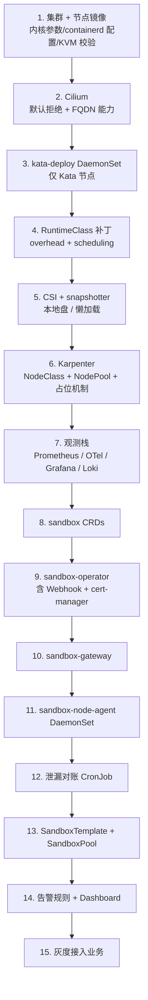

# 09 · 多环境部署方案

[← 上一篇：可观测性与安全](08-observability-security.md) | [返回导航](../README.md) | [下一篇：里程碑与风险 →](10-roadmap-risks.md)

---

## 1. 环境矩阵

| 环境 | 集群形态 | 隔离级别 | 节点 | 目的 | 能验证 |
|---|---|---|---|---|---|
| **E0 本地 Unit** | 无集群 | — | — | `envtest` + fake client | 状态机逻辑、不变式、异常分支 |
| **E1 本地 e2e** | kind（3 节点） | `simulated` | Docker 容器 | 端到端逻辑、池化、回收、指标 | 全部控制面行为 |
| **E2 本地隔离** | 单节点 kubeadm（KVM 主机） | `kata-fc` | 1 台裸金属/WSL2 | 运行时真实性、启动延迟 | 隔离、vsock、CNI+Kata |
| **E3 Staging** | 托管 K8s + metal 节点池 | `kata-fc` | 3–6 台 metal | 压测、混沌、升级演练 | 全部，含 SLO |
| **E4 Production** | 同 E3，多可用区 | `kata-fc` + `runc` | 弹性 | 承载业务 | — |

> **纪律**：E1 与 E3 的**控制器代码、CRD 定义、指标、告警规则完全一致**，仅配置不同。若某个逻辑"只在 E3 能测"，说明设计有泄漏（应对其抽象到配置）。

## 2. 本地快速开始（E1）

```bash
# 1. 创建集群
kind create cluster --config hack/kind-config.yaml

# 2. 安装 CNI（Cilium）
helm install cilium cilium/cilium -n kube-system --set kubeProxyReplacement=true

# 3. 安装 cert-manager（Webhook 证书）
helm install cert-manager jetstack/cert-manager -n cert-manager --set installCRDs=true

# 4. 构建业务组件镜像并加载进 kind
#    kind 的"节点"是容器，看不到本机 docker 的镜像缓存 —— 不做这一步会一直 ImagePullBackOff
make docker-build        # 三个镜像共用一个 Dockerfile，见 README §2.8
make kind-load           # 不经过任何 registry

# 5. 安装 CRD + Operator（本地 overlay）
make install
make deploy OVERLAY=local

# 6. 应用示例模板与池
kubectl apply -k config/samples/local

# 7. 冒烟测试
make e2e-local          # 走 simulated 隔离，验证申请/回收/泄漏

# 8. 观察
kubectl get sandboxpool fc-small -w
kubectl get agentsandbox -n sandbox-pool -w
```

> **镜像与运行时自检（Windows）**：容器运行时不可用时，先用 `hack/docker-doctor.ps1`
> 定位是**哪一层**坏了 —— CLI、守护进程、Docker Desktop 服务、WSL 还是虚拟化特性。
> 这四类问题的表面症状都是“docker 用不了”，但修复动作完全不同。

**本地 overlay 的关键配置**：
```yaml
# config/overlays/local/isolation-patch.yaml
isolation:
  level: simulated
  runtimeClassName: ""        # 回落到 runc
  requiresKvm: false
allowOvercommit: false        # 本地不做超卖
pool:
  minWarm: 2                  # 小池便于观察
  maxWarm: 5
sweeper:
  intervalSeconds: 30         # 对账跑得频繁，便于测试
```

### 2.1 E1 与 E3 的**已知差异**（必须显式认知）

| 差异 | 本地（E1） | 生产（E3/E4） | 风险 |
|---|---|---|---|
| 隔离 | runc（无真实隔离） | Kata-FC | **安全结论不可从本地推导** |
| 启动延迟 | 100–300 ms | 800–2500 ms（冷路径） | 池水位参数需在生产重调 |
| 节点创建 | 无（固定 3 容器） | Karpenter 90s–5min | **占位 Pod 机制本地测不出效果** |
| 存储 | emptyDir（宿主） | virtio-fs / virtio-blk / CSI | 卷性能结论不适用 |
| 网络 | Docker 网络 + Cilium | Cilium + virtio-net | FQDN 策略需在 E2/E3 验证 |
| 内存 | 宿主共享 | guest 独立 + VMM 开销 | 密度结论不适用 |
| 镜像 | 本地已缓存 | 需预热 / 懒加载 | 冷路径延迟构成不同 |

> **结论**：本地验证**正确性**（逻辑对不对），生产验证**性能与安全**（数字与边界）。不要把本地的延迟/密度数字写进 SLO 依据。

## 3. 生产安装顺序（依赖关系严格）

> **镜像前提**：第 9 / 10 / 12 步都要求镜像已经构建并推送。三个镜像由仓库根目录的
> 单个 `Dockerfile` 产出（`make docker-build docker-push`，多架构用 `make docker-buildx`，
> 见 [README §2.8](../README.md)）。生产上必须用**不可变 tag 或 digest**：
> 用浮动 tag 时“回滚”会退化成“重新部署一次未知内容”，而事故处理最不需要这种不确定性。



**顺序的强制性理由**：

| 步骤 | 若顺序错误会怎样 |
|---|---|
| 1 必须先于 3 | 缺少 KVM 支持，`kata-deploy` 安装成功但 Pod 无法启动（故障难定位） |
| 2 必须先于 9 | Operator 创建的 CNP 无人执行；沙箱无网络策略保护（**静默的安全缺口**） |
| 4 必须先于 13 | 池的库存占位与调度器容量计算失真，节点会 OOM |
| 6 必须先于 13 | 池扩容没有节点承接，全部 Pending（本地常见，生产首次部署必踩） |
| 7 必须先于 9 | 没有指标时无法判断控制器是否正常，等于盲飞 |
| 12 应与 13 同时 | 无对账则泄漏会在首次异常后累积 |

## 4. 配置矩阵

| 配置项 | E1 本地 | E2 KVM 单节点 | E3 Staging | E4 Production |
|---|---|---|---|---|
| `isolation.level` | `simulated` | `kata-fc` | `kata-fc` | `kata-fc`（主）+ `runc` |
| `allowOvercommit` | `false` | `false` | `true`（限 batch） | `true`（限 batch） |
| `pool.minWarm` | 2 | 5 | 按预测 | 按预测 |
| `pool.maxWarm` | 5 | 20 | 200 | 2000 |
| `pool.dampening.scaleUpCooldownSeconds` | 5 | 10 | 15 | 15 |
| `pool.dampening.scaleDownCooldownSeconds` | 30 | 60 | 180 | 180 |
| `protectMode.enabled` | `false` | `true` | `true` | `true` |
| `sweeper.intervalSeconds` | 30 | 60 | 300 | 300 |
| `hibernation.enabled` | `false` | `true`（L1） | `true`（L1） | `true`（L1+L3） |
| `maxConcurrentReconciles.sandbox` | 4 | 8 | 32 | 32 |
| `maxConcurrentReconciles.pool` | 1 | 1 | **2** | **2** |
| `karpenter.capacityReservation.enabled` | `false` | `false` | `true` | `true` |
| `defrag.enabled` | `false` | `false` | 仅观测 | 执行（低峰） |
| `admission.failurePolicy` | `Ignore` | `Fail` | `Fail` | `Fail` |
| 副本数（operator） | 1 | 1 | 2 | 3 |
| 副本数（gateway） | 1 | 2 | 3 | 6+（HPA） |

> **`maxConcurrentReconciles.pool` 必须保持很低（1–2）**：并发执行池决策会导致"多个 goroutine 同时看到水位缺口并各自扩容"，直接造成超额扩容。这是池化实现中最常见的并发 bug，务必在代码层用互斥或低并发度约束。

## 5. 目录与部署编排

```
.
├── Dockerfile                    # operator / gateway / sweeper 共用（多阶段 + distroless）
├── .dockerignore
├── api/v1alpha1/                 # CRD 类型定义（kubebuilder）
├── cmd/
│   ├── operator/main.go
│   ├── gateway/main.go
│   └── node-agent/main.go
├── internal/
│   ├── controller/
│   │   ├── sandbox_controller.go
│   │   ├── pool_controller.go
│   │   ├── template_controller.go
│   │   └── resource_optimizer.go
│   ├── claim/                    # CAS 认领协议
│   ├── sweeper/                  # 泄漏对账
│   ├── isolation/                # 隔离级别抽象层（06 §1）
│   └── metrics/
├── config/
│   ├── crd/bases/
│   ├── rbac/
│   ├── manager/
│   ├── webhook/
│   ├── base/                     # Kustomize base
│   └── overlays/
│       ├── local/                # E1
│       ├── kvm/                  # E2
│       ├── staging/              # E3
│       └── production/           # E4
├── hack/
│   ├── kind-config.yaml
│   ├── smoke/                    # 冒烟测试 Pod/脚本
│   ├── bootstrap/                # 节点初始化脚本
│   └── loadtest/                 # 压测脚本
└── test/
    ├── e2e/                      # envtest + kind e2e
    └── conformance/              # Kata 运行时一致性套件（E2/E3）
```

**Kustomize 而非 Helm（推荐）**：CRD 与 controller 的配置以结构化为先，Kustomize 的 patch 语义比 Helm 模板的字符串替换更可读、更适合多环境 overlay。若组织已标准化 Helm，则用 Helm + `values-<env>.yaml`，但要避免在模板中写复杂条件逻辑（那是可维护性的杀手）。

## 6. 节点初始化（生产镜像前提）

```bash
#!/usr/bin/env bash
# hack/bootstrap/node-init.sh —— 打包进节点镜像或由 cloud-init 执行
set -euo pipefail

# ---- 1. 内核参数 ----
cat >/etc/sysctl.d/99-sandbox.conf <<'EOF'
vm.swappiness=0
vm.overcommit_memory=1
fs.inotify.max_user_instances=8192
fs.inotify.max_user_watches=524288
fs.file-max=2097152
vm.max_map_count=262144
net.core.somaxconn=32768
EOF
sysctl --system

# ---- 2. KVM 校验（失败则节点不可用于沙箱池）----
if ! grep -qE 'vmx|svm' /proc/cpuinfo; then
  echo "FATAL: no CPU virtualization support"; exit 1
fi
[ -e /dev/kvm ] || { echo "FATAL: /dev/kvm missing"; exit 1; }
modprobe vhost_vsock
modprobe vhost_net
[ -e /dev/vhost-vsock ] || { echo "FATAL: vhost-vsock missing"; exit 1; }

# ---- 3. CPU 频率稳定性（降低 microVM 启动抖动）----
for gov in /sys/devices/system/cpu/cpu*/cpufreq/scaling_governor; do
  [ -e "$gov" ] && echo performance > "$gov" || true
done

# ---- 4. 大页预留 ----
echo 4096 > /proc/sys/vm/nr_hugepages    # 4096 × 2MiB = 8GiB

# ---- 5. 本地盘（镜像与临时盘）----
mkdir -p /var/lib/sandbox/images /var/lib/sandbox/scratch
# 假设 /dev/nvme1n1 为本地盘，需按实际设备名调整
if ! blkid /dev/nvme1n1; then
  mkfs.ext4 -F /dev/nvme1n1
fi
grep -q /var/lib/sandbox/images /etc/fstab || \
  echo "/dev/nvme1n1 /var/lib/sandbox ext4 defaults,noatime,nodiratime 0 2" >>/etc/fstab
mount -a

# ---- 6. containerd 配置（见 06 §5.1 的 TOML）----
install -m 0644 hack/bootstrap/containerd-sandbox.toml /etc/containerd/conf.d/99-sandbox.toml
systemctl restart containerd

# ---- 7. 节点标签（供 RuntimeClass.scheduling 与 NodePool 使用）----
# 由节点引导程序或 Karpenter NodeClass 完成
echo "node bootstrap done"
```

## 7. 容量与配额规划模板

| 环境 | 目标并发沙箱 | 池 `minWarm`/`maxWarm` | 节点数（按 [05 §8](05-warm-pool-and-scaling.md) 公式） | 成本上限（节点级 `limits`） |
|---|---|---|---|---|
| E3 Staging | 300 | 30 / 100 | 8（含 1 冗余） | CPU 128，内存 512Gi |
| E4 Production（初始） | 3,000 | 200 / 800 | 86（按 [05 §8.3](05-warm-pool-and-scaling.md) 验算） | CPU 800，内存 3200Gi |
| E4 Production（成熟期） | 5,000 | 400 / 1,500 | 145 | 按需调整 |

**配额对象**（按租户）：

```yaml
apiVersion: v1
kind: ConfigMap
metadata: { name: tenant-quotas, namespace: sandbox-system }
data:
  quotas.yaml: |
    defaults:
      maxConcurrentSandboxes: 50
      maxCreatesPerSecond: 5
      maxTierAllowed: medium
      allowedIsolation: [kata-fc]
    tenants:
      t-1001: { maxConcurrentSandboxes: 500, maxCreatesPerSecond: 20, maxTierAllowed: large }
      t-2002: { maxConcurrentSandboxes: 20,  maxCreatesPerSecond: 2,  maxTierAllowed: small }
```

> 配额放在 ConfigMap 而非 CRD 的理由：它是**平台运营数据**（变更频率低、无状态机需求），做成 CRD 会增加 API 面与控制器复杂度而无收益。若需要自助申请流程，再考虑 `TenantQuota` CRD。

## 8. 升级与回滚

### 8.1 各组件升级顺序

| 组件 | 顺序 | 兼容性要求 | 回滚 |
|---|---|---|---|
| **CRD** | **先**（只增字段） | 新 CRD 必须能被旧 Operator 读取（新字段旧版忽略） | CRD 不删除已用字段即可直接回滚 |
| Operator | 次（滚动） | 新旧版本对同一 CR 语义一致 | 滚动回退镜像 |
| Gateway | 次（滚动） | 与 Operator 通过 CR 解耦 | 滚动回退 |
| Node Agent | 后（DaemonSet 滚动） | 与 Operator 通过 CR 解耦 | 滚动回退；注意节点级状态 |
| **Kata** | **独立流程**（见 [06 §12](06-isolation-runtime.md)） | 版本化 RuntimeClass | 池指向旧 RuntimeClass |
| CNI / CSI | 独立窗口 | 与上表无关 | 按各自厂商流程 |

### 8.2 CRD 升级的安全规则

```
1. 只添加字段（可选、有默认值）——禁止新增必填字段
2. 禁止修改已有字段的类型或语义
3. 列表字段必须声明 +listType / +listMapKey（否则 SSA 会误覆盖）
4. 变更前跑 upgrade 测试：
     - 用旧版本创建对象 → 升级 CRD → 新 Operator 能正确 reconcile
     - 用新版本创建对象 → 降级 CRD → 旧 Operator 不崩溃（新字段被忽略）
5. 每个 CRD 版本变更都必须有对应转换（conversion）测试，即使当前不需要转换
```

### 8.3 回滚决策表

| 现象 | 回滚什么 | 是否影响运行中的沙箱 |
|---|---|---|
| Operator 崩溃循环 | Operator 镜像 | 否（沙箱继续运行）；但池与回收停止 |
| 池水位行为异常 | Operator 镜像 + `pauseScaling=true` 止血 | 否 |
| CRD 变更导致 reconcile 报错 | 旧 CRD（若未依赖新字段则为空操作） | 否 |
| Gateway 报错率升高 | Gateway 镜像 | 是（新申请失败，已有沙箱不受影响） |
| 沙箱启动失败率升高 | 检查 Kata/RuntimeClass；必要时池切回旧 RuntimeClass | 是（新沙箱受影响） |
| 节点故障 | 无需回滚；池自动补货 | 该节点沙箱丢失 |

**止血优先级（任何异常先做这三件事）**：

```bash
# 1. 停止自动扩缩（防止继续烧钱或放大故障）
kubectl patch sandboxpool fc-small --type=merge -p '{"spec":{"scaling":{"pauseScaling":true}}}'

# 2. 停止冷路径（保护节点，仅服务池内申请）
kubectl patch sandboxpool fc-small --type=merge -p '{"spec":{"degradation":{"disableColdPath":true}}}'

# 3. 观察指标，确认故障面
#    - sandbox_phase_total / pool_warm / protect_mode_active / reconcile_errors_total
```

## 9. 灾备与数据

| 数据 | 是否需备份 | 说明 |
|---|---|---|
| `SandboxTemplate` / `SandboxPool` | ✅ 是（GitOps 源） | 期望状态在 Git，集群对象可重建 |
| `AgentSandbox` CR | ⚠️ 不必（短生命周期） | 集群重建后业务重新申请；**但需保证无残留配额占用** |
| Lease / Pod / CNP | ❌ 否 | 派生态 |
| 租户配额 ConfigMap | ✅ 是（GitOps 源） | |
| 指标与审计日志 | ✅ 是（长期存储） | 合规要求 |
| 沙箱内业务状态 | ⚠️ **业务责任** | 通过 `stateURI` 外置；平台只提供机制 |

**etcd 备份**：常规集群操作即可。**恢复后必须运行泄漏对账**（`sweeper`）清理孤儿资源——因为恢复出来的对象可能引用了已不存在的 Pod/Lease。

**跨可用区**：沙箱池按可用区拆分（`topologySpreadConstraints`），避免单 AZ 故障导致全部容量损失；但**池水位要按 AZ 独立维持**（否则 AZ 故障时其他 AZ 无法承接，因为没有多余容量）。

## 10. 部署验收清单（每个环境上线前）

- [ ] 节点 KVM / vsock / 内核参数校验脚本通过（`hack/bootstrap/node-init.sh`）
- [ ] `RuntimeClass` 存在且 `overhead` 已设为粒度整数倍
- [ ] 孤立测试 Pod 能起（Kata 冒烟清单全绿，见 [06 §10.2](06-isolation-runtime.md)）
- [ ] Cilium 默认拒绝生效：沙箱访问非白名单域名失败、访问 API Server 失败、访问元数据 IP 失败
- [ ] 池水位能收敛到 `minWarm`（稳定性：连续 30min 无振荡）
- [ ] 申请热路径延迟 P95 达标；冷路径延迟 P95 达标
- [ ] 回收后无残留（对账指标为 0）
- [ ] 告警规则全部生效且有 runbook 链接
- [ ] Dashboard 可访问且数据完整
- [ ] 配额拒绝路径验证（超限返回 429）
- [ ] 升级/回滚演练完成（含 CRD 双向兼容测试）
- [ ] 逃逸响应剧本演练完成（[08 §11](08-observability-security.md)）
- [ ] 成本上限 `NodePool.limits` 已设置

## 11. 环境差异的显式清单（避免"本地通过即生产可用"的幻觉）

| 断言 | 本地（E1）可信？ | 必须在哪里验证 |
|---|---|---|
| 状态机正确性 | ✅ 可信 | E1 |
| 认领并发安全 | ✅ 可信 | E1（+E3 压测） |
| 泄漏防护 | ✅ 可信 | E1（+E3 混沌） |
| 隔离强度 | ❌ **不可信** | E2/E3 |
| 启动延迟数字 | ❌ **不可信** | E3 |
| 节点密度 | ❌ **不可信** | E3 |
| 池水位参数 | ❌ **不可信** | E3 |
| 网络策略有效性 | ❌ **不可信** | E2/E3 |
| 卷性能与行为 | ❌ **不可信** | E2/E3 |
| 成本模型 | ❌ **不可信** | E4 |
| CRD 演进兼容性 | ✅ 可信 | E1（envtest） |

---

[← 上一篇：可观测性与安全](08-observability-security.md) | [返回导航](../README.md) | [下一篇：里程碑与风险 →](10-roadmap-risks.md)
