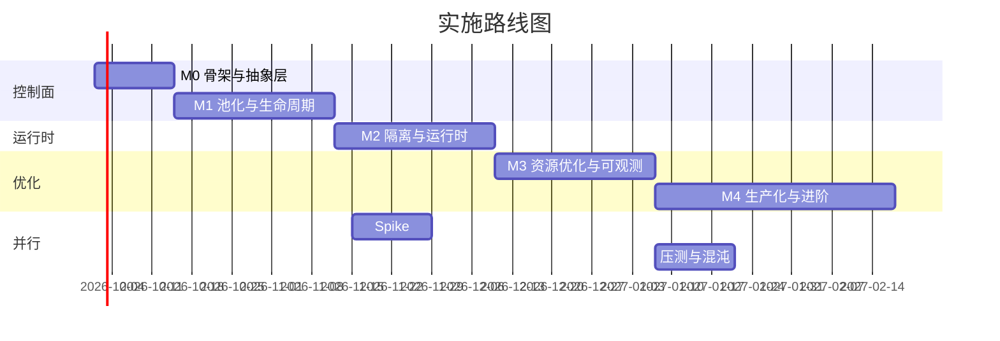
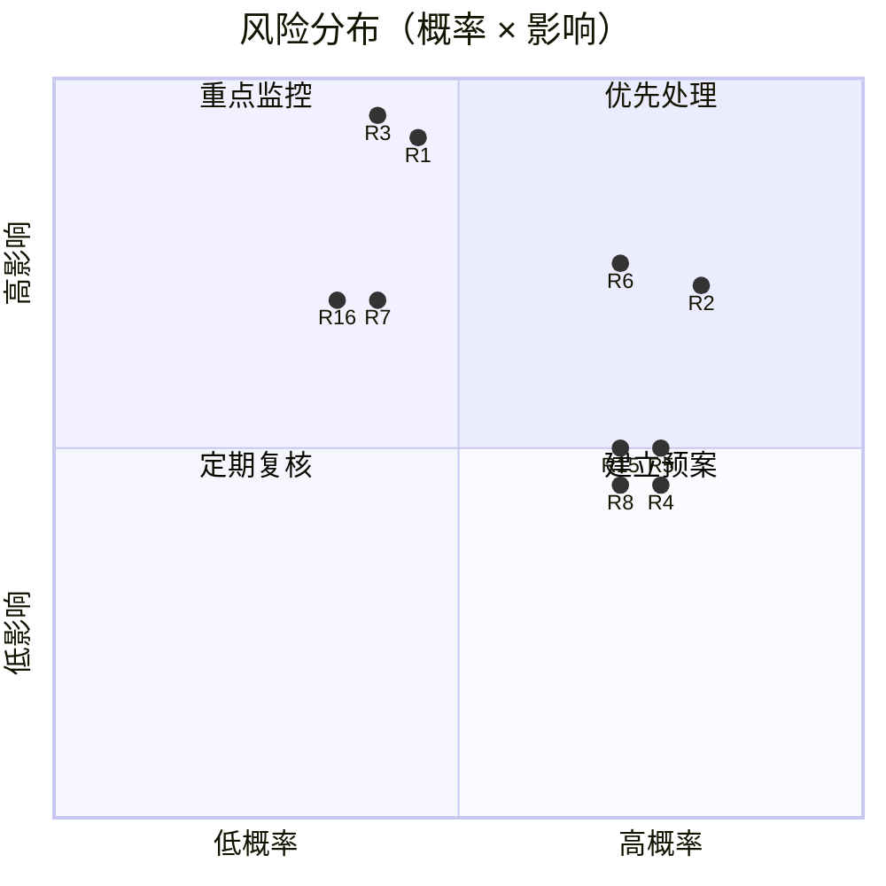

# 10 · 里程碑、风险与验证

[← 上一篇：多环境部署](09-deployment-environments.md) | [返回导航](../README.md)

---

## 1. 里程碑规划

总时长约 **18 周**到生产灰度（不含业务方接入改造）。每个里程碑的退出标准都是**可验证的客观条件**，不是"完成度百分比"。



### M0 · 骨架与抽象层（2 周）

| 交付物 | 说明 |
|---|---|
| `AgentSandbox` / `SandboxPool` / `SandboxTemplate` CRD `v1alpha1` | 含 `status` 子资源、CEL 校验、`+listType` 标注 |
| Operator 骨架 | manager、leader election、metrics endpoint、workqueue 指标 |
| **隔离抽象层**（[06 §1](06-isolation-runtime.md)） | `simulated` / `runc` / `kata-fc` 映射；RuntimeClass 探测与降级 |
| `envtest` + kind e2e 骨架 | CI 可跑；`make test` / `make e2e-local` |
| 不变式测试框架 | INV-1 ~ INV-8（[04 §5.4](04-api-and-state-machine.md)）可断言 |

**退出标准**：
- [ ] 在 kind 上提交 CR → Pod 创建 → `PodReady` → `status.phase=Ready` 全链路跑通
- [ ] `make test` 覆盖全部状态迁移（含异常分支），覆盖率 > 70%
- [ ] 全部 INV 不变式有对应测试且通过
- [ ] CRD upgrade/downgrade 测试在 CI 中通过

**风险**：CRD 字段设计返工。**缓解**：先用 §7 的 Spike 验证"`claim` 不可变 + 原地转正"这一核心假设。

### M1 · 池化与生命周期（4 周）· 已关闭 2026-09-22

| 交付物 | 说明 |
|---|---|
| `PoolController` | 水位闭环、阻尼、限速、占位 Pod 机制（占位部分在 E3 才生效） |
| 认领协议（CAS） | 冲突重试、幂等、`resourceVersion` 前置条件 |
| 生命周期完整化 | TTL / 空闲 / 心跳（Lease）/ 冻结（L1） |
| Finalizer 链 + 泄漏对账 | 5 个 Finalizer + Sweeper CronJob |
| `sandbox-gateway` | REST API、鉴权、配额、幂等键、错误语义 |
| 保护模式 | 雪崩保护（[05 §5](05-warm-pool-and-scaling.md)）：失败率触发 + 滞回 + 扩容限速 + 接入层拒绝低优。**边界：API 延迟判据与高优排队未接线**（见 05 §5 实现状态表） |
| 容器镜像 | 三个组件共用一个多阶段 `Dockerfile`（distroless 运行时、多架构）；**尚未在可用运行时上构建过**（本机阻塞点已定位到 Windows 侧的 `VirtualMachinePlatform`，不是 Dockerfile 本身） |
| 控制面部署清单 | `config/manager/`（Deployment + 指标 Service + PDB，含 leader election 与探针）；**仅渲染验证**；PVC 权限与缓存作用域已对齐 |
| 端到端验证入口 | `hack/kind-e2e.ps1`（Windows 版；等价于 `make kind-e2e`，并把选主切换与 RBAC 审计写成断言）；**已写好，尚未执行过** |

**退出标准**：
- [ ] 在 kind 上模拟 200 创建/秒，**命中率 > 90%**，无泄漏（对账指标 0）
- [ ] 认领冲突率 < 1%（压测报告）
- [ ] 池水位在阶跃负载下 **30 分钟内无振荡**（扩缩方向反转次数 = 0）
- [ ] 12 小时长跑：无内存增长、无孤儿资源、无卡住的 Finalizer
- [ ] 全部 SLO 指标有对应 PromQL 与看板面板
- [ ] 故障注入（杀 Operator / 杀 Pod / 断 Lease）后状态机自愈正确
- [ ] 三个镜像可构建可推送，且 Trivy 扫描无 HIGH/CRITICAL（**当前未达成：未在真实运行时上构建过**）
- [ ] `sandbox-operator` **以容器方式**在 kind 上跑通（含 leader election 切换）—— 判据必须是
      “Pod 里的 ServiceAccount”而不是“开发者 kubeconfig”：后者是 cluster-admin，会把
      RBAC 缺口全部掩盖掉（见 R17）
> **上面前四个勾选框的前提是一条环境依赖**：以上全部要求一个能跑 Linux 容器的宿主。
> 本机在这条上卡了很久，而且症状极具误导性 —— 看上去像“Docker 坏了”或“DISM 坏了”，
> 实际是三层叠在一起的：
>   1. `VirtualMachinePlatform` 未启用（Windows 家庭版没有 Hyper-V，WSL2 后端是唯一选项）；
>   2. 启用请求发出后机器确实重启了，但 CBS 在启动时 **延迟了启动处理**
>      （`Startup: Deferring startup processing at users request`）—— 于是“需要重启”
>      并不等于“这次重启会生效”；
>   3. 快速启动（hiberboot）默认开启，它把“关机再开机”变成一次**恢复**而非启动，
>      这正是延迟服务处理最常见的前提。
> 结论：入口脚本先诊断再用**管理员**修复，不要把重启当作万能下一步 ——
> `hack/docker-doctor.ps1`（只读，逐层报告）→ `hack/host-ready.ps1 -Mode repair`
> （按缺什么补什么，并明确告诉你何时必须重启）；镜像构建与 kind 端到端由
> `hack/kind-e2e.ps1` 一次性跑完。

### M1 关闭记录（2026-09-22）

M1 以**「交付物齐备、退出标准八项中五项未执行、三项只完成一半」**的状态关闭。
这是**用户明确决定的接受项**（登记为 R18），不是“已经验证通过” —— 两者的区别会在后续
里程碑里以完全不同的方式显现，所以逐条写清楚：

| 退出标准 | 状态 |
|---|---|
| 200 创建/秒下命中率 > 90%、无泄漏（对账指标 0） | ❌ 未执行（需要一个在跑的集群） |
| 认领冲突率 < 1%（压测报告） | ⚠️ 一半：CAS 并发冲突有 envtest 实测，**没有** 200/s 压测报告 |
| 阶跃负载下 30 分钟内无振荡（反转次数 = 0） | ❌ 未执行 |
| 12 小时长跑（内存 / 孤儿资源 / 卡住的 Finalizer） | ❌ 未执行 |
| 全部 SLO 指标有对应 PromQL 与看板面板 | ⚠️ 一半：指标语义与 PromQL/面板**设计**在 [08 §2.3](08-observability-security.md) / [08 §6](08-observability-security.md)；网关侧已实现导出（`internal/gateway/metrics.go`，手写 Prometheus 文本格式）；**控制器与对账侧的导出是显式占位**（M3 接入），**仓库里没有可直接导入的看板 JSON** |
| 故障注入（杀 Operator / 杀 Pod / 断 Lease）后自愈正确 | ⚠️ 一半：纯函数状态机的异常分支有单测，**没有**集群内的真实故障注入 |
| 三个镜像可构建可推送 + Trivy 无 HIGH/CRITICAL | ❌ 未执行（宿主缺 `VirtualMachinePlatform`，见上文环境前置） |
| `sandbox-operator` 以容器方式在 kind 上跑通（含选主切换） | ❌ 未执行（脚本已就绪：`hack/kind-e2e.ps1`） |

**为什么可以关而不是继续挂着**：上表未执行项**全部**卡在同一件事上 —— 一个能跑 Linux
容器的宿主，而不是卡在代码或设计上。把里程碑悬在这里并不会让它前进，只会让 M2/M3 的排期
失去参照。

**解除条件（启动 M2 前必须做的一件事）**：宿主修好后的第一条命令就是

```
powershell -ExecutionPolicy Bypass -File hack/kind-e2e.ps1 -Stage cluster,image,load,deploy,verify
```

它会把上表里所有需要集群的项一次跑完（选主切换与 RBAC 审计已写成断言），
并把结果回填到本表与 README §2.6。在那之前，
**README §2.6 是这些项唯一的状态源**（⚠️/❌ 不是装饰）。

**风险**：池振荡（最高概率的翻车点）。**缓解**：先以静态水位（`minWarm` 恒定）上线，通过后再逐项打开预测与阻尼参数。

### M2 · 隔离与运行时（4 周）

**仓库实现状态（2026-09-24）**：前三项已加入 E2 引导脚本、RuntimeClass 清单与
`sandbox-node-agent` 代码/DaemonSet；尚未在 KVM 宿主部署、构建镜像或执行运行时
一致性验证，因此下面的退出标准仍全部未勾选。部署入口见
[M2 E2 节点部署](11-m2-e2-bootstrap.md)。

**后续仓库实现**：Cilium 出口档位渲染、T1–T9 E2 执行器、延迟/密度报告生成器与
RuntimeClass 切换回滚演练脚本已加入。实测报告仍为[待采集](../reports/m2-e2-baseline.md)，
不能据此勾选下方退出标准。

| 交付物 | 说明 |
|---|---|
| E2 单节点 KVM 环境 | 节点初始化脚本、kubeadm、Cilium、kata-deploy |
| RuntimeClass 补丁 | `overhead` 对齐粒度（[07 §3.2](07-resource-optimization.md)） |
| `sandbox-node-agent` | 镜像预热、宿主侧 VMM RSS 采集、孤儿进程检测、cgroup freeze |
| 运行时一致性套件 | [06 §9](06-isolation-runtime.md) T1–T9 自动化 |
| Cilium 策略渲染 | 模板 → CNP，含 FQDN / 元数据 IP / API Server deny |
| 启动延迟基线 | 分阶段延迟报告（图表存证） |

**退出标准**：
- [ ] E2 冒烟清单（[06 §10.2](06-isolation-runtime.md)）全绿
- [ ] 启动延迟基线报告：冷路径 P95 ≤ 2.5s（否则必须优化或重新评估运行时选型）
- [ ] 安全验证：非白名单域名不可达、API Server 不可达、元数据 IP 不可达（附证据）
- [ ] 密度 vs 延迟曲线出图，`maxSandboxesPerNode` 有数据支撑
- [ ] Kata 升级演练成功（版本化 RuntimeClass 切换 + 回滚）

**风险**：Kata/Firecracker 达不到延迟或兼容性目标（**项目级最高风险**）。**缓解**：M2 第一周就做基准测试 spike；备选 `kata-clh`；兜底方案见 §3 R1。

### M3 · 资源优化与可观测（4 周）

| 交付物 | 说明 |
|---|---|
| 档位体系与画像闭环 | `tiers` ConfigMap、`ResourceOptimizer`、回写建议流程 |
| 超卖规则与 QoS | 规则引擎、硬上限、PriorityClass 体系 |
| 装箱调度 | `sandbox-binpack` profile、`MostAllocated`、TopologySpread |
| 完整观测栈 | 全部指标、16 条告警 + runbook、7 个看板 |
| 规模压测 | E3 上达到 NFR 4.2 的规模目标 |
| 混沌测试 | 节点故障、网络分区、etcd 抖动、API Server 限流 |

**退出标准**：
- [ ] E3 压测：3,000 并发沙箱、200 创建/秒，全部 SLO 达标
- [ ] `OOMKilled` 次数 = 0（超卖安全）
- [ ] 有效利用率与碎片率在目标区间（[07 §1.3](07-resource-optimization.md)）
- [ ] 全部告警有 runbook，且每条告警都做过"人为触发 → 收到通知 → 按 runbook 处理"演练
- [ ] 混沌场景全部通过（无泄漏、无卡死、自动恢复）

### M4 · 生产化与进阶（6 周 + 持续）

| 交付物 | 说明 |
|---|---|
| E4 灰度上线 | 5% → 25% → 50% → 100%，每步观察 ≥ 7 天 |
| L3 状态外置 | 业务 SDK 契约 + 平台侧机制 |
| 成本 A/B 验证 | 新旧参数对照，以**节点数 × 单价**为判据 |
| 碎片整理（defrag） | 低峰执行，带黑名单时段 |
| **Spike：Firecracker 快照（L5）** | 限时 2 周，结论为"做/不做"，不做则明确记录理由 |
| 灾备演练 | 集群恢复 + 对账 + 配额一致性 |

**退出标准**：
- [ ] 生产 100% 流量承接，SLO 连续 2 周达标
- [ ] 成本相对优化前基线下降（附 A/B 数据）
- [ ] 逃逸响应剧本演练完成
- [ ] 全部开放问题（§5）有结论或降级方案

---

## 2. 测试策略

| 层级 | 工具 | 覆盖内容 | 运行时机 |
|---|---|---|---|
| 单元测试 | Go `testing` + table-driven | 纯逻辑：水位算法、状态迁移判定、档位映射 | 每次提交 |
| 控制器测试 | `envtest` | 状态机全迁移、不变式、Webhook/CEL 校验 | 每次提交 |
| 集成测试 | kind + `simulated` | 申请→认领→回收全链路、池化、泄漏对账、指标 | PR 合并 |
| **运行时一致性** | E2 单节点 KVM | Kata 隔离、vsock、卷、网络策略、密度 | 每日 + 变更时 |
| 压测 | k6 / 自研负载生成器 | 200 创建/秒、3k 并发、API Server 压力 | 里程碑 |
| 混沌 | Chaos Mesh / Litmus | 节点故障、网络分区、etcd 抖动、进程 kill | 里程碑 + 每周 |
| 安全测试 | Trivy / kubesec / 自研越权用例 | 镜像、PSA、RBAC、网络绕过尝试 | 每周 |
| CRD 演进 | `envtest` + 双版本 Operator | 升级/降级双向兼容 | 每次 CRD 变更 |

### 2.1 必测的异常路径（按"最容易漏"排序）

| # | 场景 | 期望 |
|---|---|---|
| E1 | 认领瞬间 Pod 被删除 | 认领失败并返回 410，不产生孤儿 |
| E2 | 状态迁移过程中 Operator 被杀（每个 Phase 各注入一次） | 重启后 reconcile 到正确终态 |
| E3 | Finalizer 中某一步永久超时（注入） | 强制推进 + 告警，不锁死删除 |
| E4 | 池扩容过程中节点创建失败 | 库存回到合理水位，不无限重试 |
| E5 | 节点在认领过程中失联 | 沙箱标记 Failed，业务收到明确错误 |
| E6 | 心跳与活动信号矛盾 | 保守选择（不误杀）并上报冲突指标 |
| E7 | 配额在沙箱运行中被下调 | 已运行沙箱不被强杀；新申请被拒 |
| E8 | 同一沙箱被并发认领 | 仅一个成功，另一个 409 后取下一个候选 |
| E9 | etcd 恢复后存在引用已删除 Pod 的 CR | 对账将其转为 Failed |
| E10 | 池 `maxWarm` 被动态改为小于当前库存 | 缩容受限速约束，不引发批量中断 |
| E11 | RuntimeClass 在运行中被删除 | 现有沙箱不受影响；新库存创建失败并告警 |
| E12 | 沙箱被恶意 `SIGSTOP` 后不响应回收 | Finalizer 超时强制推进，Pod 被删除 |

---

## 3. 风险登记表

| # | 风险 | 概率 | 影响 | 缓解措施 | 触发信号 | 责任人 |
|---|---|---|---|---|---|---|
| **R1** | **Kata/Firecracker 启动延迟或兼容性达不到 SLO** | 中 | **极高** | M2 首周基准测试；备选 `kata-clh`；兜底降级到 `runc` + 更严格的应用层沙箱；若全不可行则重新评估 gVisor（[02 V4](02-tech-selection.md)） | 冷路径 P95 > 4s 或故障率 > 5% | 运行时团队 |
| **R2** | 节点创建延迟破坏池的秒级承诺 | **高** | 高 | 占位 Pod 预铺；节点池保底容量；`do-not-disrupt`；Karpenter `consolidateAfter` 延长 | `capacity_pending_nodes > 0` 持续 > 5min | 平台团队 |
| **R3** | 内存超卖导致跨租户 OOM（安全事故） | 中 | **极高** | 硬上限 1.8x；仅 `sandbox-batch` 开放；提高 `evictionHard` 阈值；禁用 KSM；OOM 一级告警 | `OOMKilled > 0` | 平台 + 安全 |
| **R4** | Firecracker 设备限制（无 PCI/hotplug）阻碍业务需求 | **高** | 中 | 契约前置（申请时声明全部卷）；对象存储替代挂卷；`kata-clh` 备选；GPU 需求明确排除 | 业务提出挂卷/GPU 需求 | 架构组 |
| **R5** | 池振荡（超额扩容/缩容）导致成本失控 | **高** | 中 | 阻尼 + 非对称冷却 + 低并发 + 振荡检测告警；先静态水位后开预测；`maxWarm` 硬上限 | `scale_oscillation > 3` | 平台团队 |
| **R6** | 状态机复杂度过高导致隐蔽 bug | **高** | 高 | 不变式测试；对账 Sweeper 兜底；**简化状态数**（避免增加 Phase）；每个 Phase 的故障注入测试 | 对账非 0 / 出现非法迁移 | 控制器团队 |
| **R7** | API Server 写入压力过大（5k 对象 + 高频心跳） | 中 | 高 | Lease 独立对象；status 写入节流（最小 1s）；对账批量化；informer 缓存 + predicate 过滤 | `apiserver_request_duration` P99 > 1s | 平台团队 |
| **R8** | 业务方不实现心跳/状态外置 | **高** | 中 | 契约前置写入文档；提供 SDK 自动续租；默认参数容忍（心跳丢失默认 `Grace` 而非立即回收） | `lease_expired_total` 高但业务声称正常 | 产品 + 业务 |
| **R9** | 状态外置（L3）契约复杂，业务接入成本高 | 中 | 中 | 提供可直接使用的 SDK 与示例；把 L3 定位为**可选**（默认仅 L1 冻结）；用"沙箱可丢弃"作为基础契约 | 业务接入周期 > 4 周 | 产品 |
| **R10** | Firecracker 快照 PoC 失败 | 中 | 低 | 明确定位为**可选进阶**；L3 已提供内存回收能力；不做则记录理由并结案 | Spike 超期 2 周 | 运行时团队 |
| **R11** | 早期 CRD 设计错误导致返工 | 中 | 高 | M0 阶段用 Spike 验证 `claim` 原地转正、`tier` 引用等核心假设；M3 前冻结 `v1beta1` | 需要破坏性 CRD 变更 | 架构组 |
| **R12** | 成本超预算 | 中 | 中 | `NodePool.limits` 硬上限；`maxWarm` 上限；日成本告警；`maxWarm: 0` 一键止血 | 日成本 > 预算 120% | 平台 + 财务 |
| **R13** | 沙箱复用（`ReturnToPool`）造成数据残留泄漏 | 中 | 高 | 跨租户复用**硬编码禁止**；`resetHook` 强制；`maxClaimCount` 轮换；复用前清理结果校验 | 安全测试发现残留 | 安全团队 |
| **R14** | 依赖 alpha/beta K8s 特性（in-place resize 等）导致版本受阻 | 中 | 中 | 不把 alpha 特性作为核心路径；特性探测 + 优雅降级（[07 §7](07-resource-optimization.md)） | 目标 K8s 版本不支持 | 架构组 |
| **R15** | 团队对 Kata 运维不熟悉，故障定位慢 | **高** | 中 | M2 培训；runbook（[06 §11](06-isolation-runtime.md)）；故障演练；上游社区跟进 | MTTR > 1h | 运行时团队 |
| **R16** | 多 AZ 部署下池容量分散，单 AZ 故障无法承接 | 中 | 高 | 按 AZ 独立维持水位；每 AZ 保留冗余容量；跨 AZ 申请重试策略 | AZ 故障演练失败 | 平台团队 |
| **R17** | **本地能跑、集群内跑不起来**：开发机用自己的 kubeconfig（通常是 cluster-admin），掩盖了 ServiceAccount 权限缺口与被缓存对象的读取权限缺口 | **高** | 高 | 每个组件都必须以**自己的 ServiceAccount** 在集群内跑通一轮；把代码里实际访问的资源与被授予的 RBAC 做一次对照；错误日志里出现 `forbidden` 一律当缺陷而非噪声 | 首次 in-cluster 部署失败（403 / 缓存无法同步 / 清理步骤被跳过） | 平台团队 |
| **R18** | **里程碑“已关闭”被读成“已验证”**：M1 关闭时 8 项退出标准里 5 项未执行、3 项只完成一半（原因全部是“缺一个能跑 Linux 容器的宿主”，不是代码或设计问题） | **高**（已发生） | 高 | 关闭时逐条写明状态与解除条件（§1「M1 关闭记录」），而不是把复选框删掉或统统打勾；宿主修好后的第一条命令固定为 `hack/kind-e2e.ps1`；**未回填之前 README §2.6 是这些项唯一的状态源**，任何“已达成”的说法都必须先在那里出现 | 有人在 M2 上继续叠加时，把 M1 的“已关闭”当作“已验证” | 平台团队 |

### 3.1 风险热力图



---

## 4. 验收标准（需求 → 验证方法 → 证据）

| 需求 | 目标 | 验证方法 | 证据形式 |
|---|---|---|---|
| 热路径延迟 P95 | < 800 ms | E3 压测（200 创建/秒） | 压测报告 + Grafana 快照 |
| 冷路径延迟 P95 | < 2.5 s | E3 压测（池空场景） | 分阶段延迟分解图 |
| 池命中率 | > 90% | E3 稳态 7 天 | `sandbox_pool_hit_ratio_1h` 时序图 |
| 空闲 → 资源释放 | < 60 s | E3 功能测试 | 冻结前后 CPU 曲线对比 |
| 单集群并发沙箱 | 5,000 | E3 压测 | 压测报告 |
| 峰值创建速率 | 200/s | E3 压测 | k6 报告 + `apiserver_request_duration` |
| 泄漏率 | 0 | 混沌 + 12h 长跑 | 对账指标恒为 0 的时序图 |
| 误杀率 | < 0.1% | E3 观察 | `recycle_prevented` / 总回收 比例 |
| 控制面可用性 | 99.9% | E4 计数 | 可用性报表 |
| CPU 有效利用率 | > 55% | E4 | 利用率看板 + A/B 报告 |
| 内存有效利用率 | > 65% | E4 | 同上 |
| 碎片率 | < 10% | E4 | 碎片率看板 |
| 成本 | 相对基线下降 | E4 A/B | 节点数 × 单价对比报告 |
| 可测试性 | 逻辑可在无 KVM 环境验证 | CI 检查 | `make test` 在无 KVM runner 通过 |
| CRD 可演进 | 双向兼容 | CI | upgrade/downgrade 测试通过 |
| 隔离强度 | VM 级 | E2/E3 | `uname -r` 差异证据 + 越权测试报告 |
| 出网治理 | 白名单生效 | E2/E3 | 允许/拒绝连通性测试报告 |

---

## 5. 开放问题（需在对应里程碑前结案）

| # | 问题 | 影响 | 解决方式 | 截止 |
|---|---|---|---|---|
| Q1 | Kata-FC 是否支持 in-place pod resize？ | 长驻沙箱能否在线调规格 | 特性探测测试（[06 T7](06-isolation-runtime.md)） | M2 |
| Q2 | 冻结 VMM 线程组是否导致 guest 时钟漂移？漂移幅度？ | 是否可安全使用 L1（影响 70% CPU 收益） | E2 实测 + `chrony` 缓解验证 | M2 |
| Q3 | `prealloc` vs `hugepages` 在两套池上的实际内存/延迟收益？ | 决定池配置分裂策略 | 对比基准测试 | M2 |
| Q4 | 5,000 对象规模下 Operator informer 内存与 reconcile 吞吐？ | 是否需分片控制器 | 压测 | M3 |
| Q5 | Cilium FQDN 策略在 5k 端点规模的性能与生效延迟？ | 出口治理可行性 | 压测 | M3 |
| Q6 | 懒加载镜像（Nydus/Stargz）与 Kata 的稳定组合？ | 冷路径延迟优化空间 | 集成测试（[06 T4](06-isolation-runtime.md)） | M2 |
| Q7 | `ReturnToPool`（复用）在真实业务中的价值 vs 全部 `Destroy`？ | 可显著简化设计（去掉 `resetHook`/`claimedCount`） | 业务访谈 + 数据（复用率） | M3 |
| Q8 | Gateway 是否需要请求排队（而非快速失败）？ | 影响峰值体验 | 压测 + 业务容忍度调研 | **M1（❌ 未结案，已随 M1 关闭转 M2）** |
| Q9 | 是否给 `SandboxPool` 暴露 `/scale` 子资源？ | KEDA 叠加可行性 | 按实际需求决定（默认不做） | M3 |
| Q10 | 状态外置（L3）的 SDK 契约与同步频率？ | 业务接入成本与恢复时延 | 与业务共同设计 | M4 |
| Q11 | 多 AZ 下池水位的分配算法？ | AZ 故障承接能力 | 设计 + 演练 | M4 |
| Q12 | 是否需要"池中池"（按租户子池）以提升大租户命中率？ | 池效率 vs 隔离 | 数据驱动（按租户命中率分布） | M4 |

**M1 关闭时逾期未结案的开放问题**：Q8 —— 它的“解决方式”是压测 + 业务调研，
两者都需要一个在跑的集群与真实业务输入，属于上表同一类阻塞，而不是忘了做。
它已显式转入 M2（对应 `protectMode` 里“高优排队 ≤ 200 并发”那一条尚未接线的部分，
见 [05 §5](05-warm-pool-and-scaling.md)）。

---

### 5.1 M1 关闭时的其他遗留项（非退出标准）

这些不在 M1 的退出标准里，但 M1 关闭时仍未完成，写在这里以免被“已关闭”三个字盖住：

| 遗留项 | 状态 | 为什么不算 M1 未完成 |
|---|---|---|
| `LICENSE` 文件 | ❌ 仍未添加（README 重要提示第 6 条已改口径） | 它是仓库运营事项，不是功能交付；但 README 原写“随首个代码里程碑补齐”，这已是第二次顺延，不应再顺延 |
| 接入令牌的**强制点**（数据面代理） | ❌ 未实现，网关发出的令牌目前只是一份凭据 | 设计上属于数据面，M1 交付的是控制面与接入层 |
| 控制器 / 对账侧的指标导出 | ⚠️ 显式占位（对账侧刻意用接口抽象，不绑定 Prometheus 客户端） | 计划 M3 接入，且占位是**显式**的，不会静默成功 |
| `hack/kind-e2e.ps1` 自身 | ⚠️ 已写好但**未执行过** | 与退出标准同源：缺宿主 |

---

## 6. 关键决策的可逆性（Decision Reversibility）

工程上最有价值的纪律之一：**明确每个关键决策在什么条件下应该被重新审视**。

| 决策 | 反转条件 | 反转成本 | 反转方案 |
|---|---|---|---|
| D3 Kata + Firecracker 为主 | 冷路径 P95 > 4s 且优化无效；或关键业务需求被设备限制阻塞 | **高** | 切 `kata-clh`（低）；切 gVisor（中）；自研 Firecracker 集成（极高） |
| D2 自定义 CRD | 无反转条件 | — | — |
| D4 自研池 + CAS 认领 | 规模降到 < 100 沙箱 | 中 | 简化为主备 + 静态池 |
| D7 默认"状态外置 + 重建" | 业务普遍无法接受重建（命中率与体感差） | 中 | 加速 L5 快照 PoC |
| D6 档位化（非精调） | 出现极少数超大客户需要专属档位 | 低 | 新增 `tierOverrides` + 专有池 |
| 状态机 Phase 数量 | 维护成本明显高于收益（表现为 bug 集中在状态迁移） | 中 | 合并 `Idle`/`Hibernated`，减少迁移 |
| `ReturnToPool` 复用 | Q7 结论为"复用价值低" | **低（简化）** | 全部 `Destroy`，删除 `resetHook`/`maxClaimCount` |
| `sandbox-stock` 低优先级 | 库存被频繁驱逐导致池无法维持 | 低 | 提升优先级 + 用节点容量预留替代 |

> **建议**：把上表作为架构评审的常规议题。**能低成本反转的决策应该快速决策（如复用策略）；高成本反转的决策必须用数据支撑（如运行时选型）。**

---

## 7. 前置 Spike 清单（在 M0 前完成，限时）

| # | Spike | 目的 | 限时 | 结论用途 |
|---|---|---|---|---|
| S1 | 在 KVM 环境跑通 Kata-FC，测启动延迟与密度 | **验证 R1** | 3 天 | 决定是否继续 |
| S2 | 用 kind 验证"CAS 认领 + 原地转正" | 验证 CRD 核心假设 | 2 天 | M0 CRD 设计冻结 |
| S3 | 验证 `cgroup.freeze` 对 Kata 沙箱的效果与时钟漂移 | **验证 Q2** | 2 天 | 决定 L1 是否可用（影响 70% CPU 收益） |
| S4 | Cilium `toFQDNs` 在 Kata Pod 上的生效验证 | 验证出口治理路径 | 1 天 | 安全设计定稿 |
| S5 | 估算 5k 对象下 informer 内存与 API 写入量 | 验证控制面容量假设 | 2 天 | 决定是否分片 |
| S6 | Firecracker 快照/恢复可行性 | 评估 L5 空间 | 2 天 | M4 是否投入 |

**Spike 的纪律**：每个 Spike 必须有**明确的"做/不做"结论**和**限时**（超时即结案并记录未知）。Spike 的目标不是"研究清楚"，而是"降低决策不确定性到可接受水平"。

---

## 8. 推进节奏与复盘

| 节奏 | 内容 |
|---|---|
| 每日 | 站会（阻塞项、风险变化） |
| 每周 | 指标复核：命中率、延迟、泄漏、成本；更新风险登记表 |
| 每两周 | 里程碑评审：退出标准逐项核对（不通过不放行） |
| 每个里程碑 | 回顾：哪些假设被证伪？哪些设计需要调整？更新本文件 |
| 每月 | 与业务方对齐：契约变更、Q7/Q10/Q12 等开放问题的结论 |

**里程碑评审的硬规则**：退出标准**不允许部分通过**。如果某条标准未达标，只有两个选项——① 延长该里程碑；② 显式降低标准并**记录理由与后续补偿计划**。不允许"带着已知问题进入下一阶段"，因为池化/隔离/优化是**层层依赖**的，前一层的问题会在后一层被放大（例如状态机 bug 会在优化阶段表现为"利用率数据不可信"）。

---

[← 上一篇：多环境部署](09-deployment-environments.md) | [返回导航](../README.md)
